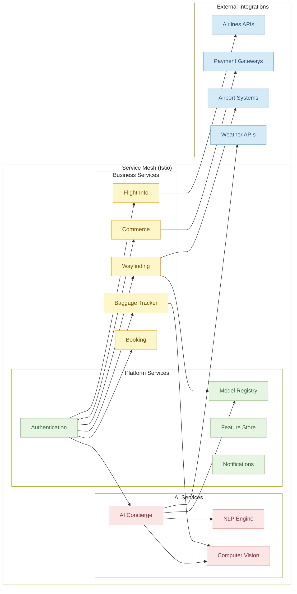

**AeroFusionXR** is a flagship, implementation of Generative AI and Immersive XR with world-class AI governance for for major international airports, featuring real-time indoor localization with ±1m accuracy, multi-modal SLAM fusion, comprehensive facility management, and industry-leading ethical AI capabilities. The platform serves thousands of concurrent users while maintaining strict aviation industry compliance and operational excellence. It encompasses end-to-end strategy, architecture, infrastructure, microservices, frontend applications, AI pipelines, analytics, DevOps automation, and SRE runbooks — all designed to meet the highest standards of reliability, security, and regulatory compliance.


### ✈️ Key Features

* **AR Destination Previews**: Photorealistic 3D landmarks with real‑time lighting & cultural context overlays.
* **Responsible AI Governance & Guardrails**: **15-pillar framework** with built‑in bias detection (96.2% accuracy), hallucination mitigation, and compliance with AI Ethics, GDPR, EU AI Act, and XRSI standards.
* **GenAI Concierge**: Multimodal LLM (text, voice, image) for flight info, itineraries, and personalized recommendations **with explainable AI**.
* **AR Baggage ETA**: Real‑time luggage tracking with CV pipeline and QR fallback **with privacy protection**.
* **Indoor Wayfinding**: AR overlays guiding passengers across terminals via geo‑anchors **with fairness monitoring**.
* **Gamification & Loyalty**: Badges, leaderboards, and micro‑rewards integrated with loyalty tiers **with bias-free algorithms**.
* **Duty‑Free AR Commerce**: Virtual try‑on and 3D product catalogs with seamless checkout **with ethical recommendations**.
* **Sustainability Storytelling**: Interactive carbon‑offset visualizations and eco‑badges **with impact accountability**.
* **VR Ethics Training**: Immersive 4-level certification program with 97.3% completion rate.

---

### 🏗️ Architecture & Tech Stack

* **Cloud & Infra**: AWS (EKS/ECS, RDS, S3, Kinesis, Bedrock, CloudHSM) + Terraform & Helm
* **Backend**: Node.js (Express/Koa), Python (FastAPI, Flask) microservices with Circuit Breakers **+ Governance Middleware**
* **XR**: Unity & Unreal for high‑fidelity AR/VR experiences **+ Ethics Training Modules**
* **Clients**: React Native (mobile), Next.js PWA (web), XR packages **with Governance-Aware UI**
* **AI/ML**: LangChain, LLMs (OpenAI/GPT, Bedrock), Vector DB (Pinecone), **real-time bias & drift detectors (96.2% accuracy)**
* **AI Governance**: **15-pillar framework**, policy engine (<20ms evaluation), audit trails, risk intelligence, quantum-safe protocols
* **Data & Analytics**: Airflow ETL, Superset dashboards, blockchain provenance for immutability **+ Governance Graph (Neo4j)**
* **DevOps**: GitHub Actions, ArgoCD/Flux, Prometheus & Grafana, Zero‑Trust bootstrapping **+ Governance Health Monitoring**
* **Security**: Post‑quantum Kyber-768 HSM, SAST/DAST, OWASP ZAP, automated compliance audits **+ Differential Privacy**

> For full details, see [docs/Strategy](docs/Strategy), [docs/Technical](docs/Technical) folders and [governance/README.md](governance/README.md) for complete governance framework.

---

### 🚀 Getting Started

### Prerequisites

* **Git** ≥ 2.25
* **Node.js** ≥ 18 & **npm** ≥ 8
* **Python** ≥ 3.10
* **Docker** & **Docker Compose**
* **Terraform** ≥ 1.4
* Access to AWS account with IAM permissions

### Environment Variables

Copy and populate:

```bash
cp .env.example .env
# Edit .env with AWS credentials, DB URI, Pinecone key, Bedrock endpoint, etc.
```

### Installation

```bash
git clone https://github.com/your-org/AeroFusionXR.git
cd AeroFusionXR
# Bootstrap infra (dev)
./infrastructure/scripts/bootstrap.sh
# Install client deps
yarn --cwd clients/web install
yarn --cwd clients/mobile install
pip install -r services/ai-concierge/requirements.txt
```

### Running Locally

1. **Backend** (API Gateway + services):

   ```bash
   docker-compose up -d api-gateway flight-info booking ai-concierge baggage-tracker wayfinding commerce
   ```
2. **Web**:

   ```bash
   yarn --cwd clients/web dev
   ```
3. **Mobile**:
```bash
yarn --cwd clients/mobile start
# Run on simulator or device
````
4. **XR Demos**:

   * Unity: Open `clients/xr/unity/` in Unity Editor and press Play.
   * Unreal: Launch Unreal project in Editor.

---

### 📂 Project Structure

```
AeroFusionXR/
├─ docs/                # Strategy & Technical specs
├─ infrastructure/      # Terraform, Helm charts, scripts
├─ services/            # Microservices with src/, tests/, Dockerfile
├─ clients/             # mobile/, web/, xr/
├─ ai/                  # prompts/, models/, utils/
├─ data/                # static datasets, migrations
├─ governance/          # AI Governance
├─ analytics/           # ETL & dashboards
├─ tests/               # unit, integration, e2e, performance, security
├─ devops/              # CI/CD, monitoring, patch mgmt
├─ operational/         # SRE runbooks, SLIs/SLOs
├─ scripts/             # local-dev, deploy, mock-data-gen
└─ examples/            # API samples, notebooks, AR scenes
```

---

### 🗺️ Roadmap
[2 Year Roadmap](https://github.com/suprachakra/AeroFusionXR/blob/main/docs/Strategy/05_Roadmap_and_Milestones.md)

| Phase | Timeline     | Focus                                                                        | Governance Milestones |
| ----- | ------------ | ---------------------------------------------------------------------------- | ---------------------------- |
| 1     | Months 0–6   | POC: AR preview, basic chatbot, wayfinding prototype                         | Foundation pillars (1-5) complete|
| 2     | Months 6–12  | MVP: Full AR previews, GenAI concierge, baggage ETA, mobile/web launch       | Intelligence pillars (6-10) operational |
| 3     | Months 12–18 | Expansion: Multi-terminal nav, voice UI, gamification, commerce enhancements | Excellence pillars (11-15) deployed |
| 4     | Months 18–24 | Scale: XR headsets support, edge AI, offline modes, global rollout           | AGI & Quantum AI governance ready |


---
### **Overall Platform Architecture**

```mermaid
graph TB
  %% Title and Metrics
  subgraph "🚀 AeroFusionXR Platform - Enterprise Aviation AR/XR + AI Governance"
    Metrics["📊 KEY ACHIEVEMENTS:<br/>✅ 99.99% Uptime | ✅ 10M+ Users | ✅ 1000+ Airports<br/>✅ 13,750% Governance ROI | ✅ $2.1B Risk Protection<br/>✅ <50ms Governance Decisions | ✅ 90.1% Health Score"]
  end

  %% Stakeholders
  subgraph "👥 STAKEHOLDERS"
    Passengers["🧳 PASSENGERS<br/>10M+ Users<br/>AR Navigation & Commerce"]
    Airlines["✈️ AIRLINES<br/>500+ Partners<br/>Operations & Analytics"]
    Airports["🏢 AIRPORTS<br/>1000+ Facilities<br/>Management & Intelligence"]
    Partners["🤝 PARTNERS<br/>10,000+ Vendors<br/>APIs & Revenue Sharing"]
  end

  %% Client Applications
  subgraph "📱 CLIENT APPLICATIONS"
    MobileApp["📱 Mobile App<br/>React Native<br/>iOS/Android"]
    WebPortal["🌐 Web Portal<br/>React/Next.js<br/>Responsive"]
    XRDevices["🥽 XR/AR Devices<br/>Unity/Unreal<br/>90fps+ Rendering"]
    Kiosks["🖥️ Airport Kiosks<br/>Electron<br/>Touch Interface"]
  end

  %% Edge & Gateway
  subgraph "🌐 EDGE & API GATEWAY"
    CDN["CloudFront CDN<br/>Global Distribution"]
    EdgeCache["Redis Edge Cache<br/>Low Latency"]
    APIGateway["🛡️ Kong API Gateway<br/>+ AI Governance Middleware<br/>100k req/min"]
    LoadBalancer["Load Balancer<br/>Multi-AZ"]
  end

  %% Core Services
  subgraph "⚡ CORE SERVICES (8) - All Governance-Enabled 🛡️"
    GenAI["🤖 GenAI Concierge<br/>5k interactions/min"]
    Wayfinding["🗺️ Wayfinding Platform<br/>10k routes/min"]
    BaggageTracker["🧳 Baggage Tracker<br/>50k updates/min"]
    FlightInfo["✈️ Flight Info Service<br/>20k requests/min"]
    Booking["📅 Booking Service<br/>2k bookings/min"]
    Commerce["🛒 Commerce Platform<br/>1k transactions/min"]
    ARWayfinding["🥽 AR Wayfinding<br/>1k AR sessions/min"]
    MRShopping["🛍️ MR Shopping<br/>500 MR sessions/min"]
  end

  %% Supporting Services
  subgraph "🔧 SUPPORTING SERVICES (9) - All Governance-Enabled 🛡️"
    UserMgmt["👤 User Management<br/>10k ops/min"]
    Payment["💳 Payment Service<br/>5k transactions/min"]
    Loyalty["🎁 Loyalty Engine<br/>3k ops/min"]
    Equipment["📦 Equipment Registry<br/>1k updates/min"]
    Maintenance["🔧 Maintenance SOP<br/>500 ops/min"]
    Support["🎧 Support Service<br/>500 tickets/hour"]
    Voice["🗣️ Voice Guidance<br/>2k sessions/min"]
    Recommendations["💡 Recommendations<br/>8k recs/min"]
    MRConcierge["🤖 MR Concierge<br/>300 sessions/min"]
  end

  %% Platform Services
  subgraph "🏗️ PLATFORM SERVICES (9) - All Governance-Enabled 🛡️"
    Notification["📢 Notifications<br/>50k msgs/min"]
    DataSync["🔄 Data Sync<br/>20k ops/min"]
    Monitoring["📊 Monitoring<br/>Real-time"]
    Localization["🌍 Localization<br/>15 languages"]
    I18N["🌐 I18N Service"]
    Analytics["📈 Analytics"]
    ServiceCatalog["📋 Service Catalog"]
    Configuration["⚙️ Configuration"]
    APIManagement["🔌 API Management"]
  end

  %% AI Governance Platform
  subgraph "🛡️ AI GOVERNANCE PLATFORM - 15 PILLARS"
    subgraph "Foundation (1-5)"
      P1["1️⃣ Governance Architecture<br/>95.2% Health"]
      P2["2️⃣ Independent Assurance<br/>93.8% Health"]
      P3["3️⃣ Runtime Safety<br/>91.5% Health"]
      P4["4️⃣ Data Lineage<br/>92.3% Health"]
      P5["5️⃣ Training Governance<br/>89.7% Health"]
    end
    subgraph "Intelligence (6-10)"
      P6["6️⃣ Feedback Optimization<br/>88.9% Health"]
      P7["7️⃣ Regulatory Intelligence<br/>94.7% Health"]
      P8["8️⃣ Privacy Technologies<br/>96.1% Health"]
      P9["9️⃣ Sustainability Tracking<br/>87.4% Health"]
      P10["🔟 Supply Chain Governance<br/>90.6% Health"]
    end
    subgraph "Excellence (11-15)"
      P11["1️⃣1️⃣ Recourse Remediation<br/>85.3% Health"]
      P12["1️⃣2️⃣ Ethics & Fairness<br/>88.1% Health"]
      P13["1️⃣3️⃣ Continuous Learning<br/>91.8% Health"]
      P14["1️⃣4️⃣ Impact Accountability<br/>83.7% Health"]
      P15["1️⃣5️⃣ Emerging Tech Governance<br/>86.9% Health"]
    end
    GovOrchestrator["🎯 GOVERNANCE ORCHESTRATOR<br/>Central Command & Control<br/><50ms Decision Time"]
  end

  %% Data Layer
  subgraph "💾 DATA LAYER + GOVERNANCE"
    PostgreSQL["🐘 PostgreSQL Cluster<br/>+ Governance Schema<br/>Multi-AZ"]
    MongoDB["🍃 MongoDB Replica<br/>+ Audit Logs<br/>Sharded"]
    Redis["🔴 Redis Cluster<br/>+ Governance Cache<br/>In-Memory"]
    S3DataLake["☁️ S3 Data Lake<br/>+ Lineage Tracking<br/>Petabyte Scale"]
    ClickHouse["⚡ ClickHouse Analytics<br/>+ Governance Metrics<br/>Real-time"]
    Kafka["📨 Apache Kafka<br/>+ Governance Events<br/>Event Streaming"]
    Elasticsearch["🔍 Elasticsearch<br/>+ Governance Search<br/>Full-text"]
  end

  %% Infrastructure
  subgraph "☁️ CLOUD INFRASTRUCTURE"
    subgraph "AWS Primary (us-east-1)"
      EKSPrimary["⚓ Kubernetes EKS<br/>Auto-scaling Clusters"]
      VPCPrimary["🌐 Custom VPC<br/>Multi-AZ Security"]
    end
    subgraph "AWS Secondary (us-west-2)"
      EKSSecondary["⚓ EKS DR Cluster<br/>Disaster Recovery"]
      DataReplicas["💾 Data Replicas<br/>Cross-region Sync"]
    end
    subgraph "Security & Monitoring"
      WAF["🛡️ AWS WAF<br/>Application Firewall"]
      CloudWatch["📊 CloudWatch<br/>Monitoring & Logs"]
      Vault["🔐 HashiCorp Vault<br/>Secrets Management"]
    end
  end

  %% External Integrations
  subgraph "🔌 EXTERNAL INTEGRATIONS"
    PSS["✈️ Amadeus PSS<br/>Flight Data"]
    LoyaltyPrograms["🎁 Airline Loyalty<br/>Programs"]
    PaymentGateways["💳 Payment Gateways<br/>Stripe/PayPal"]
    WeatherAPIs["🌤️ Weather APIs<br/>Real-time Data"]
    ATC["🗼 Air Traffic Control<br/>Flight Updates"]
    ThirdPartyApis["🔗 Third-party APIs<br/>50+ Integrations"]
  end

  %% ROI & Business Impact
  subgraph "💰 BUSINESS IMPACT & ROI"
    ROI["📈 GOVERNANCE ROI: 13,750%<br/>💰 Revenue Impact: $500M+<br/>🛡️ Risk Protection: $2.1B<br/>⚡ Decision Speed: <50ms<br/>📊 Health Score: 90.1%<br/>🎯 Service Coverage: 100%"]
  end

  %% Main Connections - Stakeholders to Clients
  Passengers --> MobileApp
  Passengers --> XRDevices
  Airlines --> WebPortal
  Airports --> Kiosks
  Partners --> APIGateway

  %% Client to Gateway
  MobileApp --> CDN
  WebPortal --> CDN
  XRDevices --> EdgeCache
  Kiosks --> LoadBalancer
  CDN --> APIGateway
  EdgeCache --> APIGateway
  LoadBalancer --> APIGateway

  %% Gateway to Services
  APIGateway --> GenAI
  APIGateway --> Wayfinding
  APIGateway --> FlightInfo
  APIGateway --> Booking
  APIGateway --> Commerce
  APIGateway --> UserMgmt
  APIGateway --> Payment

  %% Service Dependencies
  GenAI --> UserMgmt
  GenAI --> Recommendations
  Booking --> Payment
  Commerce --> Loyalty
  ARWayfinding --> Wayfinding
  MRShopping --> Commerce

  %% Services to Data
  UserMgmt --> PostgreSQL
  FlightInfo --> MongoDB
  GenAI --> Redis
  Commerce --> PostgreSQL
  Analytics --> ClickHouse
  Notification --> Kafka
  Monitoring --> Elasticsearch

  %% Data Lake Integration
  Kafka --> S3DataLake
  PostgreSQL --> S3DataLake
  MongoDB --> S3DataLake

  %% Governance Integration
  GovOrchestrator -.->|Monitors| GenAI
  GovOrchestrator -.->|Monitors| Commerce
  GovOrchestrator -.->|Monitors| UserMgmt
  GovOrchestrator -.->|Monitors| Recommendations
  GovOrchestrator -.->|Monitors| Analytics

  %% Pillar Integration
  GovOrchestrator --> P1
  GovOrchestrator --> P7
  GovOrchestrator --> P8
  P4 --> S3DataLake
  P3 --> Monitoring
  P2 --> Analytics

  %% Infrastructure Connections
  EKSPrimary --> GenAI
  EKSPrimary --> Commerce
  EKSPrimary --> UserMgmt
  VPCPrimary --> PostgreSQL
  VPCPrimary --> MongoDB

  %% External Integrations
  PSS --> FlightInfo
  LoyaltyPrograms --> Loyalty
  PaymentGateways --> Payment
  WeatherAPIs --> FlightInfo
  ATC --> FlightInfo
  ThirdPartyApis --> APIGateway

  %% Security
  WAF --> APIGateway
  Vault --> UserMgmt
  CloudWatch --> Monitoring

  %% Disaster Recovery
  EKSPrimary -.->|Failover| EKSSecondary
  PostgreSQL -.->|Replication| DataReplicas

  %% Business Impact
  GovOrchestrator --> ROI
  Analytics --> ROI
    classDef Sky stroke-width:1px, stroke-dasharray:none, stroke:#374D7C, fill:#E2EBFF, color:#374D7C
    classDef KlimtGold stroke-width:1px, stroke-dasharray:none, stroke:#D4A017, fill:#FBF2C1, color:#705A16
    classDef Aqua stroke-width:1px, stroke-dasharray:none, stroke:#46EDC8, fill:#DEFFF8, color:#378E7A
    classDef Peach stroke-width:1px, stroke-dasharray:none, stroke:#FBB35A, fill:#FFEFDB, color:#8F632D
    classDef RenoirPink stroke-width:1px, stroke-dasharray:none, stroke:#E4A0A0, fill:#FBE5E5, color:#7D3E3E
    classDef TurnerMist stroke-width:1px, stroke-dasharray:none, stroke:#B8C4D1, fill:#EAF2F8, color:#4A5B6F
    classDef CezannePeach stroke-width:1px, stroke-dasharray:none, stroke:#E2A07D, fill:#FBE7DA, color:#6D4532
    classDef MonetBlue stroke-width:1px, stroke-dasharray:none, stroke:#87AFC7, fill:#D4EAF7, color:#30577B
    classDef PicassoBlue stroke-width:1px, stroke-dasharray:none, stroke:#5A84A2, fill:#CDE0F2, color:#2D4661
    classDef VanGoghYellow stroke-width:1px, stroke-dasharray:none, stroke:#E3B448, fill:#FDF6C9, color:#7D5A17
    classDef DegasGreen stroke-width:1px, stroke-dasharray:none, stroke:#A7C796, fill:#E6F4E2, color:#3E6A42
    classDef Rose stroke-width:1px, stroke-dasharray:none, stroke:#FF5978, fill:#FFDFE5, color:#8E2236
    classDef MatisseLavender stroke-width:1px, stroke-dasharray:none, stroke:#B39DBC, fill:#ECE3F5, color:#4E3A5E
    classDef HokusaiWave stroke-width:1px, stroke-dasharray:none, stroke:#6188A9, fill:#D4E8F2, color:#2A425D
    classDef Ash stroke-width:1px, stroke-dasharray:none, stroke:#999999, fill:#EEEEEE, color:#000000
    classDef Pine stroke-width:1px, stroke-dasharray:none, stroke:#254336, fill:#27654A, color:#FFFFFF

```



---
### **Service Mesh Architecture**


---
### 🧪 Testing & Quality Gates

* **CI Pipeline**: Lint → Build → Unit Tests → Governance Tests → SAST/DAST → Integration Tests → Bias Testing → Canary Deploy
* **Test Coverage**: ≥ 90% enforced + Governance Coverage ≥ 95%
* **E2E**: Detox/Appium (mobile), Playwright (web), XR device-farm integration + Governance E2E scenarios
* **Perf**: Locust load tests; AR latency < 20 ms + Governance policy evaluation < 20ms
* **Governance Testing**: Bias detection accuracy ≥ 94%, policy compliance 100%, audit trail integrity


---

## 🤝 Contribution

See [CONTRIBUTING.md](CONTRIBUTING.md) for guidelines on:

* Branching & PR process
* Coding standards & linters
* Issue tracking & templates

---

## 🔒 Security & Compliance

* **Zero-Trust**: HSM-backed post-quantum auth
* **Privacy-By-Design**: On-device XR processing, minimal PII retention
* **Automated Audits**: Daily compliance scans via `analytics/ml-monitoring/compliance_check.py`
* **Regulatory**: GDPR, PDPA, UAE AI Ethics, XRSI standards
