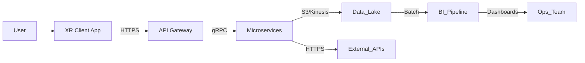

### 1. Overview

Comprehensive threat modeling, regulatory checkpoints, and Enterprise Risk Management (ERM) framework for Aerofusion XR, ensuring proactive identification, mitigation, and governance of security, privacy, operational, and strategic risks across GenAI & XR services.

### 2. Threat Models

#### 2.1. Architectural Threat Model

* **Spoofing**: Unauthorized access to microservice endpoints (Mitigation: mutual TLS, OIDC + RBAC)
* **Tampering**: Injection or modification of AR overlays/data flows (Mitigation: payload signing, integrity checks)
* **Repudiation**: Denial of actions by users or services (Mitigation: immutable audit logs, WORM storage)
* **Information Disclosure**: Leakage of PII in GenAI responses (Mitigation: real‑time redaction, privacy filters)
* **Denial of Service**: Beacon network overload or CV pipeline saturation (Mitigation: rate limiting, autoscaling, chaos testing)
* **Elevation of Privilege**: Exploitation of misconfigured IAM roles (Mitigation: least‑privilege policies, automated drift detection)

#### 2.2. Data Flow Threat Model

* **Trust Boundaries**: Identify ingress/egress points, service mesh demarcations
* **Data Classification**: Label flows carrying PII, PHI, telemetry, ensure encryption in transit & at rest

### 3. Regulatory Checkpoints

| Regulation     | Stage                  | Owner        | Deliverable                                                | Due     | Validation                                |
| -------------- | ---------------------- | ------------ | ---------------------------------------------------------- | ------- | ----------------------------------------- |
| GDPR (EU)      | Design & DPIA          | Data Privacy | DPIA report, Data Subject Rights procedures                | M3 2025 | Legal sign-off, automated audit logs      |
| PDPL (UAE)     | Implementation & Audit | Compliance   | Residency controls, DSAR portal                            | M4 2025 | Quarterly compliance scans                |
| ISO 27001      | Control Implementation | Security     | Asset inventory, access controls, vulnerability management | M5 2025 | Annual surveillance audit                 |
| ISO 42001 (AI) | AI Ethics              | AI Office    | Fairness tests, explainability logs                        | M6 2025 | Bi-annual ethics board review             |
| EU AI Act      | Risk Management Levels | Product      | Risk classification, post-market monitoring                | M2 2025 | Continuous readiness check in CI (AI Act) |

### 4. Enterprise Risk Management (ERM)

#### 4.1. Risk Register

| ID | Risk                                              | Impact   | Likelihood | Mitigation & Controls                                 | Owner           | Status      |
| -- | ------------------------------------------------- | -------- | ---------- | ----------------------------------------------------- | --------------- | ----------- |
| R1 | Model hallucinations leading to misinformed users | High     | Medium     | Automated red-teaming, human-in-loop review pipelines | SVP Data        | Monitoring  |
| R2 | Beacon network compromise disrupting wayfinding   | Critical | Low        | Multi-modal SLAM fallback, daily beacon health checks | SVP Engineering | Mitigated   |
| R3 | Unauthorized API access via misconfigured roles   | High     | Medium     | OPA policy-as-code, automated drift remediation       | SVP Security    | In Progress |
| R4 | Paid transaction failures impacting revenues      | High     | Medium     | Multi-gateway failover, retry & reconciliation logic  | SVP Product     | Ongoing     |
| R5 | Data lineage gaps causing non-compliance          | Medium   | Medium     | Centralized metadata registry with versioning API     | SVP Data        | Complete    |

#### 4.2. Governance Cadence

* **Daily**: Automated bias scans, policy-as-code validations in CI/CD
* **Weekly**: Security council reviews, penetration test reports
* **Monthly**: Cross-functional risk board, operational KPI deep-dive
* **Quarterly**: ERM steering committee, DR/BCP drills, GDPR & PDPL checkpoint
* **Annual**: ISO surveillance audit, AI ethics board review

### 5. Continuous Assurance & Feedback

* **Policy-as-Code Pipelines**: OPA, Sentinel enforced at PR and deploy stages
* **Risk Dashboard**: Real-time heat map of top 10 risks with mitigation status
* **Control Self-Tests**: Automated scripts in `scripts/` to validate network policies, IAM roles, encryption settings
* **Post-Incident Reviews**: Documented in `docs/incident_reports/` with root-cause, corrective actions

---
