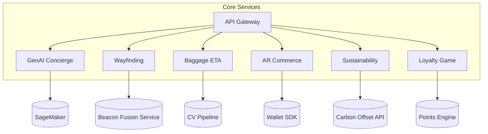
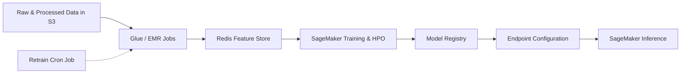

## 1. High-Level Architecture
```mermaid
flowchart LR
  subgraph Clients
    Mobile[Mobile/AR Glasses]
    Kiosk[Kiosk]
  end

  subgraph Edge Node
    EIngress[Edge Ingress LB]
    ARRender[AR Rendering Service]
    ECache[Redis Cache]
  end

  subgraph Cloud
    subgraph Region A
      ALB[(ALB)]
      API[API Gateway / Web API]
      Auth[Cognito / IAM]
      MLInfer[SageMaker Endpoint]
      DB[(Aurora PostgreSQL)]
      EVT[(Kafka Cluster)]
      FS[(Redis Feature Store)]
      S3[(S3 Data Lake)]
    end
    subgraph Region B
      ALB2[(ALB)]
      API2[Web API Replica]
    end
  end

  Mobile -->|HTTPS| ALB
  Kiosk -->|HTTPS| EIngress
  EIngress --> ARRender --> ECache --> API
  API --> Auth
  API --> MLInfer --> FS
  API --> DB
  API --> EVT
  EVT --> S3
  S3 --> EMR[EMR / Glue]
  EMR --> Training[SageMaker Training]
  Training --> ModelReg[Model Registry]
  ModelReg --> MLInfer
  ALB --- ALB2
  API --- API2
````

---

## 2. Data Flow Diagram

```mermaid
sequenceDiagram
  participant C as Client
  participant AL as API/LB
  participant DB as Aurora
  participant KF as Kafka
  participant FS as Feature Store
  participant ME as SageMaker
  participant BI as BI Dashboard

  C->>AL: Request (AR/GenAI)
  AL->>Auth: Validate Token
  Auth-->>AL: OK
  AL->>FS: Fetch features
  FS-->>AL: Feature set
  AL->>ME: Invoke model endpoint
  ME-->>AL: Prediction
  AL->>DB: Read/write session data
  AL->>KF: Publish event
  KF-->>BI: ETL pipeline ingests
  BI-->>Users: Insights dashboards
```

---

## 3. Microservice Component Diagram



---

## 4. Model Training & Deployment Pipeline



---

## 5. Resilience, Security & Compliance Layers

* **Multi-Region HA:** Active-active via Route 53 DNS failover.
* **Autoscaling:** HPA for pods, ASG for EC2, SageMaker autoscaling policies.
* **Zero-Trust Networking:** VPC‐peering, private subnets, security groups, NACLs.
* **Data Encryption:** TLS 1.3 in transit; AES-256 at rest; KMS/HSM key management.
* **Policy-As-Code:** Terraform + OPA/GitHub Actions gating for GDPR/PDPL/AI-Act compliance.
* **Observability:** OpenTelemetry tracing; Prometheus/Grafana dashboards; CloudWatch alarms.
