# System Architecture

A unified, narrative-driven architecture for **Aerofusion XR**, an enterprise-scale GenAI + XR platform tailored for a leading aviation group.

---

## 1. Introduction & Goals

**Objective:** Align every architectural decision with business targets, compliance requirements, and operational excellence—providing a single reference for all SVP stakeholders.

**Key Goals & Metrics:**

* **User Adoption:** 10% MAU in Year 1
* **AR Commerce Conversion:** 7% of users complete purchases
* **Eco Engagement:** 25% badge redemption rate
* **Performance SLAs:** 99.9% uptime, GenAI <100 ms median latency, Wayfinding <5 s route compute
* **Compliance:** Full GDPR, PDPL, AI-Act, XRSI traceability

---

## 2. Unified Architecture Views

### 2.1 Context + Container Diagram

Visualize how passengers, kiosks, and external systems interact with core Aerofusion XR services, and how those services deploy across edge and cloud.

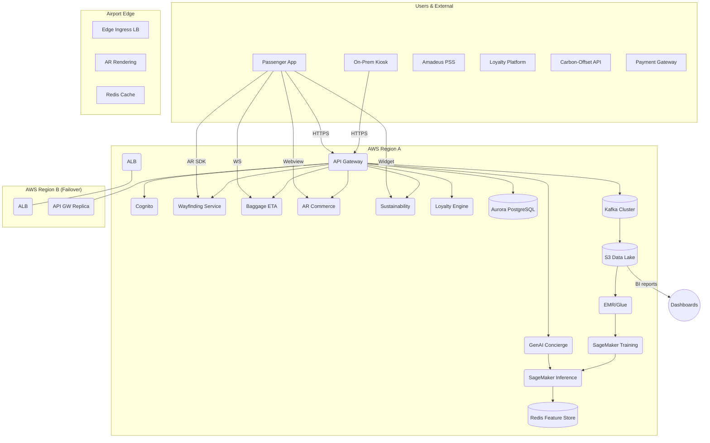

**Callouts:**

* **Edge Layer:** <50 ms local AR renders
* **Multi-Region HA:** Active–active with DNS failover
* **SLA Enforcement:** Probes, autoscaling, health checks on all services

---

## 3. Data & Control Flow

End-to-end journey for a GenAI concierge query, showing data ingestion, feature serving, model inference, and audit logging.

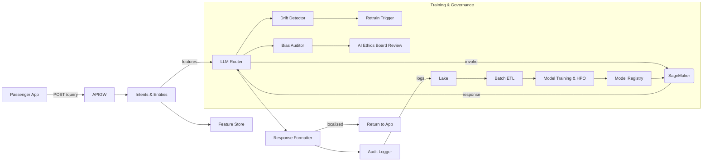

**Callouts:**

* **Traceability:** end-to-end correlation IDs
* **Governance:** automated drift/bias alerts
* **Retention:** Raw logs 7 d, features 30 d, models 365 d

---

## 4. Core Features Overview

For each feature: a combined mini-diagram plus bullet summary of modules, SLAs, and failovers.

### 4.1 GenAI Concierge

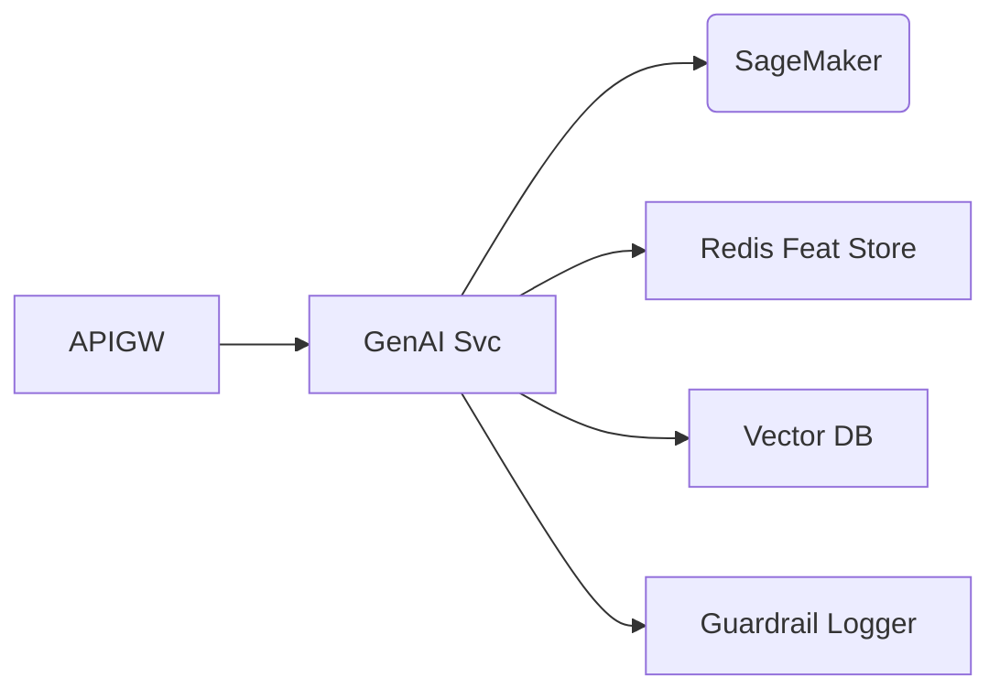

* **Modules:** Intent Parser, Vector Retriever, LLM Router, Response Formatter, Multilingual Middleware, Guardrail Logger
* **SLAs:** 95% requests <100 ms; 99.9% uptime
* **Resilience:** Circuit breakers, caching fallback (10 s)

### 4.2 AR Wayfinding

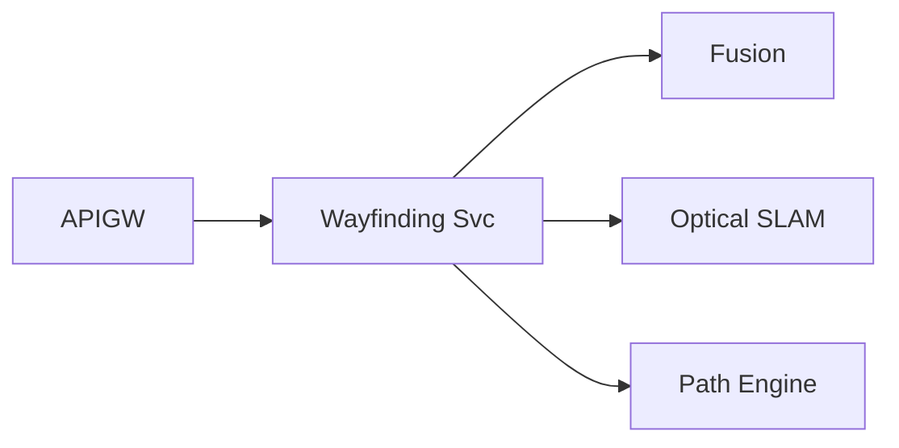

* **Modules:** Beacon Fusion, Optical SLAM, Path Engine, Route Formatter, Audit Logger
* **SLAs:** ≤5 s path compute; 99.5% accuracy
* **Fallback:** Vision-only on beacon loss

### 4.3 Baggage ETA

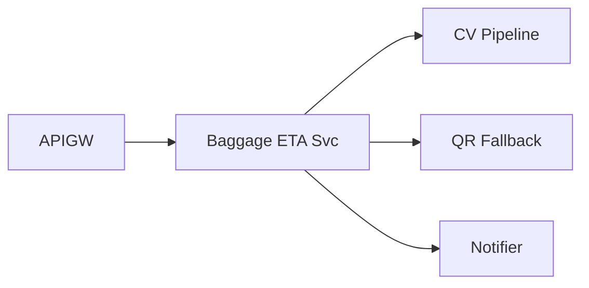

* **Modules:** Video Processor, QR Reader, ETA Calculator, Notification Service
* **SLAs:** 99% ETA within ±30 s
* **Fallback:** QR re-scan loops

### 4.4 AR Commerce

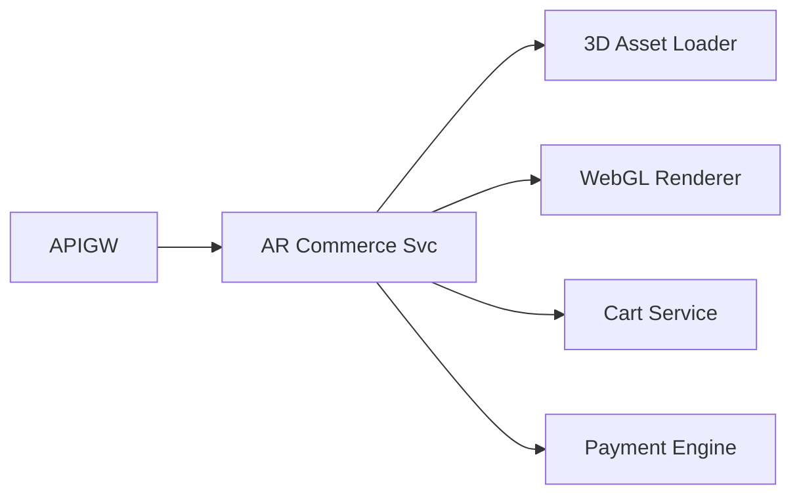

* **Modules:** Asset Loader, Renderer, Cart Manager, Payment SDK, Recommender
* **SLAs:** +12% basket size; cart persistence
* **Fallback:** Local storage on network issues

### 4.5 Sustainability

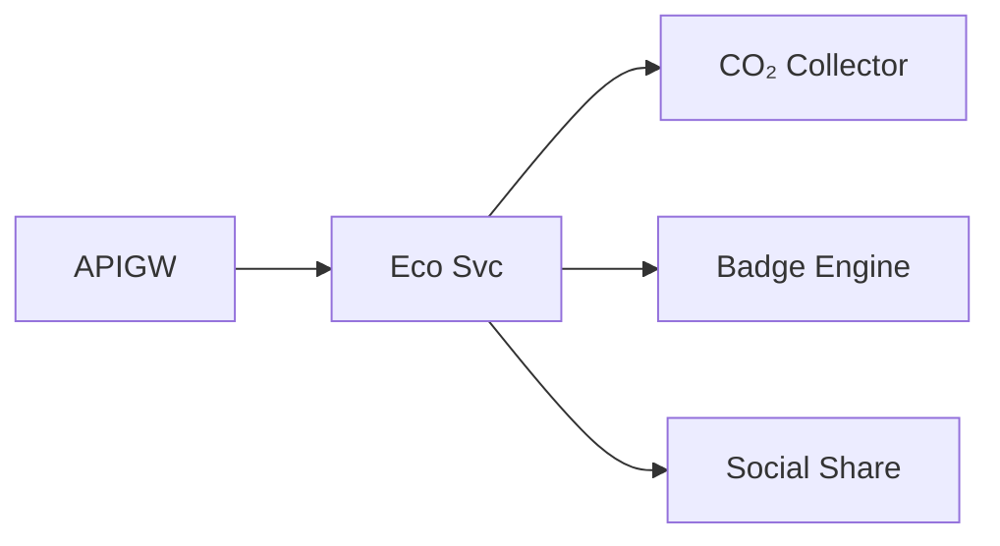

* **Modules:** CO₂ Collector, Badge Minting, Leaderboard, Social Share
* **SLAs:** 25% badge redemption
* **Fallback:** Cached offset data

---

## 5. Cross-Cutting Concerns

### 5.1 Security & Compliance

* **Zero-Trust:** mTLS, network policies
* **Key Management:** KMS/HSM flows embedded in services
* **Policy as Code:** OPA/GitHub Actions gates on GDPR/PDPL/AI-Act
* **Audit Trail:** WORM storage, blockchain anchoring

### 5.2 Network Topology

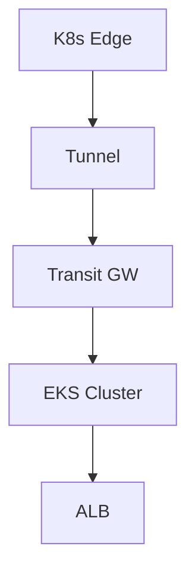

* <50 ms edge, <100 ms regional

### 5.3 CI/CD & Testing

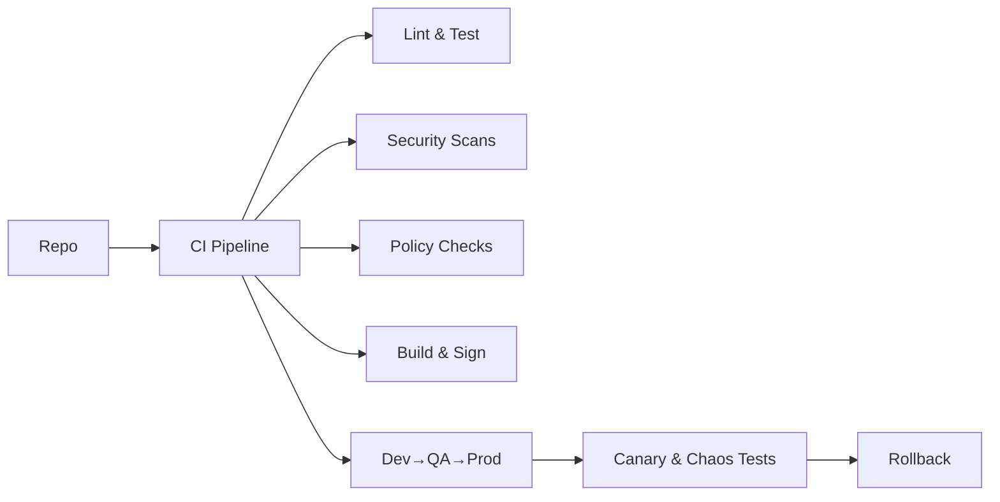

* Automated beacon & network failure tests

---

## 6. Appendices

### A. Full Sequence Diagrams

#### A.1 GenAI Concierge Query Flow

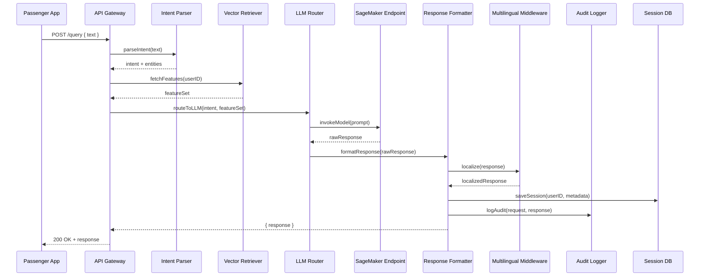

#### A.2 AR Wayfinding Request Flow

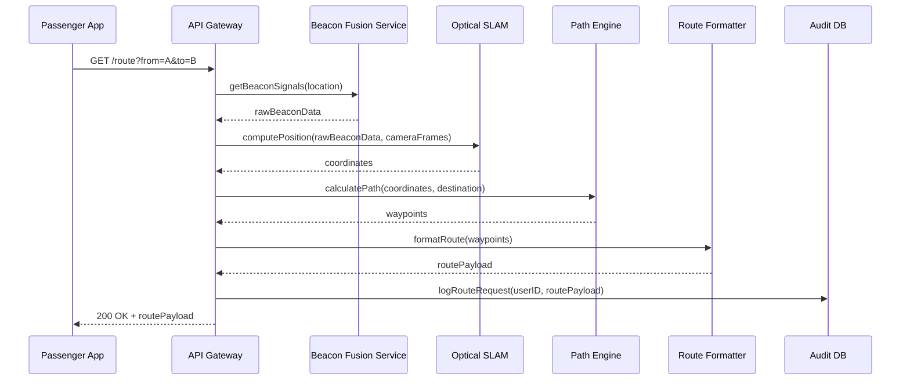

#### A.3 Baggage ETA Notification Flow

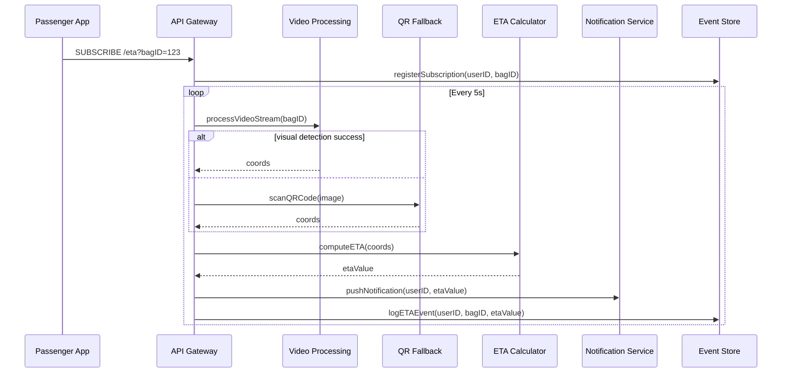

#### A.4 AR Commerce Purchase Flow

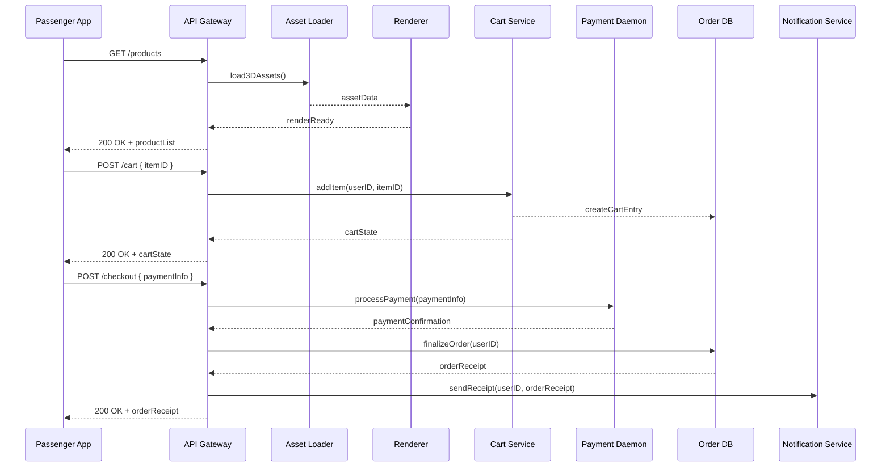

#### A.5 Sustainability Badge Issuance Flow

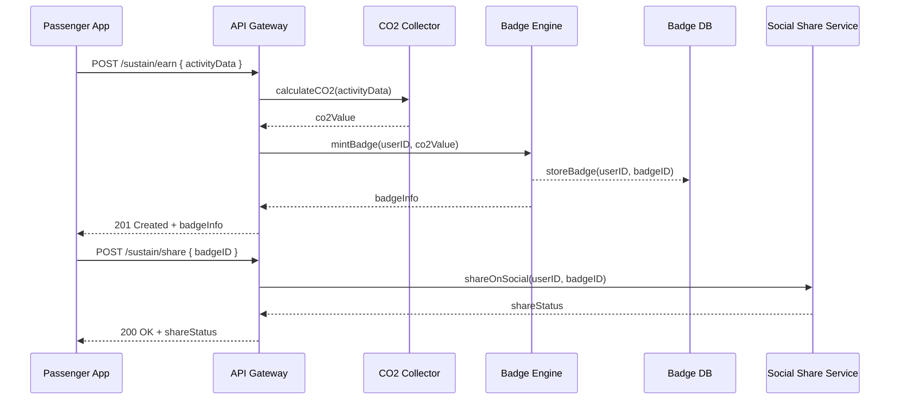
