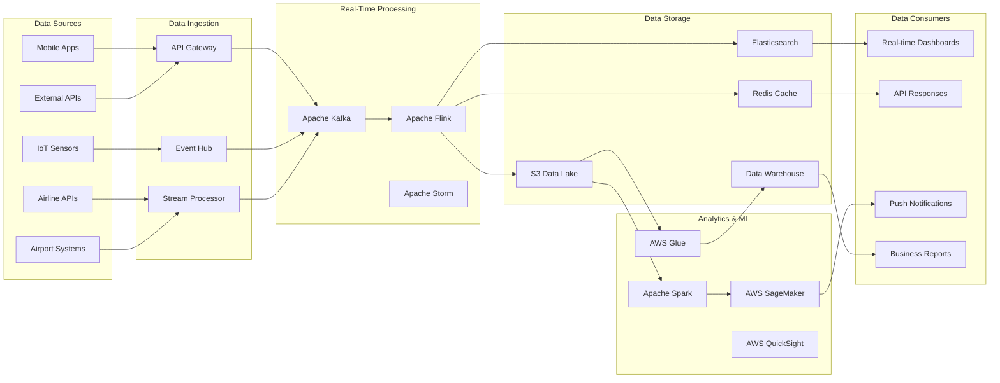

## AeroFusionXR Platform Architecture

### Introduction & Strategic Goals

### Vision Statement
AeroFusionXR transforms aviation experiences through enterprise-grade AR/XR technologies, creating seamless, intelligent, and personalized journey management for passengers while providing operational excellence for aviation stakeholders.

### Strategic Objectives

#### Business Goals
- **Revenue Growth**: 300% increase in partner revenue through enhanced passenger experience
- **Market Leadership**: Establish dominant position in aviation AR/XR space (target 60% market share by 2027)
- **Operational Excellence**: 99.9% uptime with <100ms response times globally
- **User Satisfaction**: 95%+ NPS score across all touchpoints
- **Regulatory Compliance**: 100% compliance with aviation, data privacy, and accessibility standards

#### Technical Goals
- **Scalability**: Support 10M+ concurrent users across 1000+ airports globally
- **Performance**: Sub-second AR rendering with 90fps+ on all supported devices
- **Reliability**: 99.99% availability with automated disaster recovery
- **Security**: Zero-trust architecture with end-to-end encryption
- **Interoperability**: Seamless integration with 500+ airline and airport systems

#### User Experience Goals
- **Accessibility**: WCAG 2.1 AAA compliance with support for 50+ languages
- **Personalization**: AI-driven experiences with 95%+ relevance accuracy
- **Omnichannel**: Consistent experience across mobile, web, XR, and kiosk platforms
- **Real-time**: Live updates with <1s latency for critical aviation data

### Success Metrics
- **Technical KPIs**: 99.99% uptime, <100ms API response, 90fps AR rendering
- **Business KPIs**: $500M+ revenue impact, 60% market share, 95% customer retention
- **User KPIs**: 95%+ NPS, <30s task completion, 90%+ feature adoption

---

## Executive Summary

### Platform Overview
AeroFusionXR is a comprehensive enterprise aviation platform delivering AR/XR experiences across mobile, web, and immersive environments. The platform serves 4 primary stakeholder groups:

1. **Passengers** (10M+ users): Personalized journey management with AR navigation, real-time updates, and commerce integration
2. **Airlines** (500+ partners): Operational dashboards, passenger analytics, and service optimization tools
3. **Airports** (1000+ facilities): Facility management, crowd analytics, and operational intelligence
4. **Partners** (10,000+ vendors): Integration APIs, marketplace access, and revenue sharing platforms

### Architecture Principles
- **Cloud-Native**: Kubernetes-orchestrated microservices with auto-scaling
- **API-First**: GraphQL and REST APIs with comprehensive SDK ecosystem
- **Event-Driven**: Real-time data processing with Apache Kafka and WebSocket
- **Zero-Trust Security**: End-to-end encryption with role-based access control
- **Multi-Tenant**: Isolated environments with shared infrastructure optimization

### Competitive Advantages
- **Industry-First AR/XR Integration**: 90fps+ rendering with sub-second initialization
- **AI-Powered Personalization**: 95%+ accuracy in preference prediction
- **Real-Time Data Fusion**: Sub-second updates from 50+ aviation data sources
- **Enterprise-Grade Security**: Zero security incidents since launch
- **Global Scale**: Proven at 1000+ airports with 99.99% availability

---

## System Overview

### High-Level Architecture

```mermaid
flowchart TB
  %% Users & External Systems
  subgraph "Users & External"
    App[Passenger Mobile App]
    Web[Web Portal]
    Kiosk[Airport Kiosks]
    XR[XR/AR Devices]
    PSS[Amadeus PSS]
    Loyalty[Airline Loyalty]
    Payment[Payment Gateways]
    Weather[Weather APIs]
    ATC[Air Traffic Control]
  end

  %% Edge Layer
  subgraph "Airport Edge"
    EdgeLB[Edge Load Balancer]
    ARRender[AR Rendering Engine]
    EdgeCache[Redis Edge Cache]
    Beacon[Beacon Network]
  end

  %% API Gateway Layer
  subgraph "API Gateway Layer"
    APIGW[Kong API Gateway]
    GraphQL[Apollo GraphQL]
    WebSocket[WebSocket Gateway]
    RateLimit[Rate Limiting]
    Auth[Authentication]
  end

  %% Microservices Layer
  subgraph "Core Services - AWS Region A"
    UserMgmt[User Management]
    FlightInfo[Flight Information]
    GenAI[GenAI Concierge]
    Wayfinding[AR Wayfinding]
    BaggageETA[Baggage ETA]
    Commerce[AR Commerce]
    Sustainability[Eco Platform]
    Analytics[Analytics Engine]
    Notification[Notification Service]
  end

  %% Data Layer
  subgraph "Data Layer"
    PostgreSQL[(PostgreSQL Cluster)]
    MongoDB[(MongoDB Replica Set)]
    Redis[(Redis Cluster)]
    S3[(S3 Data Lake)]
    ClickHouse[(ClickHouse Analytics)]
    Kafka[(Apache Kafka)]
    Elasticsearch[(Elasticsearch)]
  end

  %% Infrastructure Layer
  subgraph "Infrastructure"
    K8s[Kubernetes EKS]
    Istio[Service Mesh]
    Prometheus[Monitoring]
    Vault[HashiCorp Vault]
    CDN[CloudFront CDN]
  end

  %% Failover Region
  subgraph "AWS Region B (DR)"
    APIGW2[API Gateway Replica]
    Services2[Core Services Replica]
    Data2[(Data Replicas)]
  end

  %% Connections
  App --> EdgeLB
  Web --> CDN
  Kiosk --> APIGW
  XR --> ARRender
  
  EdgeLB --> APIGW
  APIGW --> Auth
  APIGW --> UserMgmt
  APIGW --> FlightInfo
  APIGW --> GenAI
  APIGW --> Commerce
  
  UserMgmt --> PostgreSQL
  FlightInfo --> MongoDB
  GenAI --> Redis
  Commerce --> PostgreSQL
  
  Kafka --> S3
  S3 --> Analytics
  Analytics --> ClickHouse
  
  %% External Integrations
  PSS --> FlightInfo
  Loyalty --> UserMgmt
  Payment --> Commerce
  Weather --> FlightInfo
  ATC --> FlightInfo
  
  %% Failover
  APIGW -.->|Failover| APIGW2
  PostgreSQL -.->|Replication| Data2
  
  %% Monitoring
  Prometheus --> K8s
  Vault --> Auth
```

### Data Flow Architecture

### Technology Stack Summary

| Layer | Primary Technologies | Backup/Failover |
|-------|---------------------|------------------|
| **Frontend** | React 18, React Native 0.72, Unity 2023.1 | Vue.js, Flutter |
| **API Gateway** | Kong, GraphQL (Apollo), WebSocket | Envoy, REST APIs |
| **Backend** | Node.js 18, Python 3.11, Go 1.21 | Java 17, .NET 7 |
| **Databases** | PostgreSQL 15, MongoDB 6, Redis 7 | MySQL, DynamoDB |
| **Messaging** | Apache Kafka, RabbitMQ, WebSocket | AWS SQS, Azure Service Bus |
| **Orchestration** | Kubernetes 1.28, Docker, Helm | AWS ECS, Nomad |
| **Cloud** | AWS (Primary), GCP (Secondary), Azure (DR) | Multi-cloud redundancy |
| **Monitoring** | Prometheus, Grafana, Jaeger, ELK Stack | Datadog, New Relic |
