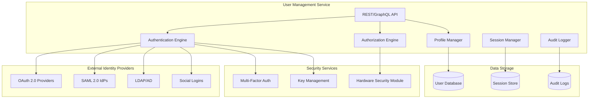
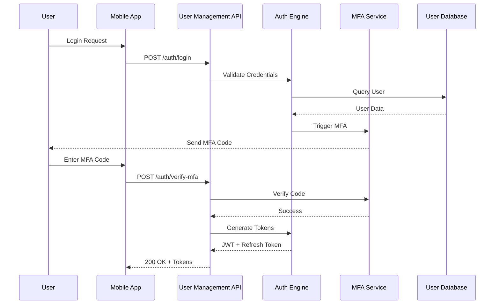
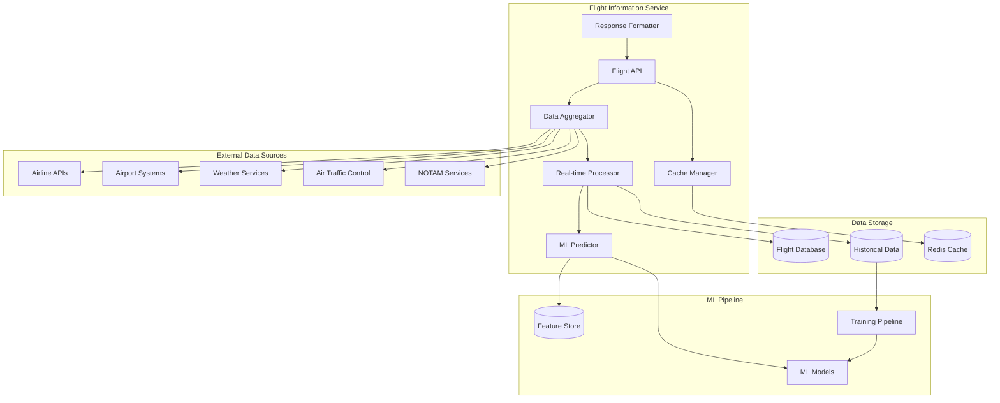
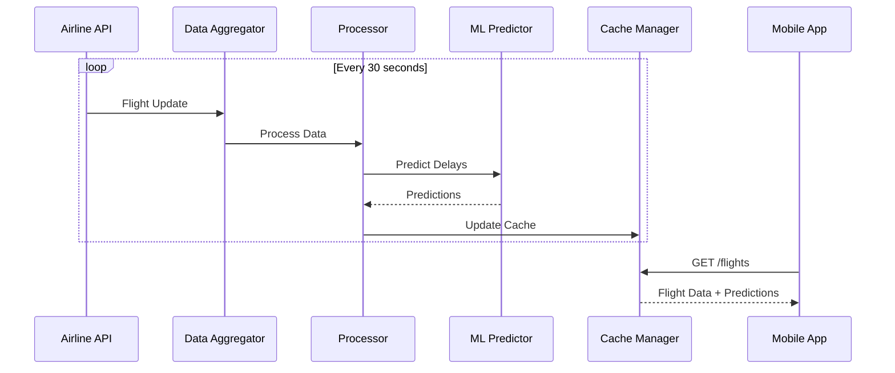
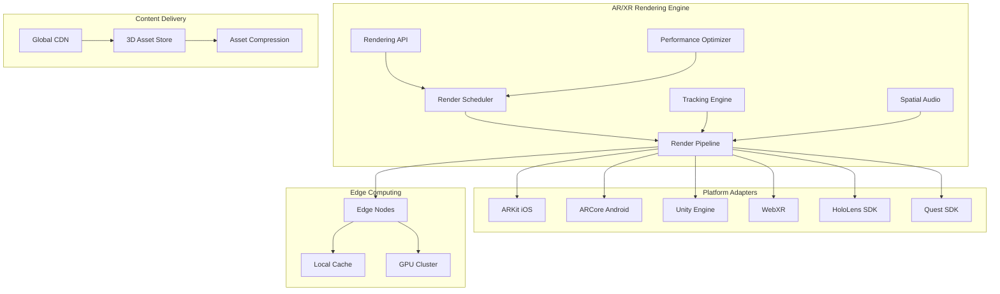
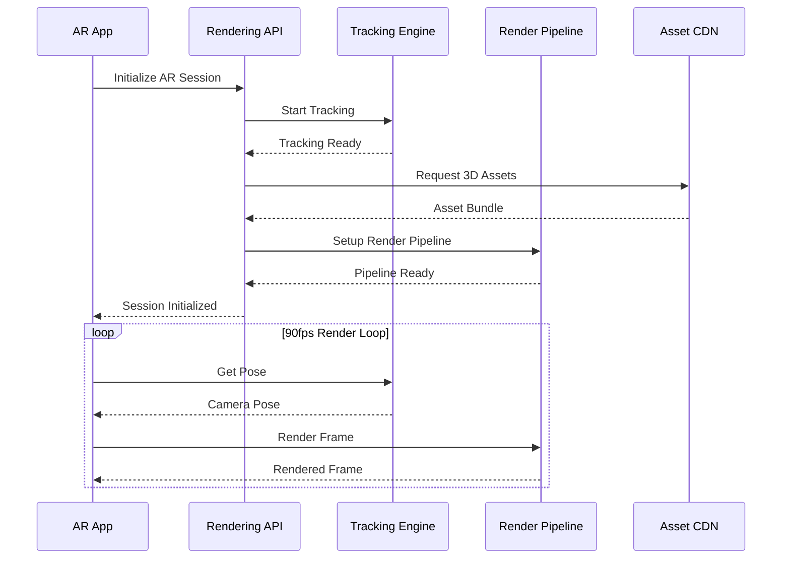
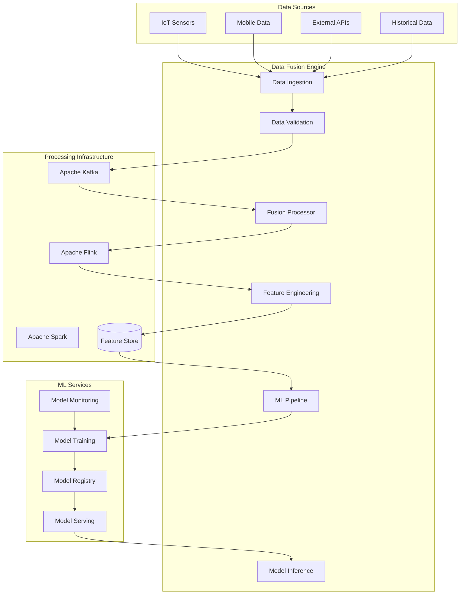
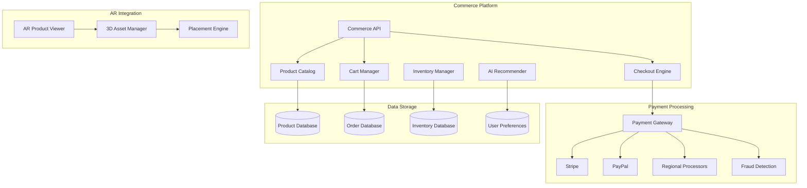
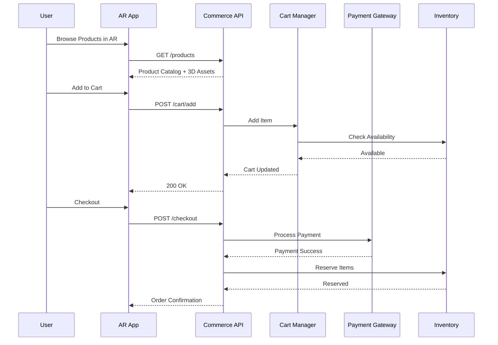
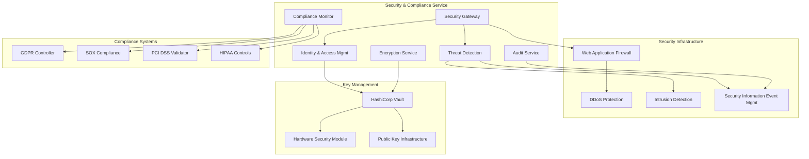

### 1. User Management Service

#### Business Purpose
Centralized identity and access management for all platform users with enterprise-grade security and compliance.

#### Service Architecture

#### Authentication Flow

#### SLAs & Performance
- **Availability**: 99.99% (52.6 minutes downtime/year)
- **Response Time**: <50ms for authentication, <100ms for authorization
- **Throughput**: 10,000 auth requests/second sustained
- **Recovery Time**: <5 minutes (automated failover)
- **Recovery Point**: <1 minute (real-time replication)

#### Failover Strategy
1. **Primary Failure**: Automatic failover to secondary region (AWS → GCP)
2. **Database Failure**: PostgreSQL streaming replication with 3 replicas
3. **Cache Failure**: Redis Cluster with automatic resharding
4. **Network Partition**: Circuit breaker pattern with graceful degradation

#### Integration Points
- External IdPs (LDAP, Active Directory, Okta, Azure AD)
- Biometric services (Face ID, Touch ID, fingerprint scanners)
- Audit systems (SIEM, compliance platforms)
- All internal microservices (authentication required)

#### Monitoring & Observability
- **Metrics**: Authentication success/failure rates, response times, concurrent sessions
- **Alerts**: Failed login attempts >100/min, response time >200ms, error rate >1%
- **Logging**: Structured JSON logs with correlation IDs and security events
- **Dashboards**: Real-time authentication metrics and security posture

### 2. Flight Information Service

#### Business Purpose
Real-time flight data aggregation and processing from 500+ airlines and 1000+ airports with predictive analytics.

#### Service Architecture

#### Data Processing Flow

#### SLAs & Performance
- **Availability**: 99.99% (flight-critical service)
- **Data Freshness**: <30 seconds for critical updates
- **Prediction Accuracy**: 90%+ for delay predictions
- **Throughput**: 1M flight updates/hour during peak
- **Response Time**: <100ms for flight queries

#### Failover Strategy
1. **Data Source Failure**: Automatic failover to backup providers
2. **Service Failure**: Blue-green deployment with zero downtime
3. **Database Failure**: Multi-master PostgreSQL with conflict resolution
4. **Cache Failure**: Distributed Redis with consistent hashing

#### Integration Points
- Airlines: SITA, ARINC, proprietary APIs
- Airports: AODB systems, gate management
- Weather: NOAA, AccuWeather, aviation weather services
- ATC: FAA SWIM, Eurocontrol, regional ATC systems

### 3. AR/XR Rendering Engine

#### Business Purpose
High-performance AR/XR rendering with 90fps+ across all supported devices and platforms.

#### Service Architecture

#### AR Session Flow

#### SLAs & Performance
- **Frame Rate**: 90fps minimum, 120fps target
- **Latency**: <20ms motion-to-photon
- **Initialization**: <1 second AR session start
- **Tracking Accuracy**: <5cm positional error
- **Battery Impact**: <20% additional drain on mobile

#### Failover Strategy
1. **Edge Node Failure**: Automatic CDN failover to nearest edge
2. **Rendering Failure**: Progressive quality degradation
3. **Tracking Loss**: IMU-based dead reckoning for 5 seconds
4. **Network Issues**: Local caching and offline mode

### 4. Data Fusion Engine

#### Service Architecture

#### SLAs & Performance
- **Processing Latency**: <1 second end-to-end
- **Throughput**: 1M events/second sustained
- **ML Inference**: <10ms model serving
- **Data Quality**: 99.9% accuracy threshold
- **Storage**: 5-year retention with automated archival

#### Failover Strategy
1. **Processing Failure**: Kafka replay with checkpointing
2. **ML Model Failure**: Fallback to previous model version
3. **Storage Failure**: Multi-zone replication with automatic recovery
4. **Network Partition**: Local buffering with eventual consistency

### 5. Commerce Platform

#### Business Purpose
Integrated e-commerce solution for aviation retail with real-time inventory and personalized recommendations.

#### Service Architecture

#### Purchase Flow

#### SLAs & Performance
- **Availability**: 99.99% (revenue-critical)
- **Transaction Speed**: <2 seconds checkout completion
- **Payment Success**: 99.5% authorization rate
- **Recommendation Response**: <100ms
- **Inventory Accuracy**: 99.9% real-time sync

#### Failover Strategy
1. **Payment Failure**: Automatic processor failover
2. **Inventory Sync**: Event-driven reconciliation
3. **Database Failure**: Read replicas with eventual consistency
4. **Regional Outage**: Cross-region traffic distribution

### 6. Security & Compliance Service

#### Business Purpose
Enterprise-grade security with zero-trust architecture and comprehensive compliance management.

#### Service Architecture

#### SLAs & Performance
- **Threat Detection**: <1 minute average detection time
- **Incident Response**: <15 minutes automated containment
- **Compliance Score**: 100% regulatory compliance
- **Security Audits**: Zero critical findings in annual audits
- **Vulnerability Management**: <24 hours for critical patches
