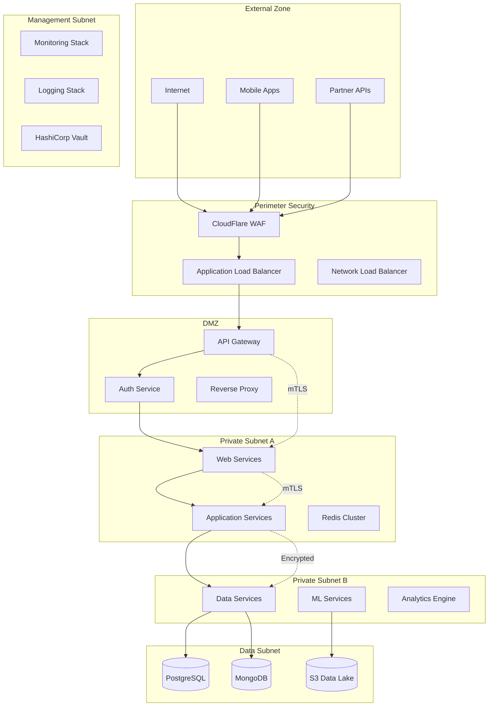
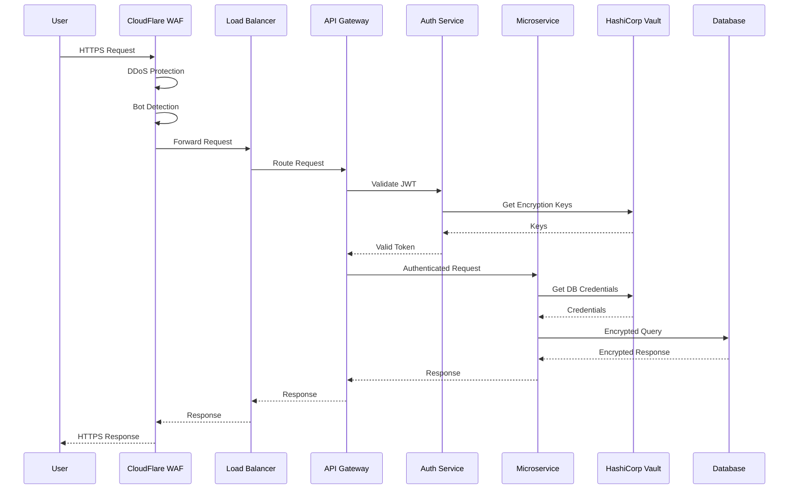
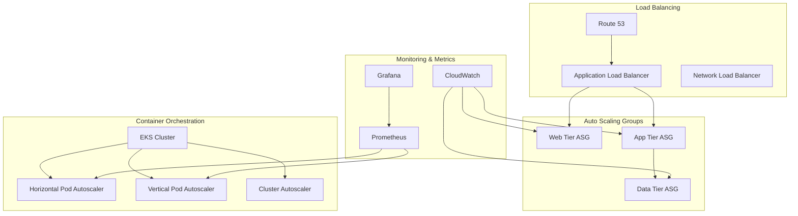
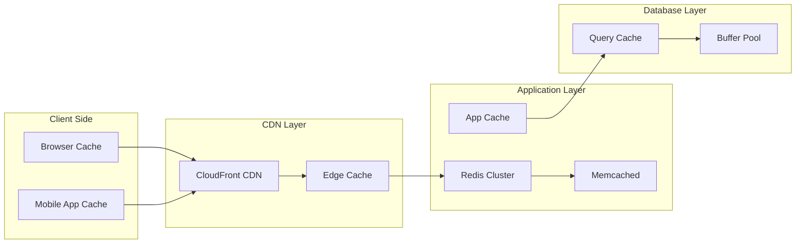

### Security Architecture

#### Zero-Trust Network Topology

```mermaid
flowchart TB
  subgraph "External Zone"
    Internet[Internet]
    Mobile[Mobile Apps]
    Partners[Partner APIs]
  end

  subgraph "Perimeter Security"
    CloudFlare[CloudFlare WAF]
    ALB[Application Load Balancer]
    NLB[Network Load Balancer]
  end

  subgraph "DMZ"
    APIGateway[API Gateway]
    Auth[Auth Service]
    ReverseProxy[Reverse Proxy]
  end

  subgraph "Private Subnet A"
    WebServices[Web Services]
    AppServices[Application Services]
    Cache[Redis Cluster]
  end

  subgraph "Private Subnet B"
    DataServices[Data Services]
    MLServices[ML Services]
    Analytics[Analytics Engine]
  end

  subgraph "Data Subnet"
    PostgreSQL[(PostgreSQL)]
    MongoDB[(MongoDB)]
    S3[(S3 Data Lake)]
  end

  subgraph "Management Subnet"
    Monitoring[Monitoring Stack]
    Logging[Logging Stack]
    Vault[HashiCorp Vault]
  end

  Internet --> CloudFlare
  Mobile --> CloudFlare
  Partners --> CloudFlare
  CloudFlare --> ALB
  ALB --> APIGateway
  APIGateway --> Auth
  Auth --> WebServices
  WebServices --> AppServices
  AppServices --> DataServices
  DataServices --> PostgreSQL
  DataServices --> MongoDB
  MLServices --> S3
  
  %% Security Controls
  APIGateway -.->|mTLS| WebServices
  WebServices -.->|mTLS| AppServices
  AppServices -.->|Encrypted| DataServices
```

#### Security Flow Diagram

```mermaid
sequenceDiagram
  participant User as User
  participant WAF as CloudFlare WAF
  participant LB as Load Balancer
  participant API as API Gateway
  participant Auth as Auth Service
  participant Service as Microservice
  participant Vault as HashiCorp Vault
  participant DB as Database

  User->>WAF: HTTPS Request
  WAF->>WAF: DDoS Protection
  WAF->>WAF: Bot Detection
  WAF->>LB: Forward Request
  LB->>API: Route Request
  API->>Auth: Validate JWT
  Auth->>Vault: Get Encryption Keys
  Vault-->>Auth: Keys
  Auth-->>API: Valid Token
  API->>Service: Authenticated Request
  Service->>Vault: Get DB Credentials
  Vault-->>Service: Credentials
  Service->>DB: Encrypted Query
  DB-->>Service: Encrypted Response
  Service-->>API: Response
  API-->>LB: Response
  LB-->>WAF: Response
  WAF-->>User: HTTPS Response
```

### Performance & Scalability

#### Auto-Scaling Architecture

```mermaid
flowchart TB
  subgraph "Load Balancing"
    ALB[Application Load Balancer]
    NLB[Network Load Balancer]
    DNS[Route 53]
  end

  subgraph "Auto Scaling Groups"
    ASG1[Web Tier ASG]
    ASG2[App Tier ASG]
    ASG3[Data Tier ASG]
  end

  subgraph "Container Orchestration"
    EKS[EKS Cluster]
    HPA[Horizontal Pod Autoscaler]
    VPA[Vertical Pod Autoscaler]
    CA[Cluster Autoscaler]
  end

  subgraph "Monitoring & Metrics"
    CW[CloudWatch]
    Prometheus[Prometheus]
    Grafana[Grafana]
  end

  DNS --> ALB
  ALB --> ASG1
  ALB --> ASG2
  ASG2 --> ASG3
  EKS --> HPA
  EKS --> VPA
  EKS --> CA
  CW --> ASG1
  CW --> ASG2
  CW --> ASG3
  Prometheus --> HPA
  Prometheus --> VPA
  Grafana --> Prometheus
```

#### Caching Strategy

```mermaid
flowchart LR
  subgraph "Client Side"
    Browser[Browser Cache]
    Mobile[Mobile App Cache]
  end

  subgraph "CDN Layer"
    CloudFront[CloudFront CDN]
    EdgeCache[Edge Cache]
  end

  subgraph "Application Layer"
    Redis[Redis Cluster]
    Memcached[Memcached]
    ApplicationCache[App Cache]
  end

  subgraph "Database Layer"
    QueryCache[Query Cache]
    BufferPool[Buffer Pool]
  end

  Browser --> CloudFront
  Mobile --> CloudFront
  CloudFront --> EdgeCache
  EdgeCache --> Redis
  Redis --> Memcached
  ApplicationCache --> QueryCache
  QueryCache --> BufferPool
```
