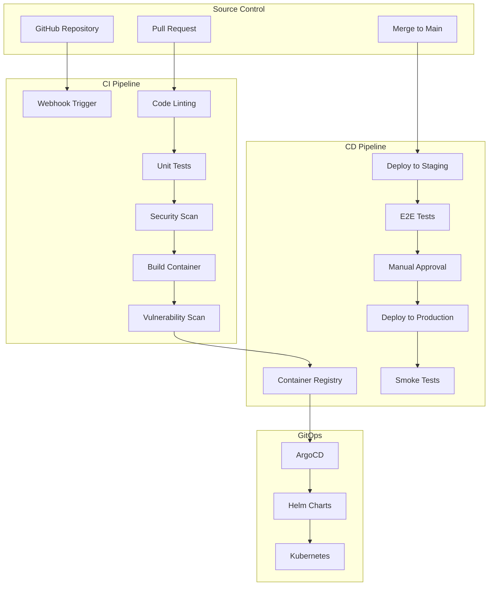
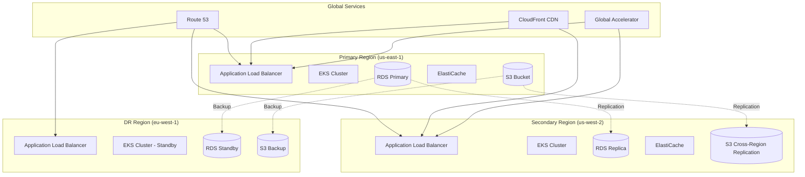
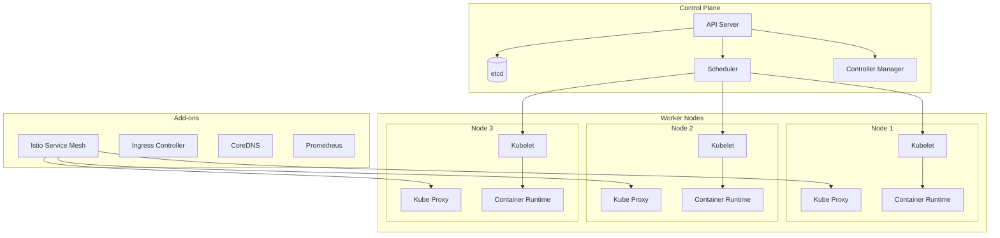

### CI/CD Pipeline Architecture

```mermaid
flowchart TB
  subgraph "Source Control"
    GitHub[GitHub Repository]
    PR[Pull Request]
    Merge[Merge to Main]
  end

  subgraph "CI Pipeline"
    Trigger[Webhook Trigger]
    Lint[Code Linting]
    Test[Unit Tests]
    Security[Security Scan]
    Build[Build Container]
    Scan[Vulnerability Scan]
  end

  subgraph "CD Pipeline"
    Registry[Container Registry]
    Staging[Deploy to Staging]
    E2E[E2E Tests]
    Approval[Manual Approval]
    Prod[Deploy to Production]
    Smoke[Smoke Tests]
  end

  subgraph "GitOps"
    ArgoCD[ArgoCD]
    Helm[Helm Charts]
    K8s[Kubernetes]
  end

  GitHub --> Trigger
  PR --> Lint
  Lint --> Test
  Test --> Security
  Security --> Build
  Build --> Scan
  Scan --> Registry
  Merge --> Staging
  Staging --> E2E
  E2E --> Approval
  Approval --> Prod
  Prod --> Smoke
  Registry --> ArgoCD
  ArgoCD --> Helm
  Helm --> K8s
```

### Multi-Region Deployment

```mermaid
flowchart TB
  subgraph "Primary Region (us-east-1)"
    ALB1[Application Load Balancer]
    EKS1[EKS Cluster]
    RDS1[(RDS Primary)]
    Cache1[ElastiCache]
    S31[(S3 Bucket)]
  end

  subgraph "Secondary Region (us-west-2)"
    ALB2[Application Load Balancer]
    EKS2[EKS Cluster]
    RDS2[(RDS Replica)]
    Cache2[ElastiCache]
    S32[(S3 Cross-Region Replication)]
  end

  subgraph "DR Region (eu-west-1)"
    ALB3[Application Load Balancer]
    EKS3[EKS Cluster - Standby]
    RDS3[(RDS Standby)]
    S33[(S3 Backup)]
  end

  subgraph "Global Services"
    Route53[Route 53]
    CloudFront[CloudFront CDN]
    GlobalAccelerator[Global Accelerator]
  end

  Route53 --> ALB1
  Route53 --> ALB2
  Route53 --> ALB3
  CloudFront --> ALB1
  CloudFront --> ALB2
  GlobalAccelerator --> ALB1
  GlobalAccelerator --> ALB2
  
  RDS1 -.->|Replication| RDS2
  RDS1 -.->|Backup| RDS3
  S31 -.->|Replication| S32
  S31 -.->|Backup| S33
```

### Kubernetes Architecture

```mermaid
flowchart TB
  subgraph "Control Plane"
    API[API Server]
    ETCD[(etcd)]
    Scheduler[Scheduler]
    Controller[Controller Manager]
  end

  subgraph "Worker Nodes"
    subgraph "Node 1"
      Kubelet1[Kubelet]
      Proxy1[Kube Proxy]
      Runtime1[Container Runtime]
    end
    subgraph "Node 2"
      Kubelet2[Kubelet]
      Proxy2[Kube Proxy]
      Runtime2[Container Runtime]
    end
    subgraph "Node 3"
      Kubelet3[Kubelet]
      Proxy3[Kube Proxy]
      Runtime3[Container Runtime]
    end
  end

  subgraph "Add-ons"
    Istio[Istio Service Mesh]
    Ingress[Ingress Controller]
    DNS[CoreDNS]
    Monitoring[Prometheus]
  end

  API --> ETCD
  API --> Scheduler
  API --> Controller
  Scheduler --> Kubelet1
  Scheduler --> Kubelet2
  Scheduler --> Kubelet3
  Kubelet1 --> Runtime1
  Kubelet2 --> Runtime2
  Kubelet3 --> Runtime3
  Istio --> Proxy1
  Istio --> Proxy2
  Istio --> Proxy3
```
