### A. Core User Journey Flows

#### A.1 GenAI Concierge Interaction Flow

#### A.2 AR Wayfinding Navigation Flow

#### A.3 Baggage Tracking with ETA Flow

#### A.4 AR Commerce Purchase Flow

#### A.5 Sustainability Badge Earning Flow

```mermaid
sequenceDiagram
  participant U as Passenger
  participant App as Mobile App
  participant APIGW as API Gateway
  participant Eco as Sustainability Service
  participant Carbon as Carbon Calculator
  participant Badge as Badge Engine
  participant Blockchain as Badge Blockchain
  participant Social as Social Sharing
  participant Leaderboard as Leaderboard Service

  U->>App: Complete Sustainable Action
  App->>APIGW: POST /sustainability/action { actionType, data }
  APIGW->>Eco: Process Sustainable Action
  Eco->>Carbon: Calculate CO2 Impact
  Carbon-->>Eco: CO2 Saved: 2.5kg
  Eco->>Badge: Check Badge Eligibility
  Badge-->>Eco: Eligible for "Green Traveler" Badge
  Eco->>Blockchain: Mint NFT Badge
  Blockchain-->>Eco: Badge Minted (TokenID: 12345)
  Eco->>Leaderboard: Update User Score
  Leaderboard-->>Eco: New Rank: #247
  Eco-->>APIGW: Badge Earned
  APIGW-->>App: Achievement Unlocked
  App-->>U: "🌱 Badge Earned: Green Traveler! You saved 2.5kg CO2"
  
  U->>App: Share Achievement
  App->>APIGW: POST /sustainability/share { badgeID }
  APIGW->>Social: Generate Share Content
  Social-->>APIGW: Share Link + Image
  APIGW-->>App: Share Ready
  App-->>U: Share on Social Media
```

### B. System Integration Flows

#### B.1 Real-Time Flight Data Synchronization

#### B.2 Multi-Service Health Check Flow

### C. Security and Compliance Flows

#### C.1 Zero-Trust Authentication Flow

