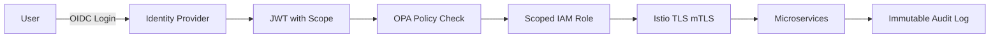

### Summary
Zero-trust architecture, HSM-based secure credentialing, end-to-end encryption, data classification, DPIA audit trail, red-team breach simulations, and compliance to GDPR, PDPL, ISO 27001, and ISO 42001 for Responsible AI.

### 1. Zero Trust Enforcement

| Principle             | Implementation                                                                       |
| --------------------- | ------------------------------------------------------------------------------------ |
| Identity Verification | OIDC with short-lived tokens, device attestation, and session fingerprint validation |
| Least Privilege       | RBAC per API, per method; scoped secrets via HashiCorp Vault                         |
| Network Controls      | K8s network policies, Istio mTLS, deny-by-default firewall policies                  |
| Policy-as-Code        | OPA/Gatekeeper policies for deploy, CI/CD, and runtime                               |

### 2. Encryption Strategy

| Data Type             | Encryption          | Tooling/Rotation               |
| --------------------- | ------------------- | ------------------------------ |
| At-Rest (PII, Logs)   | AES-256-GCM         | AWS KMS, Vault (30-day rotate) |
| In-Transit (All APIs) | TLS 1.3             | Istio Gateway, ACM             |
| Secrets/Keys          | HSM (FIPS 140-2 L3) | KMS-backed HSM                 |
| AI Models/Weights     | SHA-256, Cosign     | Rekor transparency log         |

### 3. Privacy Controls

* **Data subject request portal** (GDPR Article 15, 17)
* **Anonymization Engine**: k-Anonymity + Differential Privacy on reports
* **Consent-as-a-Service**: via Osano SDK integration and feature toggles
* **Automated DPIA pipeline** per use case with logs in `audit/dpia/`

### 4. Red-Team & Breach Simulations

| Scenario                      | Frequency | Tools Used           | Response SLA |
| ----------------------------- | --------- | -------------------- | ------------ |
| Token Theft Simulation        | Monthly   | Red Canary           | <15 min      |
| AR Session Injection          | Monthly   | BurpSuite/ZAP        | <10 min      |
| LLM Jailbreak (Prompt Attack) | Bi-weekly | Adversarial triggers | <5 min       |

### 5. Compliance Traceability Matrix

| Regulation | Compliance Feature                  | Logs/Artifacts                           |
| ---------- | ----------------------------------- | ---------------------------------------- |
| GDPR       | Consent, DSAR, Erasure APIs         | `logs/gdpr/`, `apis/userservice/openapi` |
| PDPL       | Residency, lawful basis, opt-out UI | Terraform, retention policy audit        |
| ISO 27001  | Asset register, access audit trail  | IAM logs, AWS Access Analyzer            |
| ISO 42001  | Explainability, fairness, DPO flows | `docs/RAI`, `logs/ethics/audits/`        |
