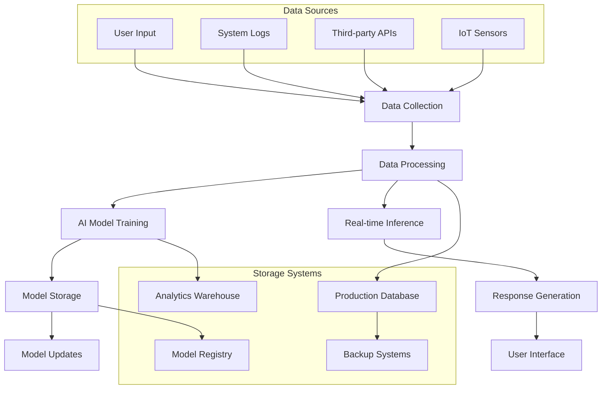

# Data Protection Impact Assessment (DPIA) Template

**Service/System Name**: [AI Service Name]  
**DPIA Version**: [e.g., v1.0]  
**Assessment Date**: [YYYY-MM-DD]  
**Assessor**: [Name and Role]  
**Review Date**: [YYYY-MM-DD]

---

## 1. Executive Summary

### 1.1 Purpose
Brief description of why this DPIA is being conducted and the AI system being assessed.

### 1.2 Key Findings
- **Risk Level**: [High/Medium/Low]
- **Compliance Status**: [Compliant/Requires Action/Non-Compliant]
- **Recommended Actions**: [Number] critical actions required

### 1.3 Approval Status
- [ ] **DPO Approval**: [Date] [Signature]
- [ ] **AI Ethics Board Approval**: [Date] [Signature]
- [ ] **Legal Review**: [Date] [Signature]

---

## 2. System Description

### 2.1 AI System Overview
- **System Name**: [e.g., AI Concierge, Recommendations Engine]
- **Purpose**: [Primary function and business objective]
- **Technology**: [ML framework, model type, architecture]
- **Deployment**: [Production/Staging/Development]
- **Users**: [Passengers, Staff, Airlines, etc.]

### 2.2 Data Processing Context
- **Processing Purpose**: [Specific data processing objectives]
- **Legal Basis**: [GDPR Article 6 basis for processing]
- **Special Categories**: [GDPR Article 9 if applicable]
- **Geographic Scope**: [UAE, EU, Global]
- **Data Controller**: AeroFusionXR
- **Data Processors**: [Third-party processors if any]

---

## 3. Data Inventory & Flow

### 3.1 Personal Data Categories

| Data Category | Examples | Source | Sensitivity | Retention |
|---------------|----------|--------|-------------|-----------|
| **Identity Data** | Name, passport number, nationality | User input, booking systems | High | 2 years |
| **Contact Data** | Email, phone, address | User registration | Medium | 2 years |
| **Behavioral Data** | App usage, preferences, interactions | System logs | Medium | 1 year |
| **Location Data** | GPS coordinates, beacon proximity | Mobile app, sensors | High | 30 days |
| **Biometric Data** | Voice patterns, facial recognition | AI processing | Very High | Immediate deletion |
| **Special Categories** | Health data, religious preferences | User disclosure | Very High | Explicit consent only |

### 3.2 Data Flow Mapping

### 3.3 Third-Party Data Sharing

| Recipient | Data Categories | Purpose | Legal Basis | Safeguards |
|-----------|-----------------|---------|-------------|------------|
| **Cloud Provider** | All encrypted data | Infrastructure hosting | Legitimate interest | DPA, encryption |
| **Analytics Partner** | Anonymized usage data | Performance optimization | Legitimate interest | Anonymization |
| **Security Vendor** | Log data | Threat detection | Legitimate interest | Limited access |

---

## 4. Risk Assessment

### 4.1 Privacy Risks

| Risk | Likelihood | Impact | Risk Level | Mitigation |
|------|------------|--------|------------|------------|
| **Unauthorized Access** | Medium | High | High | Access controls, encryption |
| **Data Breach** | Low | Very High | High | Security monitoring, incident response |
| **Profiling/Discrimination** | Medium | High | High | Bias testing, fairness controls |
| **Function Creep** | Medium | Medium | Medium | Purpose limitation, governance |
| **Vendor Risk** | Low | High | Medium | Vendor assessments, contracts |

### 4.2 Technical Risks

| Risk | Description | Likelihood | Impact | Mitigation |
|------|-------------|------------|--------|------------|
| **Model Bias** | AI system shows discriminatory behavior | Medium | High | Bias testing, diverse training data |
| **Data Poisoning** | Malicious data affects model performance | Low | High | Data validation, monitoring |
| **Model Inversion** | Attackers extract training data from model | Low | Very High | Differential privacy, access controls |
| **Adversarial Attacks** | Inputs designed to fool the AI system | Medium | Medium | Robustness testing, input validation |

### 4.3 Compliance Risks

| Regulation | Risk | Assessment | Mitigation |
|------------|------|------------|------------|
| **GDPR** | Non-compliance with data subject rights | Medium | Data subject portal, automated responses |
| **PDPL** | Violation of UAE data protection law | Low | Local data residency, consent management |
| **Aviation Regulations** | Safety/security violations | Low | Compliance monitoring, safety protocols |
| **EU AI Act** | High-risk AI system violations | Medium | Risk management system, human oversight |

---

## 5. Data Subject Rights

### 5.1 Rights Implementation

| Right | Implementation | Response Time | Automation Level |
|-------|----------------|---------------|------------------|
| **Right to Information** | Privacy notice, model cards | Immediate | Fully automated |
| **Right of Access** | Data export functionality | 30 days | Semi-automated |
| **Right to Rectification** | Profile update interface | 30 days | Manual process |
| **Right to Erasure** | Account deletion, data purging | 30 days | Semi-automated |
| **Right to Portability** | Data export in JSON/CSV | 30 days | Fully automated |
| **Right to Object** | Opt-out mechanisms | Immediate | Fully automated |

### 5.2 Consent Management

- **Consent Capture**: [Describe how consent is obtained]
- **Consent Storage**: [How consent records are maintained]
- **Consent Withdrawal**: [Process for withdrawing consent]
- **Consent Renewal**: [When and how consent is renewed]

---

## 6. Technical & Organizational Measures

### 6.1 Technical Safeguards

| Measure | Implementation | Effectiveness |
|---------|----------------|---------------|
| **Encryption at Rest** | AES-256 encryption for all stored data | High |
| **Encryption in Transit** | TLS 1.3 for all data transmission | High |
| **Access Controls** | RBAC with principle of least privilege | High |
| **Data Anonymization** | k-anonymity and differential privacy | Medium |
| **Audit Logging** | Comprehensive logging of all data access | High |
| **Data Minimization** | Only collect necessary data | High |

### 6.2 Organizational Safeguards

| Measure | Implementation | Effectiveness |
|---------|----------------|---------------|
| **Staff Training** | Regular privacy and security training | Medium |
| **Access Management** | Regular access reviews and updates | High |
| **Incident Response** | Defined procedures for data breaches | High |
| **Vendor Management** | Due diligence and contract controls | Medium |
| **Privacy by Design** | Privacy considerations in development | High |
| **Regular Audits** | Internal and external privacy audits | High |

---

## 7. AI-Specific Considerations

### 7.1 Algorithmic Transparency

- **Model Explainability**: [How decisions are explained to users]
- **Algorithm Disclosure**: [What information is provided about the AI system]
- **Decision Logic**: [How automated decision-making works]
- **Human Review**: [When human intervention is available]

### 7.2 Bias and Fairness

- **Bias Testing**: [Methods used to detect bias]
- **Fairness Metrics**: [Specific metrics monitored]
- **Mitigation Strategies**: [How bias is addressed]
- **Monitoring**: [Ongoing bias monitoring procedures]

### 7.3 Automated Decision-Making

- **Scope**: [What decisions are fully automated]
- **Legal Basis**: [Justification for automated decisions]
- **Safeguards**: [Protections for data subjects]
- **Appeal Process**: [How decisions can be challenged]

---

## 8. International Transfers

### 8.1 Transfer Mechanisms

| Destination | Data Categories | Legal Basis | Safeguards |
|-------------|-----------------|-------------|------------|
| **EU** | All personal data | Adequacy decision | GDPR compliance |
| **US** | Cloud storage data | Standard Contractual Clauses | DPA, encryption |
| **Other** | Limited operational data | Legitimate interest | Case-by-case assessment |

### 8.2 Transfer Safeguards

- **Standard Contractual Clauses**: [Details of SCCs used]
- **Binding Corporate Rules**: [If applicable]
- **Adequacy Decisions**: [Reliance on adequacy decisions]
- **Derogations**: [Specific derogations used]

---

## 9. Monitoring & Review

### 9.1 Ongoing Monitoring

| Metric | Frequency | Threshold | Action |
|--------|-----------|-----------|--------|
| **Data Access Logs** | Daily | Unusual patterns | Investigation |
| **Consent Rates** | Weekly | <80% | Review consent process |
| **Data Subject Requests** | Monthly | >10/month | Process review |
| **Bias Metrics** | Daily | >5% variance | Model review |

### 9.2 Review Schedule

- **DPIA Review**: Every 6 months or when significant changes occur
- **Risk Assessment**: Quarterly review of risk levels
- **Compliance Check**: Annual comprehensive compliance review
- **Stakeholder Consultation**: As needed for significant changes

---

## 10. Consultation & Approval

### 10.1 Stakeholder Consultation

| Stakeholder | Consultation Date | Feedback | Resolution |
|-------------|-------------------|----------|------------|
| **Data Subjects** | [Date] | [Summary] | [How addressed] |
| **DPO** | [Date] | [Summary] | [How addressed] |
| **AI Ethics Board** | [Date] | [Summary] | [How addressed] |
| **Legal Team** | [Date] | [Summary] | [How addressed] |

### 10.2 Supervisory Authority

- **Consultation Required**: [Yes/No - if high risk]
- **Authority Contacted**: [Which supervisory authority]
- **Consultation Date**: [When consultation occurred]
- **Authority Response**: [Summary of response]
- **Follow-up Actions**: [Required actions]

---

## 11. Action Plan

### 11.1 Immediate Actions (0-30 days)

| Action | Owner | Due Date | Status |
|--------|-------|----------|--------|
| [Action 1] | [Owner] | [Date] | [ ] |
| [Action 2] | [Owner] | [Date] | [ ] |

### 11.2 Short-term Actions (1-6 months)

| Action | Owner | Due Date | Status |
|--------|-------|----------|--------|
| [Action 1] | [Owner] | [Date] | [ ] |
| [Action 2] | [Owner] | [Date] | [ ] |

### 11.3 Long-term Actions (6+ months)

| Action | Owner | Due Date | Status |
|--------|-------|----------|--------|
| [Action 1] | [Owner] | [Date] | [ ] |
| [Action 2] | [Owner] | [Date] | [ ] |

---

## 12. Conclusion & Recommendation

### 12.1 Overall Assessment
[Summary of the overall privacy risk and compliance status]

### 12.2 Recommendation
- [ ] **Proceed** - Low risk, adequate safeguards
- [ ] **Proceed with Conditions** - Medium risk, additional measures required
- [ ] **Do Not Proceed** - High risk, fundamental issues must be addressed

### 12.3 Next Steps
[Specific next steps and timeline for implementation]

---

## 13. Appendices

### Appendix A: Legal Basis Analysis
[Detailed analysis of legal basis for processing]

### Appendix B: Technical Architecture
[Technical details of data processing systems]

### Appendix C: Vendor Assessments
[Due diligence reports for third-party processors]

### Appendix D: Consultation Records
[Detailed records of stakeholder consultations]

---

**Document Control**  
**Owner**: Data Protection Officer  
**Approved By**: AI Ethics Board  
**Next Review**: [Date + 6 months]  
**Classification**: Confidential 