# 🏗️ AeroFusionXR Services Architecture

## 🎯 Overview
Welcome to the AeroFusionXR microservices ecosystem! This directory contains all services organized by business domains in a 3-tier hierarchical architecture designed for scalability, maintainability, and clear separation of concerns.

## 🏛️ Architecture Hierarchy

```
services/
├── 🎯 core/           # Mission-critical services (8 services)
├── 🔧 supporting/     # Business-critical services (9 services)
└── 🌐 platform/       # Infrastructure services (9 services)
```

## 🎯 **CORE SERVICES** - Mission Critical
*The heart of AeroFusionXR - primary passenger-facing services that deliver core business value*

### **Passenger Experience Domain** (4 services)
- **AI Concierge** - Central AI intelligence hub
- **Wayfinding Platform** - Navigation and routing
- **Baggage Tracker** - Real-time baggage tracking  
- **Flight Info** - Flight status and updates

### **Commerce Domain** (4 services)
- **Booking** - Reservations and bookings
- **Commerce** - E-commerce platform
- **AR Wayfinding** - AR Commerce experiences
- **MR Collaborative Shopping** - Mixed reality shopping

---

## 🔧 **SUPPORTING SERVICES** - Business Critical
*Essential services that enable and enhance core functionality*

### **User Management Domain** (3 services)
- **User Profile** - User data and preferences
- **Payment Checkout** - Payment processing
- **Loyalty Rewards** - Loyalty program management

### **Operations Domain** (3 services)
- **Equipment Registry** - Airport equipment tracking
- **Maintenance SOP** - Maintenance procedures
- **Customer Support** - Help desk and support

### **Experience Enhancement Domain** (3 services)
- **Voice Guidance** - Voice-based assistance
- **Recommendations Engine** - Personalized suggestions
- **MR Concierge** - Mixed reality concierge

---

## 🌐 **PLATFORM SERVICES** - Infrastructure
*Foundation services that support the entire ecosystem*

### **Infrastructure Domain** (4 services)
- **API Gateway** - API routing and security
- **Notifications** - Messaging and alerts
- **Offline Sync** - Data synchronization
- **Monitoring Observability** - System monitoring

### **Shared Services Domain** (5 services)
- **Localization** - Multi-language support
- **Localization I18N** - Internationalization
- **Dashboard Analytics** - Business intelligence
- **Catalog Backend** - Product/service catalog
- **Config** - Configuration management

## 📊 Service Dependencies

```mermaid
graph TB
    subgraph "🎯 CORE SERVICES"
        A[Passenger Experience]
        B[Commerce]
    end
    
    subgraph "🔧 SUPPORTING SERVICES"
        C[User Management]
        D[Operations]
        E[Experience Enhancement]
    end
    
    subgraph "🌐 PLATFORM SERVICES"
        F[Infrastructure]
        G[Shared Services]
    end
    
    A --> C
    A --> E
    A --> F
    A --> G
    
    B --> C
    B --> F
    B --> G
    
    C --> F
    D --> F
    E --> F
```



## 🚀 Getting Started

### Quick Navigation
- **[Core Services →](./core/README.md)** - Mission-critical passenger services
- **[Supporting Services →](./supporting/README.md)** - Business-critical enablers
- **[Platform Services →](./platform/README.md)** - Infrastructure foundation

### Development Workflow
1. **New Feature Development**: Start with core services
2. **Infrastructure Changes**: Begin with platform services
3. **User Experience**: Enhance through supporting services

### Deployment Strategy
- **Core services**: High availability, auto-scaling
- **Supporting services**: Business hours scaling
- **Platform services**: Always-on infrastructure

## 📈 Service Scaling Priorities

### **Priority 1: Core Services**
- Always-on, high availability (99.9%+)
- Auto-scaling based on demand
- Real-time monitoring and alerting

### **Priority 2: Supporting Services**
- Business hours optimization
- Moderate scaling requirements
- Standard monitoring

### **Priority 3: Platform Services**
- Infrastructure-level availability
- Shared resource optimization
- System-level monitoring

## 🛠️ Development Guidelines

### **Service Ownership**
- **Core**: Product teams
- **Supporting**: Feature teams  
- **Platform**: Infrastructure teams

### **Technology Stack**
- **Languages**: TypeScript, Python, Node.js
- **Databases**: MongoDB, Redis
- **Communication**: REST APIs, WebSockets, gRPC
- **Monitoring**: OpenTelemetry, Prometheus

### **Deployment**
- **Containerization**: Docker
- **Orchestration**: Kubernetes
- **CI/CD**: GitHub Actions
- **Service Mesh**: Istio

## 📚 Documentation Structure

Each service directory contains:
- `README.md` - Service-specific documentation
- `API.md` - API documentation
- `DEPLOYMENT.md` - Deployment instructions
- `TROUBLESHOOTING.md` - Common issues and solutions

## 🔗 Quick Links

- **[Architecture Decision Records (ADRs)](../docs/adr/)**
- **[API Gateway Documentation](./platform/infrastructure/api-gateway/README.md)**
- **[Deployment Guide](../docs/deployment/)**
- **[Monitoring Dashboard](../docs/monitoring/)**

## 🤝 Contributing

1. Choose appropriate service tier for your feature
2. Follow domain-specific guidelines
3. Ensure cross-service compatibility
4. Update relevant documentation

---

*This architecture enables AeroFusionXR to scale efficiently while maintaining clear separation of concerns and enabling autonomous team development.* 