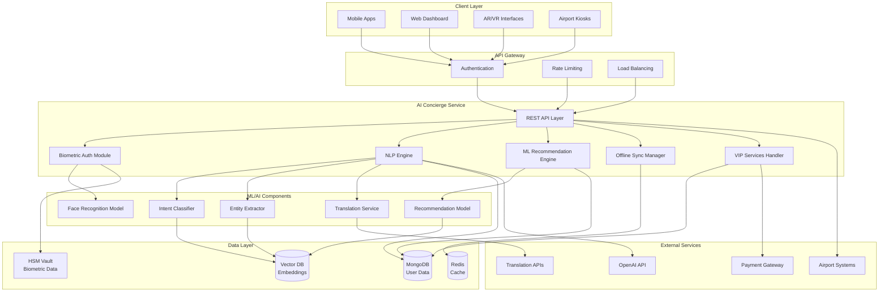
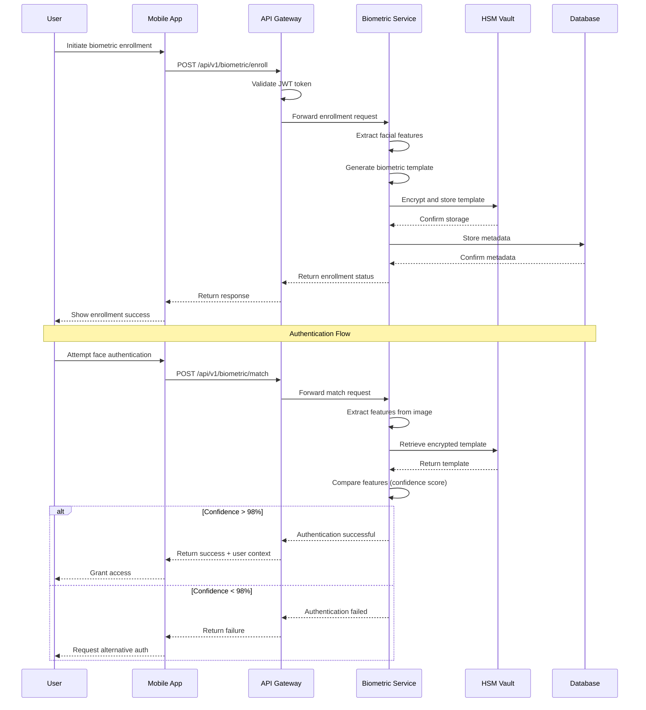
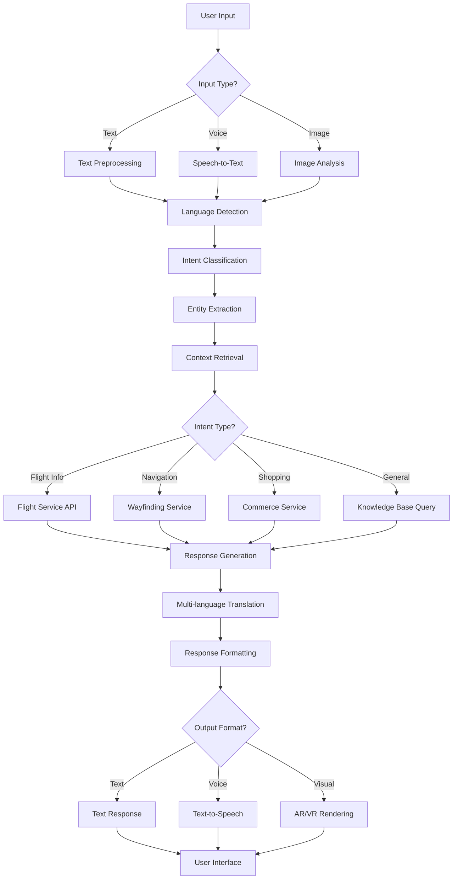

# AI Concierge Service

## Overview
The AI Concierge Service is the central intelligence hub of AeroFusionXR, providing personalized AI-powered assistance, biometric authentication, multilingual support, and seamless integration across all airport services. This service combines advanced machine learning, natural language processing, and computer vision to deliver exceptional passenger experiences.

## 🚀 Key Features

### 1. **Biometric & Touchless Services**
**Complete touchless experience with facial recognition and biometric authentication**

- **Face Boarding**: Automatic gate access via facial recognition (≤500ms, ≥98% confidence)
- **Lounge Entry**: Membership verification and access control
- **Touchless Valet**: Vehicle retrieval via face + license plate recognition
- **Security Pre-Clearance**: Fast-track security lane access
- **Biometric Payment**: Duty-free purchases via facial recognition
- **Privacy & Opt-Out**: GDPR-compliant data deletion (24-hour secure wiping)

**Technical Specs**:
- AES-256-GCM encryption for template storage
- TLS 1.3 with certificate pinning
- HSM-backed secure vault
- 99.9% system availability
- 200 requests/sec peak capacity

### 2. **Offline-First Architecture**
**Seamless operation during network disruptions**

- **Local Data Sync**: Critical data cached locally with 24-hour offline capability
- **Progressive Sync**: Automatic data synchronization when connectivity restored
- **Conflict Resolution**: Intelligent merge strategies for offline changes
- **Fallback Services**: Core functionality maintained during outages

### 3. **Multilingual AI Assistant**
**Natural language processing in 15+ languages**

- **Real-time Translation**: Instant translation for passenger queries
- **Cultural Context**: Culturally-aware responses and recommendations
- **Voice Recognition**: Multi-accent speech processing
- **Text-to-Speech**: Natural voice synthesis in multiple languages

### 4. **Personalized Recommendations**
**ML-powered personalized suggestions**

- **Behavioral Analysis**: Learning from passenger preferences and history
- **Contextual Offers**: Location and time-aware recommendations
- **Dynamic Pricing**: Real-time price optimization
- **Cross-selling**: Intelligent upselling based on passenger profile

### 5. **VIP & Premium Services**
**Enhanced services for premium passengers**

- **Priority Routing**: Expedited pathways and services
- **Concierge Booking**: Personal assistant for reservations and requests
- **Exclusive Access**: Premium lounge and facility access
- **Custom Preferences**: Personalized service configurations

## ��️ Architecture

### **Service Architecture Overview**



### **Biometric Authentication Flow**



### **AI Conversation Processing**



### Service Structure
```
ai-concierge/
├── src/
│   ├── routes/           # API endpoints
│   │   ├── biometricRoutes.ts    # Biometric authentication
│   │   ├── vipRoutes.ts          # VIP services
│   │   ├── kioskRoutes.ts        # Kiosk integration
│   │   └── baggageRoutes.ts      # Baggage assistance
│   ├── services/         # Core business logic
│   │   ├── BiometricAuthService.ts
│   │   ├── MLRecommendationService.ts
│   │   └── OfflineSyncService.ts
│   ├── handlers/         # ML pipeline handlers
│   ├── pipelines/        # Data processing pipelines
│   └── utils/           # Shared utilities
├── tests/               # Test suites
├── app.py              # Python Flask application
├── main.py             # Main service entry point
└── requirements.txt    # Python dependencies
```

### Technology Stack
- **Backend**: Python Flask + TypeScript Node.js
- **ML/AI**: TensorFlow, PyTorch, OpenAI GPT
- **Database**: MongoDB, Redis (caching)
- **Authentication**: JWT, OAuth 2.0, Biometric templates
- **Communication**: WebSocket, REST API, gRPC
- **Monitoring**: OpenTelemetry, Prometheus metrics

## 📡 API Endpoints

### Biometric Services
```http
POST /api/v1/biometric/enroll          # Enroll biometric template
POST /api/v1/biometric/match           # Face matching
POST /api/v1/biometric/authorize/:context  # Context-aware authorization
GET  /api/v1/biometric/status/:userID  # User biometric status
POST /api/v1/biometric/consent         # Consent management
DELETE /api/v1/biometric/template/:userID  # Template deletion
```

### AI Assistant
```http
POST /api/v1/chat/message              # Natural language queries
GET  /api/v1/chat/history/:sessionID   # Conversation history
POST /api/v1/translate                 # Real-time translation
POST /api/v1/recommendations           # Personalized suggestions
```

### VIP Services
```http
GET  /api/v1/vip/profile/:userID       # VIP profile and preferences
POST /api/v1/vip/request               # Concierge service requests
GET  /api/v1/vip/services              # Available premium services
POST /api/v1/vip/booking               # Premium service booking
```

### Offline Sync
```http
POST /api/v1/sync/upload               # Upload offline changes
GET  /api/v1/sync/download             # Download latest data
GET  /api/v1/sync/status               # Sync status and conflicts
```

## 🔧 Configuration

### Environment Variables
```bash
# Service Configuration
SERVICE_NAME=ai-concierge
PORT=8000
NODE_ENV=production

# AI/ML Configuration
OPENAI_API_KEY=your_openai_key
MODEL_REGISTRY_URL=http://model-registry:8000
FEATURE_STORE_URL=http://feature-store:8000

# Database Configuration
MONGODB_URI=mongodb://mongodb:27017/ai_concierge
REDIS_URL=redis://redis:6379

# Security Configuration
JWT_SECRET=your_jwt_secret
BIOMETRIC_ENCRYPTION_KEY=your_encryption_key

# External Integrations
TRANSLATION_API_KEY=your_translation_key
PAYMENT_GATEWAY_URL=https://payment-gateway/api
```

### Performance Tuning
```yaml
# Resource Limits
memory_limit: 2GB
cpu_limit: 1000m
replicas: 3

# Caching Strategy
redis_ttl: 300s
local_cache_size: 100MB
offline_cache_duration: 24h

# ML Model Configuration
model_batch_size: 32
inference_timeout: 5s
model_refresh_interval: 1h
```

## 🚀 Getting Started

### Prerequisites
- Node.js 18+
- Python 3.9+
- MongoDB 5.0+
- Redis 6.0+

### Installation
```bash
# Install dependencies
npm install
pip install -r requirements.txt

# Build TypeScript
npm run build

# Start service
npm run start
# OR for development
npm run dev
```

### Docker Deployment
```bash
# Build image
docker build -t ai-concierge .

# Run container
docker run -p 8000:8000 \
  -e MONGODB_URI=mongodb://localhost:27017/ai_concierge \
  -e REDIS_URL=redis://localhost:6379 \
  ai-concierge
```

## 🧪 Testing

### Unit Tests
```bash
npm run test              # Run all tests
npm run test:unit         # Unit tests only
npm run test:integration  # Integration tests
npm run test:coverage     # Coverage report
```

### API Testing
```bash
# Health check
curl http://localhost:8000/health

# Biometric enrollment
curl -X POST http://localhost:8000/api/v1/biometric/enroll \
  -H "Content-Type: application/json" \
  -d '{"userID": "test_user", "encryptedTemplate": "..."}'
```

## 📊 Monitoring & Analytics

### Metrics Collected
- **Performance**: Response times, throughput, error rates
- **Biometric**: Match confidence, success rates, failure analysis
- **AI**: Model accuracy, inference latency, recommendation CTR
- **Business**: User engagement, service utilization, revenue impact

### Health Checks
- **Service Health**: `/health` endpoint
- **Database Connectivity**: MongoDB and Redis status
- **ML Model Status**: Model loading and inference capability
- **External Dependencies**: API connectivity and response times

### Alerting
- Response time > 5 seconds
- Error rate > 1%
- Biometric match confidence < 95%
- Offline sync failures
- Resource utilization > 80%

## 🔒 Security & Privacy

### Data Protection
- **Encryption**: AES-256-GCM for biometric templates
- **Communication**: TLS 1.3 with certificate pinning
- **Storage**: HSM-backed secure vault for sensitive data
- **Access Control**: Role-based permissions and audit logging

### Privacy Compliance
- **GDPR**: Right to be forgotten, data portability
- **UAE PDPL**: Local data protection compliance
- **ICAO Standards**: Biometric data handling standards
- **Consent Management**: Granular consent tracking and management

### Security Features
- **Rate Limiting**: API endpoint protection
- **Input Validation**: Comprehensive request sanitization
- **Authentication**: Multi-factor authentication support
- **Audit Logging**: Complete activity tracking

## 🔄 Integration Points

### Internal Services
- **Wayfinding Platform**: Location-aware recommendations
- **Baggage Tracker**: Baggage status and notifications
- **Flight Info**: Real-time flight updates and alerts
- **Commerce**: Personalized shopping recommendations
- **User Profile**: Passenger preferences and history

### External Systems
- **Emirates Pay**: Payment processing integration
- **Immigration Systems**: Security pre-clearance
- **Lounge Access Control**: Membership verification
- **Airport Operations**: Real-time facility status

## 📈 Performance Benchmarks

### Response Times
- **Biometric Match**: ≤800ms end-to-end
- **AI Chat Response**: ≤2s for complex queries
- **Recommendations**: ≤500ms for personalized results
- **Translation**: ≤1s for real-time translation

### Scalability
- **Concurrent Users**: 10,000+ simultaneous sessions
- **Requests/Second**: 1,000+ peak capacity
- **Data Processing**: 1M+ biometric templates
- **ML Inference**: 100+ predictions/second

## 🛠️ Development

### Code Quality
- **TypeScript**: Strict mode enabled
- **ESLint**: Airbnb configuration
- **Prettier**: Code formatting
- **Husky**: Pre-commit hooks

### CI/CD Pipeline
- **Testing**: Automated unit and integration tests
- **Security**: Vulnerability scanning and dependency checks
- **Performance**: Load testing and benchmarking
- **Deployment**: Blue-green deployment strategy

## 📚 Additional Resources

### Documentation
- [API Reference](./docs/api-reference.md)
- [ML Model Documentation](./docs/ml-models.md)
- [Security Guidelines](./docs/security.md)
- [Deployment Guide](./docs/deployment.md)

### Support
- **Issues**: GitHub Issues for bug reports
- **Discussions**: Team Slack #ai-concierge
- **Documentation**: Internal wiki and knowledge base
- **Training**: Video tutorials and onboarding materials

---
