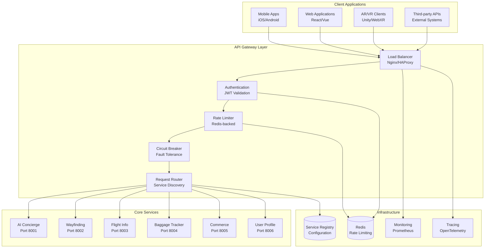
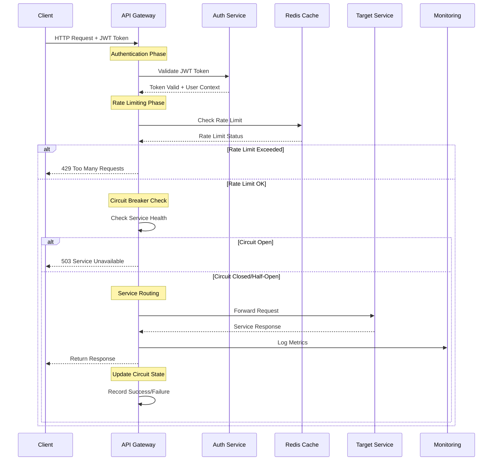
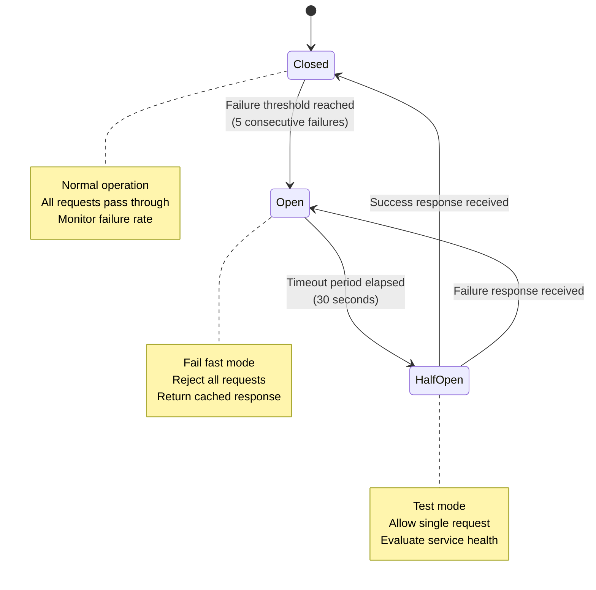

# API Gateway Service

## Overview
The API Gateway is the central entry point for all AeroFusionXR services, providing authentication, authorization, rate limiting, load balancing, and service orchestration. Built with Python FastAPI, it offers enterprise-grade security, monitoring, and fault tolerance for the entire platform.

## 🚀 Key Features

### 1. **Authentication & Authorization**
**Enterprise-grade security with JWT and role-based access control**

- **JWT Authentication**: Secure token-based authentication with configurable expiry
- **Role-based Authorization**: Granular permissions (passenger, staff, admin)
- **Multi-factor Authentication**: Support for biometric and traditional 2FA
- **Session Management**: Secure session handling with refresh tokens
- **OAuth 2.0 Integration**: Support for external identity providers

**Security Features**:
- AES-256 token encryption
- Configurable token expiry (default: 24 hours)
- Automatic token refresh
- Secure logout with token blacklisting
- Rate-limited authentication attempts

### 2. **Circuit Breaker & Fault Tolerance**
**Resilient service communication with automatic failure handling**

- **Circuit Breaker Pattern**: Automatic failure detection and recovery
- **Health Monitoring**: Continuous service health checks
- **Graceful Degradation**: Fallback responses during service outages
- **Retry Logic**: Configurable retry strategies with exponential backoff
- **Timeout Management**: Request timeout handling and cancellation

**Fault Tolerance**:
- Configurable failure thresholds (default: 5 failures)
- Circuit breaker timeout (default: 30 seconds)
- Half-open state testing for service recovery
- Real-time circuit breaker status monitoring

### 3. **Rate Limiting & Traffic Management**
**Advanced rate limiting with Redis-backed sliding windows**

- **Sliding Window Rate Limiting**: Precise request rate control
- **User-based Limits**: Individual user rate limiting
- **Endpoint-specific Limits**: Different limits per API endpoint
- **Burst Protection**: Configurable burst allowances
- **Rate Limit Headers**: Standard rate limit response headers

**Rate Limiting Features**:
- Default: 1000 requests/hour per user
- Configurable burst limits
- Redis-backed distributed rate limiting
- Real-time rate limit monitoring
- Automatic rate limit violation alerts

### 4. **Service Discovery & Load Balancing**
**Dynamic service registration and intelligent load balancing**

- **Automatic Service Discovery**: Dynamic service registration
- **Health-based Routing**: Route only to healthy service instances
- **Load Balancing**: Round-robin and weighted load balancing
- **Service Registry**: Centralized service configuration
- **Dynamic Configuration**: Runtime service configuration updates

### 5. **Monitoring & Observability**
**Comprehensive monitoring with OpenTelemetry and Prometheus**

- **Distributed Tracing**: End-to-end request tracing
- **Metrics Collection**: Detailed performance and business metrics
- **Health Checks**: Service and dependency health monitoring
- **Logging**: Structured logging with correlation IDs
- **Alerting**: Real-time alerts for critical issues

**Monitoring Features**:
- Request/response metrics
- Service health status
- Circuit breaker state monitoring
- Rate limiting violation tracking
- Performance benchmarking

## 🏗️ Architecture

### **API Gateway Architecture Overview**



### **Request Processing Flow**



### **Circuit Breaker State Machine**



### Service Structure
```
api-gateway/
├── app.py                      # Main FastAPI application
├── app_complete.py             # Complete implementation
├── app_final.py                # Production-ready version
├── app_endpoints.py            # Endpoint definitions
├── requirements.txt            # Python dependencies
├── Dockerfile                  # Container configuration
└── config/
    ├── kong/                   # Kong configuration (alternative)
    └── nginx/                  # Nginx configuration
```

### Core Components
- **Authentication Service**: JWT token management and validation
- **Circuit Breaker**: Fault tolerance and service protection
- **Rate Limiter**: Traffic control and abuse prevention
- **Service Registry**: Dynamic service discovery and configuration
- **Request Router**: Intelligent request routing and load balancing
- **Monitoring**: Metrics collection and health monitoring

### Technology Stack
- **Framework**: Python FastAPI with async/await
- **Authentication**: JWT with configurable algorithms
- **Caching**: Redis for rate limiting and session storage
- **Monitoring**: OpenTelemetry, Prometheus metrics
- **Communication**: HTTP/HTTPS, WebSocket support
- **Database**: Redis for state management

## 📡 API Endpoints

### Authentication
```http
POST /auth/login                # User authentication
POST /auth/logout               # User logout
POST /auth/refresh              # Token refresh
GET  /auth/profile              # User profile
POST /auth/change-password      # Password change
```

### Service Proxy
```http
GET|POST|PUT|DELETE /api/v1/{service}/{path}  # Service proxy endpoint
```

### Administration
```http
GET  /admin/services            # List registered services
POST /admin/circuit-breaker/{service}/reset   # Reset circuit breaker
GET  /admin/metrics/summary     # Metrics summary
GET  /admin/health              # System health
GET  /metrics                   # Prometheus metrics
```

### System Endpoints
```http
GET  /health                    # Health check
GET  /info                      # Service information
```

## 🔧 Configuration

### Environment Variables
```bash
# Service Configuration
SERVICE_NAME=api-gateway
VERSION=1.0.0
PORT=8000
LOG_LEVEL=INFO

# Security Configuration
JWT_SECRET=your-super-secret-jwt-key
JWT_ALGORITHM=HS256
JWT_EXPIRY_HOURS=24

# Rate Limiting
RATE_LIMIT_REQUESTS=1000
RATE_LIMIT_WINDOW=3600
REDIS_URL=redis://redis:6379

# Circuit Breaker
CIRCUIT_BREAKER_FAILURES=5
CIRCUIT_BREAKER_TIMEOUT=30
REQUEST_TIMEOUT=30

# Monitoring
OTEL_ENDPOINT=http://otel-collector:4317
```

### Service Registration
```python
# Register a new service
services = {
    "ai-concierge": {
        "url": "http://ai-concierge:8000",
        "health_endpoint": "/health",
        "timeout": 30,
        "circuit_breaker_enabled": True
    }
}
```

### Rate Limiting Configuration
```python
# Configure rate limits per role
rate_limits = {
    "passenger": {"requests_per_hour": 1000, "burst_limit": 50},
    "staff": {"requests_per_hour": 5000, "burst_limit": 100},
    "admin": {"requests_per_hour": 10000, "burst_limit": 200}
}
```

## 🚀 Getting Started

### Prerequisites
- Python 3.9+
- Redis 6.0+
- Docker (optional)

### Installation
```bash
# Install dependencies
pip install -r requirements.txt

# Set environment variables
export JWT_SECRET=your-secret-key
export REDIS_URL=redis://localhost:6379

# Start service
python app.py
# OR for development
uvicorn app:app --reload --host 0.0.0.0 --port 8000
```

### Docker Deployment
```bash
# Build image
docker build -t api-gateway .

# Run container
docker run -p 8000:8000 \
  -e JWT_SECRET=your-secret-key \
  -e REDIS_URL=redis://redis:6379 \
  api-gateway
```

### Service Registration
```bash
# Register services via API
curl -X POST http://localhost:8000/admin/services \
  -H "Content-Type: application/json" \
  -d '{
    "name": "ai-concierge",
    "url": "http://ai-concierge:8000",
    "health_endpoint": "/health"
  }'
```

## 🧪 Testing

### Health Check
```bash
# Check gateway health
curl http://localhost:8000/health

# Check service health
curl http://localhost:8000/admin/services
```

### Authentication Testing
```bash
# Login
curl -X POST http://localhost:8000/auth/login \
  -H "Content-Type: application/json" \
  -d '{"username": "test@example.com", "password": "password"}'

# Use token
curl -H "Authorization: Bearer YOUR_TOKEN" \
  http://localhost:8000/api/v1/ai-concierge/health
```

### Rate Limiting Testing
```bash
# Test rate limits
for i in {1..1100}; do
  curl -H "Authorization: Bearer YOUR_TOKEN" \
    http://localhost:8000/api/v1/ai-concierge/health
done
```

## 📊 Monitoring & Analytics

### Key Metrics
- **Request Metrics**: Total requests, response times, error rates
- **Authentication**: Login attempts, token validations, failures
- **Rate Limiting**: Violations, blocked requests, user patterns
- **Circuit Breaker**: State changes, failure rates, recovery times
- **Service Health**: Availability, response times, error rates

### Prometheus Metrics
```
# Request metrics
api_gateway_requests_total{method, path, status_code, service}
api_gateway_request_duration_seconds{method, path, service}

# Service health
api_gateway_service_health{service}
api_gateway_circuit_breaker_state{service}

# Rate limiting
api_gateway_rate_limit_hits_total{user_id, endpoint}

# Authentication
api_gateway_jwt_validations_total{status}
```

### Health Checks
- **Service Health**: All registered services
- **Database Connectivity**: Redis connection status
- **Circuit Breaker Status**: Current state of all circuit breakers
- **Rate Limiting**: Redis rate limit storage health

### Alerting Rules
```yaml
# High error rate
- alert: HighErrorRate
  expr: rate(api_gateway_requests_total{status_code=~"5.."}[5m]) > 0.1

# Circuit breaker open
- alert: CircuitBreakerOpen
  expr: api_gateway_circuit_breaker_state == 1

# Service down
- alert: ServiceDown
  expr: api_gateway_service_health == 0
```

## 🔒 Security Features

### Authentication Security
- **JWT Secret Rotation**: Support for key rotation
- **Token Blacklisting**: Immediate token revocation
- **Brute Force Protection**: Rate limiting on login attempts
- **Session Security**: Secure session management
- **Password Policies**: Configurable password requirements

### Network Security
- **HTTPS Only**: TLS 1.3 enforcement
- **CORS Configuration**: Configurable cross-origin policies
- **Security Headers**: HSTS, CSP, X-Frame-Options
- **IP Whitelisting**: Optional IP-based access control
- **Request Validation**: Input sanitization and validation

### Data Protection
- **Encryption in Transit**: TLS encryption for all communications
- **Sensitive Data Masking**: Automatic PII masking in logs
- **Audit Logging**: Complete request/response audit trail
- **Data Retention**: Configurable log retention policies

## 🔄 Integration Points

### Internal Services
- **AI Concierge**: Authentication and request routing
- **Wayfinding Platform**: Location-based access control
- **Baggage Tracker**: Real-time data access
- **Flight Info**: Flight data API access
- **Commerce**: Payment and transaction routing
- **User Profile**: User management and preferences

### External Systems
- **Identity Providers**: OAuth 2.0, SAML integration
- **Monitoring Systems**: Prometheus, Grafana, ELK stack
- **Load Balancers**: Nginx, HAProxy, cloud load balancers
- **CDN**: CloudFlare, AWS CloudFront integration
- **Security Tools**: WAF, DDoS protection, vulnerability scanners

## 📈 Performance Benchmarks

### Throughput
- **Concurrent Requests**: 10,000+ simultaneous connections
- **Requests per Second**: 5,000+ RPS sustained
- **Authentication**: 1,000+ logins/second
- **Rate Limiting**: 100,000+ rate checks/second

### Latency
- **Authentication**: <50ms token validation
- **Request Routing**: <10ms routing overhead
- **Health Checks**: <100ms service health validation
- **Circuit Breaker**: <1ms failure detection

### Resource Usage
- **Memory**: <512MB under normal load
- **CPU**: <50% utilization at peak load
- **Network**: <1Gbps bandwidth utilization
- **Storage**: <1GB for logs and state

## 🛠️ Development

### Code Quality
- **Python Standards**: PEP 8 compliance
- **Type Hints**: Full type annotation coverage
- **Testing**: 90%+ code coverage
- **Documentation**: Comprehensive API documentation

### Development Workflow
```bash
# Setup development environment
python -m venv venv
source venv/bin/activate
pip install -r requirements.txt

# Run with auto-reload
uvicorn app:app --reload

# Run tests
pytest tests/ --cov=app

# Format code
black app.py
isort app.py
```

### API Documentation
- **OpenAPI/Swagger**: Auto-generated API documentation
- **Interactive Docs**: Available at `/docs` endpoint
- **ReDoc**: Alternative documentation at `/redoc`
- **Postman Collection**: Exportable API collection

## 🚨 Troubleshooting

### Common Issues

#### Authentication Failures
```bash
# Check JWT configuration
curl http://localhost:8000/auth/login -v

# Validate token
python -c "import jwt; print(jwt.decode('TOKEN', 'SECRET', algorithms=['HS256']))"
```

#### Service Connectivity Issues
```bash
# Check service registration
curl http://localhost:8000/admin/services

# Test service health
curl http://localhost:8000/health
```

#### Rate Limiting Issues
```bash
# Check Redis connectivity
redis-cli ping

# Monitor rate limit status
curl -H "Authorization: Bearer TOKEN" \
  http://localhost:8000/api/v1/service/endpoint -v
```

## 📚 Additional Resources

### Documentation
- [FastAPI Documentation](https://fastapi.tiangolo.com/)
- [JWT Best Practices](https://auth0.com/blog/a-look-at-the-latest-draft-for-jwt-bcp/)
- [Circuit Breaker Pattern](https://martinfowler.com/bliki/CircuitBreaker.html)
- [Rate Limiting Strategies](https://cloud.google.com/architecture/rate-limiting-strategies-techniques)

### Monitoring & Observability
- [OpenTelemetry Python](https://opentelemetry.io/docs/instrumentation/python/)
- [Prometheus Python Client](https://prometheus.io/docs/prometheus/latest/querying/basics/)
- [Grafana Dashboards](https://grafana.com/grafana/dashboards/)

### Security Resources
- [OWASP API Security](https://owasp.org/www-project-api-security/)
- [JWT Security Best Practices](https://tools.ietf.org/html/rfc8725)
- [Python Security Guidelines](https://python-security.readthedocs.io/)

---

**Last Updated**: December 2024  
**Version**: 1.0.0  
**Maintainer**: AeroFusionXR Platform Team 