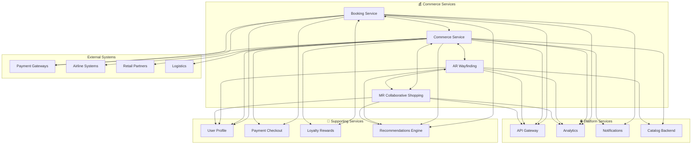

# 💰 Commerce - Core Domain

## 💰 Overview
The **Commerce** domain drives revenue generation and financial transactions within AeroFusionXR. These services create seamless shopping experiences, from traditional e-commerce to cutting-edge AR/MR retail, ensuring high conversion rates and customer satisfaction while maintaining security and compliance.

## 🎯 Domain Mission
**"Transforming airport retail through innovative, immersive commerce experiences that drive revenue growth and customer delight."**

## 🏗️ Service Portfolio

```
commerce/
├── 📋 booking/                    # Reservations and bookings
├── 🛒 commerce/                   # E-commerce platform
├── 🥽 ar-wayfinding/             # AR shopping experiences
└── 🤝 mr-collaborative-shopping/  # Mixed reality shopping
```

## 📋 **Booking Service**
*Comprehensive reservation and booking management*

### **Core Capabilities**
- **Multi-Service Booking** - Flights, lounges, services, experiences
- **Dynamic Pricing** - Real-time price optimization
- **Inventory Management** - Real-time availability tracking
- **Payment Integration** - Secure transaction processing

### **Key Features**
- Real-time availability checking
- Group booking management
- Cancellation and modification handling
- Loyalty program integration

### **Performance Standards**
- **Response Time**: ≤1s for reservation processing
- **Availability**: 99.9% uptime
- **Conversion Rate**: 85%+ booking success
- **Payment Success**: 99.5%+ transaction completion

## 🛒 **Commerce Service**
*Traditional and digital retail platform*

### **Core Capabilities**
- **Product Catalog** - Comprehensive retail inventory
- **Shopping Cart** - Multi-vendor cart management
- **Payment Processing** - Secure payment gateway
- **Order Fulfillment** - Delivery and pickup coordination

### **Key Features**
- Duty-free shopping integration
- Pickup/delivery scheduling
- Multi-currency support
- Promotional campaigns

### **Performance Standards**
- **Response Time**: ≤500ms for product catalog
- **Availability**: 99.9% uptime
- **Cart Abandonment**: <20% rate
- **Order Accuracy**: 99.8%+ fulfillment

## 🥽 **AR Wayfinding Service**
*Augmented reality shopping navigation*

### **Core Capabilities**
- **AR Store Navigation** - Visual store guidance
- **Product Discovery** - AR product visualization
- **Price Comparison** - Real-time price display
- **Virtual Try-On** - AR product testing

### **Key Features**
- AR store maps and directions
- Product information overlays
- Interactive shopping lists
- Social sharing integration

### **Performance Standards**
- **Response Time**: ≤100ms for AR rendering
- **Availability**: 99.5% uptime
- **Tracking Accuracy**: 98%+ AR alignment
- **Engagement**: 5+ minutes average session

## 🤝 **MR Collaborative Shopping Service**
*Mixed reality group shopping experiences*

### **Core Capabilities**
- **Shared Virtual Spaces** - Multi-user shopping environments
- **Real-Time Collaboration** - Synchronized shopping sessions
- **Avatar Interaction** - Virtual shopping companions
- **Cross-Reality Sync** - Mobile, AR, VR integration

### **Key Features**
- Virtual shopping rooms
- Real-time friend shopping
- Group decision making tools
- Social commerce features

### **Performance Standards**
- **Response Time**: ≤200ms for interaction response
- **Availability**: 99.5% uptime
- **Concurrent Users**: 100+ per session
- **Session Duration**: 10+ minutes average

## 📊 Revenue Impact Matrix



## 🚀 Revenue Performance Standards

### **Commerce KPIs**
- **Revenue Growth**: 25%+ year-over-year
- **Conversion Rate**: 15%+ improvement
- **Average Order Value**: $75+ per transaction
- **Customer Lifetime Value**: $500+ per passenger

### **Service-Specific Metrics**

#### **Booking Service**
- **Booking Conversion**: 85%+ completion rate
- **Upselling Success**: 30%+ additional services
- **Cancellation Rate**: <5% of bookings
- **Revenue per Booking**: $150+ average

#### **Commerce Service**
- **Cart Conversion**: 80%+ checkout completion
- **Cross-Selling**: 25%+ additional items
- **Return Rate**: <2% of purchases
- **Revenue per User**: $60+ average

#### **AR/MR Services**
- **Engagement Rate**: 70%+ interaction completion
- **Purchase Intent**: 40%+ post-experience
- **Session Value**: $25+ average
- **Viral Coefficient**: 2.5+ social shares

## 🛡️ Commerce Security

### **Payment Security**
- **PCI DSS Compliance** - Level 1 certification
- **Tokenization** - Secure payment data handling
- **Fraud Detection** - Real-time transaction monitoring
- **3D Secure** - Enhanced payment authentication

### **Data Protection**
- **Customer Data**: End-to-end encryption
- **Transaction Logs**: Immutable audit trails
- **Personal Information**: GDPR/PDPL compliance
- **Biometric Payments**: HSM-secured storage

## 🔄 Customer Journey Flow

### **Discovery Phase**
1. **AR Wayfinding** presents nearby retail opportunities
2. **Recommendations Engine** suggests personalized products
3. **Commerce Service** displays product catalogs
4. **MR Collaborative Shopping** enables social discovery

### **Shopping Phase**
1. **AR Wayfinding** guides to physical locations
2. **Commerce Service** manages shopping cart
3. **User Profile** applies preferences and history
4. **Loyalty Rewards** calculates points and benefits

### **Purchase Phase**
1. **Payment Checkout** processes transactions
2. **Booking Service** handles reservations
3. **Notifications** confirm purchase details
4. **Analytics** tracks conversion metrics

### **Fulfillment Phase**
1. **Commerce Service** coordinates delivery/pickup
2. **Notifications** provide status updates
3. **Customer Support** handles inquiries
4. **Loyalty Rewards** awards points

## 🛠️ Development Standards

### **Commerce-Specific Guidelines**
- **Security First** - PCI DSS compliance mandatory
- **Mobile Optimization** - Mobile-first design
- **Performance Critical** - Sub-second response times
- **A/B Testing** - Continuous conversion optimization

### **Integration Patterns**
- **Saga Pattern** - Distributed transaction management
- **Event Sourcing** - Complete transaction history
- **CQRS** - Optimized read/write operations
- **Circuit Breaker** - Payment service resilience

## 💳 Payment & Financial Standards

### **Payment Processing**
- **Multi-Currency Support** - 15+ currencies
- **Payment Methods** - Cards, digital wallets, biometric
- **Settlement Times** - T+1 for most transactions
- **Refund Processing** - 24-hour maximum

### **Financial Reporting**
- **Real-Time Revenue** - Live dashboard updates
- **Reconciliation** - Automated daily processing
- **Tax Compliance** - Multi-jurisdiction support
- **Audit Trail** - Complete transaction history

## 🚦 Commerce Health Dashboard

### **Real-Time Status**
| Service | Status | Revenue Today | Transactions | Conversion Rate | Avg Order Value |
|---------|--------|---------------|--------------|-----------------|-----------------|
| Booking Service | 🟢 Healthy | $45,680 | 342 | 87% | $156 |
| Commerce Service | 🟢 Healthy | $28,920 | 478 | 82% | $67 |
| AR Wayfinding | 🟡 Warning | $12,340 | 156 | 76% | $89 |
| MR Collaborative Shopping | 🟢 Healthy | $8,760 | 89 | 85% | $128 |

### **Business Impact Metrics**
- **Total Daily Revenue**: $95,700
- **Revenue Growth**: 28% vs last month
- **Customer Acquisition Cost**: $45 per customer
- **Return on Ad Spend**: 4.2x ROAS

## 📈 Revenue Optimization

### **Pricing Strategy**
- **Dynamic Pricing** - Real-time price optimization
- **Demand-Based Pricing** - Peak/off-peak adjustment
- **Personalized Offers** - Individual pricing strategies
- **Group Discounts** - Volume-based pricing

### **Conversion Optimization**
- **A/B Testing** - Continuous interface optimization
- **Personalization** - Individual experience customization
- **Recommendation Tuning** - ML-powered suggestions
- **Checkout Optimization** - Friction reduction

## 🔗 Quick Links

- **[Booking Service →](./booking/README.md)**
- **[Commerce Service →](./commerce/README.md)**
- **[AR Wayfinding Service →](./ar-wayfinding/README.md)**
- **[MR Collaborative Shopping →](./mr-collaborative-shopping/README.md)**
- **[Revenue Analytics](http://analytics.aerofusionxr.com/commerce)**
- **[Commerce Dashboard](http://monitoring.aerofusionxr.com/commerce)**

---

*The Commerce domain transforms airport retail from traditional shopping to immersive, personalized experiences that drive revenue growth and customer satisfaction.* 