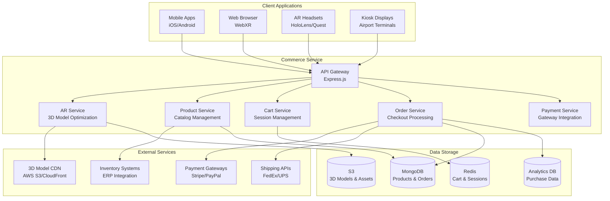
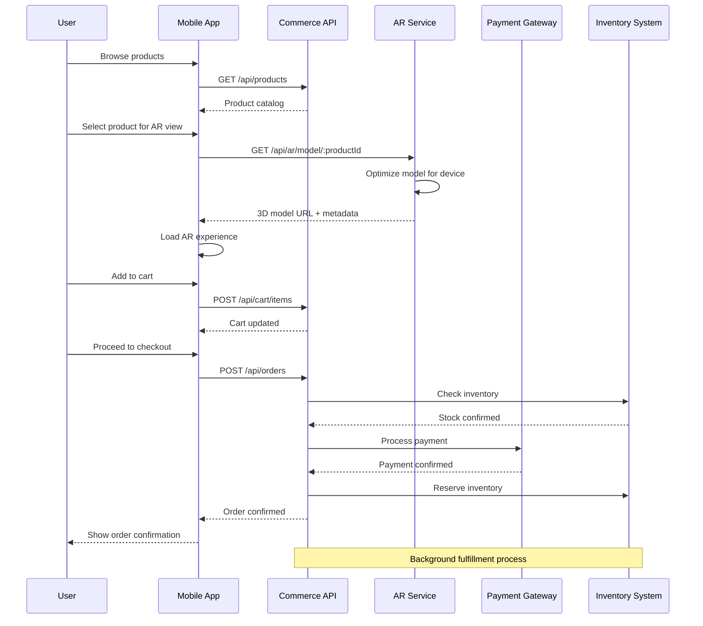
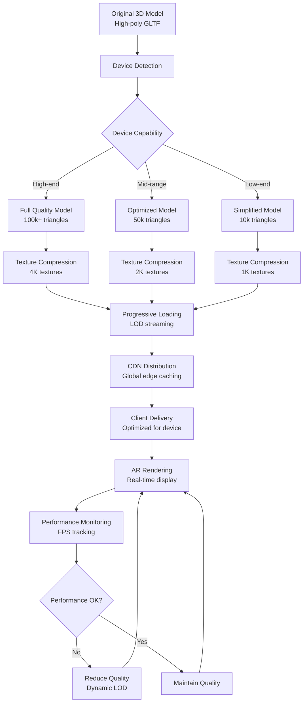

# Commerce Service

AR-enabled commerce service with real-time 3D product visualization and checkout for AeroFusion XR.

## Features

### Core Features

- **3D Product Catalog & AR Try-On**
  - GLTF/USDC asset loading with LOD management
  - Client-side rendering optimizations (10 fps min)
  - ARKit/ARCore live preview + fallback to 2D zoom
  - Device-specific model optimization

- **Cart & Checkout Flow**
  - Persistent cart across devices & sessions
  - Multi-gateway payment with retry & rollback
  - 3DS strong customer authentication support
  - Real-time inventory validation

- **Promotions & Campaigns**
  - Dynamic overlay promotions (time-limited, geo-fenced)
  - CMS hook for "flash sale" banners
  - A/B testing toggles for campaign variants
  - Personalized recommendations

- **Order Management & Fulfillment**
  - Real-time inventory sync with warehouses
  - Instant digital receipt & order status updates
  - Returns & refund workflows
  - Order history & tracking

### Technical Features

- **AR & 3D**
  - Automatic LOD selection based on device
  - Progressive model loading
  - Texture compression & streaming
  - WebXR integration

- **Performance & Scalability**
  - Redis-based cart persistence
  - MongoDB for product & order data
  - S3 for 3D model storage
  - Auto-scaling support

- **Security & Compliance**
  - PCI DSS compliance for payments
  - GDPR-compliant data handling
  - Rate limiting & DDoS protection
  - Input validation & sanitization

- **Monitoring & Observability**
  - OpenTelemetry integration
  - Prometheus metrics
  - Structured logging
  - Health checks

## Getting Started

### Prerequisites

- Node.js 20.x
- npm 10.x
- MongoDB 7.x
- Redis 7.x
- AWS Account (for S3)
- Docker (optional)
- Kubernetes (optional)

### Installation

1. Clone the repository:
   ```bash
   git clone https://github.com/aerofusion/aerofusion-xr.git
   cd services/commerce
   ```

2. Install dependencies:
   ```bash
   npm install
   ```

3. Configure environment variables:
   ```bash
   cp .env.example .env
   # Edit .env with your configuration
   ```

4. Start the service:
   ```bash
   npm run dev
   ```

### Docker

Build and run with Docker:

```bash
docker build -t aerofusion/commerce .
docker run -p 3000:3000 aerofusion/commerce
```

### Kubernetes

Deploy to Kubernetes:

```bash
kubectl apply -f k8s/
```

## API Documentation

### AR & 3D Models

```http
GET /api/ar/compatibility
```

Response:
```json
{
  "arSupported": true,
  "maxTriangles": 100000,
  "maxTextureSize": 4096,
  "supportedFormats": ["gltf", "usdc"]
}
```

```http
GET /api/ar/model/:productId
```

Response:
```json
{
  "modelUrl": "https://...",
  "format": "gltf",
  "triangleCount": 50000
}
```

### Products & Cart

```http
GET /api/products
```

Response:
```json
{
  "products": [
    {
      "id": "prod123",
      "name": "Product Name",
      "price": 99.99,
      "arAssets": {
        "gltfUrl": "https://...",
        "thumbnailUrl": "https://..."
      }
    }
  ]
}
```

```http
POST /api/cart/items
Content-Type: application/json

{
  "productId": "prod123",
  "quantity": 1
}
```

### Orders & Checkout

```http
POST /api/orders
Content-Type: application/json

{
  "cartId": "cart123",
  "paymentToken": "tok_visa"
}
```

Response:
```json
{
  "orderId": "ord123",
  "status": "CONFIRMED",
  "total": 99.99
}
```

## Architecture

### **Commerce Service Architecture**



### **AR Commerce Purchase Flow**



### **3D Model Optimization Pipeline**



### Components

- **AR Service**: Handles 3D model loading and optimization
- **Product Service**: Manages product catalog and inventory
- **Cart Service**: Handles shopping cart persistence
- **Order Service**: Manages order processing and fulfillment
- **Payment Service**: Integrates with payment gateways

## Contributing

1. Fork the repository
2. Create your feature branch (`git checkout -b feature/amazing-feature`)
3. Commit your changes (`git commit -m 'Add amazing feature'`)
4. Push to the branch (`git push origin feature/amazing-feature`)
5. Open a Pull Request

## License

This project is licensed under the MIT License - see the [LICENSE](LICENSE) file for details. 