# 🤖 Passenger Experience - Core Domain

## 🤖 Overview
The **Passenger Experience** domain represents the direct touchpoints between AeroFusionXR and airport passengers. These services define the passenger journey, from arrival to departure, ensuring seamless navigation, intelligent assistance, and real-time information delivery.

## 🎯 Domain Mission
**"Delivering exceptional, AI-powered passenger experiences that make airport travel effortless, enjoyable, and efficient."**

## 🏗️ Service Portfolio

```
passenger-experience/
├── 🧠 ai-concierge/           # Central AI intelligence hub
├── 🗺️ wayfinding-platform/    # Navigation and routing
├── 🧳 baggage-tracker/        # Real-time baggage tracking
└── ✈️ flight-info/            # Flight status and updates
```

## 🧠 **AI Concierge Service**
*The intelligent heart of passenger assistance*

### **Core Capabilities**
- **Natural Language Processing** - Multi-language conversation
- **Biometric Authentication** - Touchless passenger identification
- **Personalized Recommendations** - AI-powered suggestions
- **Cross-Service Orchestration** - Unified passenger experience

### **Key Features**
- Biometric & Touchless Services (Feature 18)
- Offline-First Architecture (Feature 19)
- Real-time translation in 15+ languages
- VIP & premium passenger services

### **Performance Standards**
- **Response Time**: ≤800ms for complex queries
- **Availability**: 99.9% uptime
- **Accuracy**: 95%+ intent recognition
- **Scalability**: 10,000+ concurrent users

## 🗺️ **Wayfinding Platform Service**
*Intelligent navigation and spatial awareness*

### **Core Capabilities**
- **Multi-Floor Navigation** - Complex airport routing
- **AR/VR Integration** - Immersive direction guidance
- **Real-Time Positioning** - Precise indoor location
- **Accessibility Support** - Inclusive navigation options

### **Key Features**
- SLAM-based indoor positioning
- Multi-floor route optimization
- AR waypoint overlays
- Voice-guided navigation

### **Performance Standards**
- **Response Time**: ≤500ms for route calculation
- **Availability**: 99.9% uptime
- **Accuracy**: 98%+ route success rate
- **Positioning**: ±2m accuracy indoors

## 🧳 **Baggage Tracker Service**
*Real-time baggage lifecycle management*

### **Core Capabilities**
- **RFID/IoT Tracking** - Continuous baggage monitoring
- **Predictive Analytics** - Proactive issue detection
- **Mobile Notifications** - Real-time status updates
- **Integration Hub** - Airport baggage system connectivity

### **Key Features**
- Real-time baggage location tracking
- Predictive delay notifications
- Baggage claim optimization
- Lost baggage assistance

### **Performance Standards**
- **Response Time**: ≤300ms for status updates
- **Availability**: 99.8% uptime
- **Tracking Accuracy**: 99.5%+ bag visibility
- **Update Frequency**: Real-time (<30s delay)

## ✈️ **Flight Info Service**
*Comprehensive flight information and updates*

### **Core Capabilities**
- **Real-Time Data Integration** - Live flight information
- **Predictive Analytics** - Delay and gate predictions
- **Multi-Source Aggregation** - Comprehensive flight data
- **Push Notifications** - Proactive passenger alerts

### **Key Features**
- Live flight status updates
- Gate change notifications
- Boarding time predictions
- Weather impact analysis

### **Performance Standards**
- **Response Time**: ≤200ms for flight data
- **Availability**: 99.9% uptime
- **Data Freshness**: <60s update latency
- **Accuracy**: 99%+ flight information accuracy

## 📊 Service Integration Matrix

```mermaid
graph TB
    subgraph "🤖 Passenger Experience Services"
        A[AI Concierge]
        B[Wayfinding Platform]
        C[Baggage Tracker]
        D[Flight Info]
    end
    
    subgraph "🔧 Supporting Services"
        E[User Profile]
        F[Notifications]
        G[Recommendations Engine]
        H[Voice Guidance]
    end
    
    subgraph "🌐 Platform Services"
        I[API Gateway]
        J[Localization]
        K[Analytics]
        L[Monitoring]
    end
    
    subgraph "External Systems"
        M[Airport Operations]
        N[Airline Systems]
        O[Immigration]
        P[Security]
    end
    
    A <--> B
    A <--> C
    A <--> D
    
    A --> E
    A --> F
    A --> G
    A --> H
    
    B --> E
    B --> H
    
    C --> E
    C --> F
    
    D --> F
    
    A --> I
    B --> I
    C --> I
    D --> I
    
    A --> J
    B --> J
    D --> J
    
    A --> K
    B --> K
    C --> K
    D --> K
    
    A --> L
    B --> L
    C --> L
    D --> L
    
    D --> M
    D --> N
    A --> O
    A --> P
```



## 🚀 Domain Performance Standards

### **Unified KPIs**
- **Domain Availability**: 99.9%+ uptime
- **Cross-Service Response**: ≤1s end-to-end
- **Passenger Satisfaction**: 95%+ rating
- **Service Integration**: 99%+ successful handoffs

### **Passenger Journey Metrics**
- **Check-in to Security**: ≤15 minutes
- **Navigation Success Rate**: 98%+
- **Baggage Claim Time**: ≤20 minutes
- **Flight Info Accuracy**: 99%+

## 🛡️ Domain Security

### **Passenger Data Protection**
- **Biometric Data**: HSM-secured storage
- **Personal Information**: AES-256-GCM encryption
- **Location Tracking**: Anonymized by default
- **Cross-Border Compliance**: GDPR, PDPL adherence

### **Privacy Controls**
- **Consent Management** - Granular privacy controls
- **Data Minimization** - Collect only necessary data
- **Right to be Forgotten** - Complete data deletion
- **Anonymization** - Automatic PII scrubbing

## 🔄 Passenger Journey Flow

### **Arrival Experience**
1. **AI Concierge** welcomes passenger via biometric recognition
2. **Flight Info** provides real-time departure updates
3. **Wayfinding** guides to check-in/security
4. **Baggage Tracker** confirms baggage processing

### **Airport Navigation**
1. **Wayfinding** calculates optimal routes
2. **AI Concierge** provides contextual assistance
3. **Voice Guidance** offers audio directions
4. **Real-time Updates** adjust for crowds/delays

### **Departure Experience**
1. **Flight Info** monitors departure status
2. **AI Concierge** manages gate changes
3. **Baggage Tracker** confirms loading
4. **Notifications** provide boarding alerts

## 🛠️ Development Standards

### **Domain-Specific Guidelines**
- **Passenger-First Design** - UX is paramount
- **Accessibility Compliance** - WCAG 2.1 AA standard
- **Multi-Language Support** - 15+ languages
- **Real-Time Performance** - Sub-second responses

### **Integration Patterns**
- **Event-Driven Architecture** - Real-time passenger updates
- **Saga Pattern** - Cross-service passenger workflows
- **Circuit Breaker** - Graceful degradation
- **Compensation** - Journey recovery mechanisms

## 🚦 Service Health Dashboard

### **Real-Time Status**
| Service | Status | Passengers Served | Avg Response Time | Success Rate |
|---------|--------|------------------|-------------------|--------------|
| AI Concierge | 🟢 Healthy | 12,450/day | 650ms | 98.5% |
| Wayfinding Platform | 🟢 Healthy | 8,920/day | 420ms | 99.2% |
| Baggage Tracker | 🟡 Warning | 6,780/day | 280ms | 99.8% |
| Flight Info | 🟢 Healthy | 15,340/day | 180ms | 99.1% |

### **Passenger Impact Metrics**
- **Journey Time Reduction**: 25% average improvement
- **Passenger Satisfaction**: 96% positive feedback
- **Service Resolution**: 92% self-service success
- **Accessibility Usage**: 8% of passengers

## 🔗 Quick Links

- **[AI Concierge Service →](./ai-concierge/README.md)**
- **[Wayfinding Platform →](./wayfinding-platform/README.md)**
- **[Baggage Tracker →](./baggage-tracker/README.md)**
- **[Flight Info Service →](./flight-info/README.md)**
- **[Passenger Journey Analytics](http://analytics.aerofusionxr.com/passenger-experience)**
- **[Domain Health Dashboard](http://monitoring.aerofusionxr.com/passenger-experience)**

---

*The Passenger Experience domain transforms airport navigation from stressful to seamless, ensuring every passenger feels guided, informed, and valued throughout their journey.* 