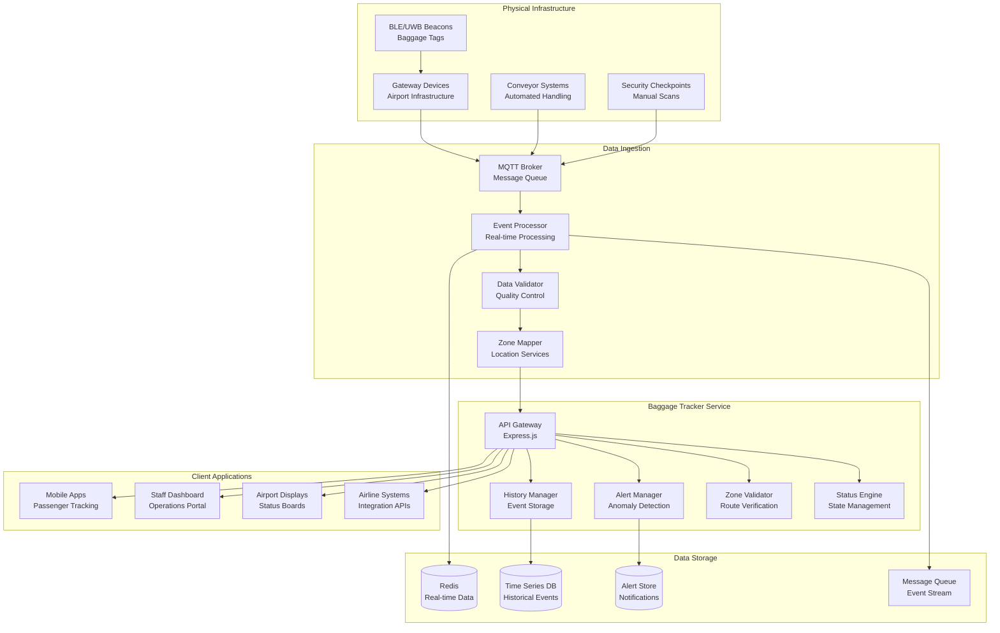
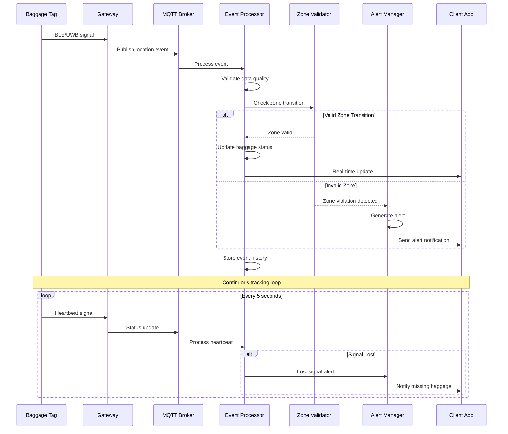
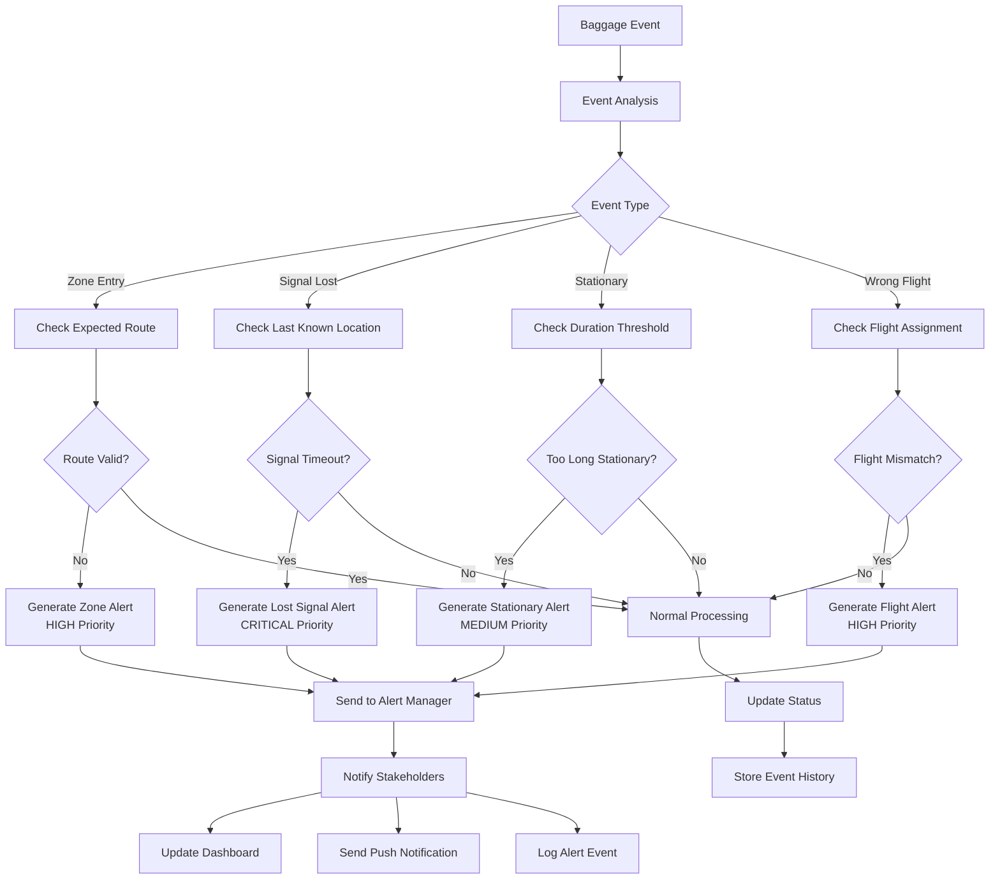

# Baggage Tracking Service

Real-time baggage tracking service with MQTT integration and Redis-based event storage for AeroFusion XR.

## Features

### Core Features

- **Real-time Tracking**
  - BLE/UWB beacon integration
  - MQTT-based event streaming
  - Sub-second position updates
  - Zone-based tracking

- **Event Processing**
  - Real-time event correlation
  - Status updates
  - Alert generation
  - Historical tracking

- **Alert System**
  - Wrong zone detection
  - Stationary baggage alerts
  - Lost signal warnings
  - Flight schedule integration

- **API Integration**
  - RESTful API
  - Real-time WebSocket updates
  - Batch operations support
  - Search and filtering

### Technical Features

- **Monitoring & Observability**
  - OpenTelemetry integration
  - Prometheus metrics
  - Structured logging
  - Health checks

- **Infrastructure**
  - Docker containerization
  - Kubernetes deployment
  - AWS EKS hosting
  - Auto-scaling support

- **Data Storage**
  - Redis for real-time data
  - Event sourcing pattern
  - Time-series metrics
  - Data retention policies

## Getting Started

### Prerequisites

- Node.js 20.x
- npm 10.x
- Redis 7.x
- MQTT Broker (e.g., Mosquitto)
- Docker (optional)
- Kubernetes (optional)

### Installation

1. Clone the repository:
   ```bash
   git clone https://github.com/aerofusion/aerofusion-xr.git
   cd services/baggage-tracker
   ```

2. Install dependencies:
   ```bash
   npm install
   ```

3. Configure environment variables:
   ```bash
   cp .env.example .env
   # Edit .env with your configuration
   ```

4. Start the service:
   ```bash
   npm run dev
   ```

### Docker

Build and run with Docker:

```bash
docker build -t aerofusion/baggage-tracker .
docker run -p 3000:3000 aerofusion/baggage-tracker
```

### Kubernetes

Deploy to Kubernetes:

```bash
kubectl apply -f k8s/
```

## API Documentation

### Track Baggage

```http
GET /api/baggage/:tagId
```

Response:
```json
{
  "id": "tag123",
  "flightNumber": "AF123",
  "status": "IN_TRANSIT",
  "lastLocation": {
    "x": 100,
    "y": 200,
    "z": 0,
    "zone": "Terminal-A",
    "timestamp": "2024-02-24T12:00:00Z"
  }
}
```

### Get History

```http
GET /api/baggage/:tagId/history
```

Response:
```json
[
  {
    "tagId": "tag123",
    "eventType": "ZONE_ENTRY",
    "location": {
      "zone": "Terminal-A",
      "timestamp": "2024-02-24T12:00:00Z"
    }
  }
]
```

### Get Alerts

```http
GET /api/baggage/:tagId/alerts
```

Response:
```json
[
  {
    "tagId": "tag123",
    "alertType": "WRONG_ZONE",
    "severity": "HIGH",
    "message": "Baggage detected in incorrect zone",
    "timestamp": "2024-02-24T12:00:00Z"
  }
]
```

### Search Tags

```http
POST /api/baggage/search
Content-Type: application/json

{
  "flightNumber": "AF123",
  "status": "IN_TRANSIT",
  "zone": "Terminal-A"
}
```

## Monitoring

### Metrics

Available at `/metrics` in Prometheus format:

- `baggage_event_latency_seconds`: Event processing latency
- `baggage_alerts_total`: Total number of alerts generated
- `baggage_active_tags`: Number of active tags being tracked

### Health Check

Available at `/health`:

```json
{
  "status": "ok",
  "version": "1.0.0",
  "timestamp": "2024-02-24T12:00:00Z"
}
```

## Architecture

### **Baggage Tracking System Architecture**



### **Real-time Baggage Tracking Flow**



### **Alert Generation & Processing**



### Components

- **Event Processor**: Handles MQTT messages and updates tag status
- **Alert Manager**: Monitors for anomalies and generates alerts
- **Zone Validator**: Validates baggage location against expected route
- **History Manager**: Maintains event history with retention policies

## Contributing

1. Fork the repository
2. Create your feature branch (`git checkout -b feature/amazing-feature`)
3. Commit your changes (`git commit -m 'Add amazing feature'`)
4. Push to the branch (`git push origin feature/amazing-feature`)
5. Open a Pull Request

## License

This project is licensed under the MIT License - see the [LICENSE](LICENSE) file for details. 