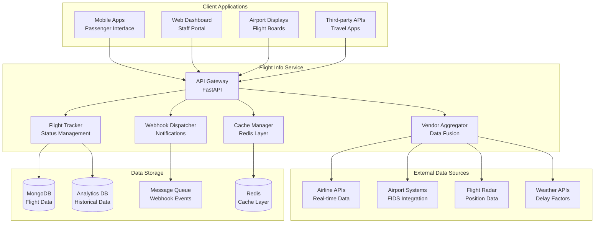
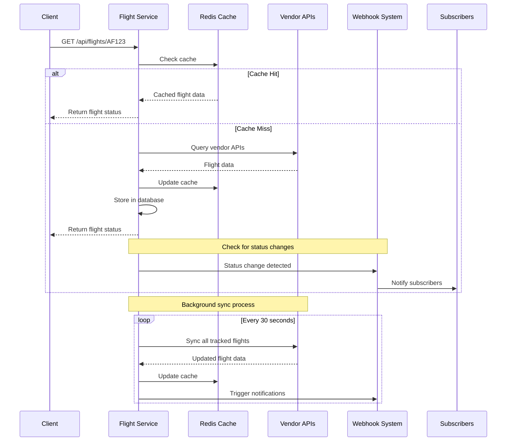
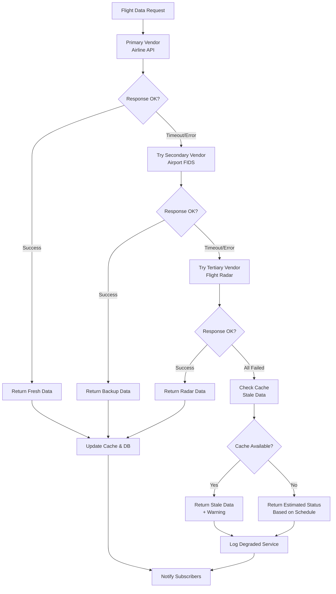

# Flight Info Service

Real-time flight status and schedule service for AeroFusion XR, built with FastAPI and Python.

## Features

### Core Features

- **Flight Status Queries**
  - Single/multi-flight lookup by number, date, route
  - Real-time vendor aggregation + consistency check
  - Caching layer with TTL and manual invalidation
  - Historical flight data access

- **Schedule & Connection Planning**
  - Multi-leg itineraries and "gap analysis" for layovers
  - Calendar integration (iCal/Google) export
  - Alert subscription on schedule changes
  - Real-time schedule updates

- **Webhook & Push Callbacks**
  - Subscriber registration API
  - Retry-safe webhook dispatcher with DLQ
  - Parallel vendor fallbacks for high availability
  - HMAC signature verification

- **Fallback & Degradation Modes**
  - Stale cache read when vendor down
  - "Estimated" status compute based on historical averages
  - Graceful user messaging ("Data delayed by 2 m")
  - Automatic vendor failover

### Technical Features

- **Performance & Scalability**
  - Redis-based caching
  - MongoDB for flight data
  - Horizontal scaling support
  - Rate limiting & throttling

- **Monitoring & Observability**
  - OpenTelemetry integration
  - Prometheus metrics
  - Structured logging
  - Health checks

- **Security & Compliance**
  - PII redaction
  - Data residency controls
  - Audit logging
  - Rate limiting

## Getting Started

### Prerequisites

- Python 3.11+
- Poetry
- MongoDB 7.x
- Redis 7.x
- Docker (optional)
- Kubernetes (optional)

### Installation

1. Clone the repository:
   ```bash
   git clone https://github.com/aerofusion/aerofusion-xr.git
   cd services/flight-info
   ```

2. Install dependencies:
   ```bash
   poetry install
   ```

3. Configure environment variables:
   ```bash
   cp .env.example .env
   # Edit .env with your configuration
   ```

4. Start the service:
   ```bash
   poetry run uvicorn flight_info.main:app --reload
   ```

### Docker

Build and run with Docker:

```bash
docker build -t aerofusion/flight-info .
docker run -p 8000:8000 aerofusion/flight-info
```

### Kubernetes

Deploy to Kubernetes:

```bash
kubectl apply -f k8s/
```

## API Documentation

### Flight Status

```http
GET /api/flights/{flight_number}
```

Response:
```json
{
  "flight_number": "AF123",
  "airline": "Air France",
  "status": "IN_AIR",
  "origin": {
    "code": "CDG",
    "name": "Charles de Gaulle Airport"
  },
  "destination": {
    "code": "JFK",
    "name": "John F. Kennedy International Airport"
  },
  "scheduled_departure": "2024-02-24T10:00:00Z",
  "scheduled_arrival": "2024-02-24T22:00:00Z",
  "position": {
    "latitude": 45.0000,
    "longitude": -40.0000,
    "altitude": 35000
  }
}
```

### Flight Search

```http
GET /api/flights?origin=CDG&destination=JFK
```

Response:
```json
{
  "flights": [
    {
      "flight_number": "AF123",
      "airline": "Air France",
      "status": "SCHEDULED"
    }
  ]
}
```

### Webhook Subscriptions

```http
POST /api/subscriptions
Content-Type: application/json

{
  "flight_numbers": ["AF123"],
  "callback_url": "https://api.example.com/webhooks",
  "events": ["STATUS_CHANGE", "DELAY"],
  "secret": "your_webhook_secret"
}
```

Response:
```json
{
  "id": "sub_123456",
  "status": "ACTIVE",
  "created_at": "2024-02-24T12:00:00Z"
}
```

## Architecture

### **Flight Info Service Architecture**



### **Real-time Flight Tracking Flow**



### **Vendor Failover & Fallback Strategy**



### Components

- **Flight Tracker**: Manages real-time flight status tracking
- **Webhook Dispatcher**: Handles subscription management and notifications
- **Cache Manager**: Coordinates Redis caching layer
- **Vendor Clients**: Integrates with external flight data providers

## Development

### Code Style

We use:
- Black for code formatting
- Ruff for linting
- MyPy for type checking

Run all checks:

```bash
poetry run black .
poetry run ruff check .
poetry run mypy .
```

### Testing

Run tests:

```bash
poetry run pytest
```

With coverage:

```bash
poetry run pytest --cov=flight_info
```

## Contributing

1. Fork the repository
2. Create your feature branch (`git checkout -b feature/amazing-feature`)
3. Run tests and linting
4. Commit your changes (`git commit -m 'Add amazing feature'`)
5. Push to the branch (`git push origin feature/amazing-feature`)
6. Open a Pull Request

## License

This project is licensed under the MIT License - see the [LICENSE](LICENSE) file for details. 