# Wayfinding Platform Service

## Overview
The Wayfinding Platform is the core navigation engine of AeroFusionXR, providing advanced indoor positioning, multi-floor routing, AR navigation overlays, and real-time crowd management. This service combines SLAM (Simultaneous Localization and Mapping), beacon fusion, and machine learning to deliver precise navigation experiences throughout airport terminals.

## 🚀 Key Features

### 1. **Advanced Indoor Positioning**
**Sub-meter accuracy positioning using multi-sensor fusion**

- **Beacon-SLAM Fusion**: Combines Bluetooth beacons, UWB, and visual SLAM
- **Kalman Filtering**: Advanced noise reduction and position smoothing
- **Real-time Tracking**: 100ms update intervals with <2m accuracy
- **Multi-floor Support**: Seamless transitions between terminal levels
- **Offline Capability**: Local positioning when network unavailable

**Technical Specs**:
- Position accuracy: <2 meters (95% confidence)
- Update frequency: 10Hz (100ms intervals)
- Supported beacons: BLE 5.0, UWB, WiFi fingerprinting
- SLAM features: Visual-inertial odometry, loop closure detection

### 2. **Intelligent Multi-Floor Routing**
**Optimized pathfinding across complex airport layouts**

- **Dynamic Routing**: Real-time path optimization based on crowds and closures
- **Accessibility Support**: Wheelchair-friendly routes with elevator preferences
- **Multi-modal Paths**: Walking, moving walkways, elevators, escalators
- **Time-aware Routing**: Considers gate changes, boarding times, security queues
- **Crowd Avoidance**: ML-powered crowd density prediction and avoidance

**Routing Features**:
- A* pathfinding with custom heuristics
- Real-time obstacle detection and rerouting
- Accessibility compliance (ADA, WCAG)
- Multi-language turn-by-turn directions
- Integration with flight schedules and gate changes

### 3. **AR Navigation Overlay**
**Immersive augmented reality wayfinding experience**

- **3D Path Visualization**: Floating arrows and path indicators in AR
- **POI Highlighting**: Interactive points of interest with contextual information
- **Distance Indicators**: Real-time distance and time estimates
- **Multi-language Support**: Localized AR content in 15+ languages
- **Accessibility Features**: Audio cues and high-contrast visual modes

### 4. **Real-time Crowd Management**
**ML-powered crowd density monitoring and flow optimization**

- **Density Heatmaps**: Real-time visualization of crowd concentrations
- **Flow Prediction**: ML models predicting passenger movement patterns
- **Bottleneck Detection**: Automatic identification of congestion points
- **Dynamic Signage**: Real-time updates to digital wayfinding displays
- **Load Balancing**: Route suggestions to distribute passenger flow

### 5. **Emergency & Evacuation Support**
**Critical safety features for emergency situations**

- **Emergency Routing**: Fastest evacuation paths to emergency exits
- **Accessibility Evacuation**: Special routes for mobility-impaired passengers
- **Real-time Updates**: Integration with emergency management systems
- **Multi-language Alerts**: Emergency notifications in passenger's language
- **Offline Operation**: Critical functionality during network outages

## 🚀 Key Features

### 1. **Advanced Indoor Positioning**
**Sub-meter accuracy positioning using multi-sensor fusion**

- **Beacon-SLAM Fusion**: Combines Bluetooth beacons, UWB, and visual SLAM
- **Kalman Filtering**: Advanced noise reduction and position smoothing
- **Real-time Tracking**: 100ms update intervals with <2m accuracy
- **Multi-floor Support**: Seamless transitions between terminal levels
- **Offline Capability**: Local positioning when network unavailable

**Technical Specs**:
- Position accuracy: <2 meters (95% confidence)
- Update frequency: 10Hz (100ms intervals)
- Supported beacons: BLE 5.0, UWB, WiFi fingerprinting
- SLAM features: Visual-inertial odometry, loop closure detection

### 2. **Intelligent Multi-Floor Routing**
**Optimized pathfinding across complex airport layouts**

- **Dynamic Routing**: Real-time path optimization based on crowds and closures
- **Accessibility Support**: Wheelchair-friendly routes with elevator preferences
- **Multi-modal Paths**: Walking, moving walkways, elevators, escalators
- **Time-aware Routing**: Considers gate changes, boarding times, security queues
- **Crowd Avoidance**: ML-powered crowd density prediction and avoidance

**Routing Features**:
- A* pathfinding with custom heuristics
- Real-time obstacle detection and rerouting
- Accessibility compliance (ADA, WCAG)
- Multi-language turn-by-turn directions
- Integration with flight schedules and gate changes

### 3. **AR Navigation Overlay**
**Immersive augmented reality wayfinding experience**

- **3D Path Visualization**: Floating arrows and path indicators in AR
- **POI Highlighting**: Interactive points of interest with contextual information
- **Distance Indicators**: Real-time distance and time estimates
- **Multi-language Support**: Localized AR content in 15+ languages
- **Accessibility Features**: Audio cues and high-contrast visual modes

### 4. **Real-time Crowd Management**
**ML-powered crowd density monitoring and flow optimization**

- **Density Heatmaps**: Real-time visualization of crowd concentrations
- **Flow Prediction**: ML models predicting passenger movement patterns
- **Bottleneck Detection**: Automatic identification of congestion points
- **Dynamic Signage**: Real-time updates to digital wayfinding displays
- **Load Balancing**: Route suggestions to distribute passenger flow

### 5. **Emergency & Evacuation Support**
**Critical safety features for emergency situations**

- **Emergency Routing**: Fastest evacuation paths to emergency exits
- **Accessibility Evacuation**: Special routes for mobility-impaired passengers
- **Real-time Updates**: Integration with emergency management systems
- **Multi-language Alerts**: Emergency notifications in passenger's language
- **Offline Operation**: Critical functionality during network outages

## 🏗️ Architecture

### **System Architecture Overview**


### **Indoor Positioning Data Flow**

```mermaid
sequenceDiagram
    participant D as Device
    participant B as BLE Beacons
    participant U as UWB Anchors
    participant C as Camera
    participant P as Positioning Engine
    participant K as Kalman Filter
    participant A as API Response
    
    Note over D,A: Multi-sensor Positioning Cycle
    
    D->>B: Scan for BLE signals
    B-->>D: RSSI + Beacon IDs
    
    D->>U: UWB ranging request
    U-->>D: Precise distance measurements
    
    D->>C: Capture camera frame
    C-->>D: Visual features + IMU data
    
    D->>P: Send sensor data bundle
    
    P->>P: Trilaterate BLE positions
    P->>P: Calculate UWB coordinates
    P->>P: Process visual SLAM
    P->>P: Fuse multi-modal data
    
    P->>K: Raw position estimate
    K->>K: Apply Kalman filtering
    K->>K: Smooth position trajectory
    K-->>P: Filtered position
    
    P->>A: Position + confidence score
    A-->>D: Location update (±1m accuracy)
    
    Note over D,A: Update Frequency: 10Hz (100ms)
```



### **Multi-Floor Routing Algorithm**


### Service Structure
```
wayfinding-platform/
├── src/
│   ├── core/
│   │   ├── positioning/
│   │   │   ├── BeaconSlamFusion.ts      # Multi-sensor positioning
│   │   │   ├── KalmanFilter.ts          # Position smoothing
│   │   │   └── SlamFusionService.ts     # Visual SLAM integration
│   │   ├── routing/
│   │   │   ├── MultiFloorRouter.ts      # Cross-floor pathfinding
│   │   │   ├── PathOptimizer.ts         # Route optimization
│   │   │   └── AccessibilityRouter.ts   # ADA-compliant routing
│   │   └── crowd/
│   │       ├── CrowdDensityService.ts   # Crowd monitoring
│   │       └── FlowPredictionService.ts # ML flow prediction
│   ├── ar/
│   │   ├── NavigationOverlay.ts         # AR path visualization
│   │   ├── POIRenderer.ts               # Point of interest rendering
│   │   └── ARCalibrationService.ts      # AR coordinate calibration
│   ├── services/
│   │   ├── NavigationService.ts         # Main navigation logic
│   │   ├── MapDataService.ts            # Map data management
│   │   └── EmergencyService.ts          # Emergency routing
│   └── utils/
│       ├── GeometryUtils.ts             # Spatial calculations
│       └── PathUtils.ts                 # Path manipulation utilities
├── tests/                               # Comprehensive test suite
├── docs/                               # API documentation
└── config/                             # Configuration files
```

### Technology Stack
- **Backend**: TypeScript Node.js with Express
- **Positioning**: Custom SLAM fusion algorithms
- **ML/AI**: TensorFlow.js for crowd prediction
- **Database**: MongoDB (map data), Redis (real-time cache)
- **Communication**: WebSocket for real-time updates
- **Monitoring**: OpenTelemetry, Prometheus metrics

## 📡 API Endpoints

### Positioning Services
```http
POST /api/position/update               # Update position from sensors
GET  /api/position/current/:deviceId    # Get current position
POST /api/position/calibrate            # Calibrate positioning system
GET  /api/position/accuracy             # Get positioning accuracy metrics
```

### Routing Services
```http
POST /api/route/find                    # Find optimal route
GET  /api/route/:routeId                # Get route details
POST /api/route/optimize                # Optimize existing route
DELETE /api/route/:routeId              # Cancel route
```

### AR Navigation
```http
GET  /api/ar/overlay/:routeId           # Get AR overlay data
POST /api/ar/calibrate                  # Calibrate AR coordinates
GET  /api/ar/poi/:location              # Get points of interest
```

### Crowd Management
```http
GET  /api/crowd/density/:area           # Get crowd density for area
GET  /api/crowd/heatmap                 # Get crowd density heatmap
POST /api/crowd/report                  # Report crowd observation
GET  /api/crowd/predictions             # Get crowd flow predictions
```

### Emergency Services
```http
POST /api/emergency/route               # Get emergency evacuation route
GET  /api/emergency/exits/:location     # Get nearest emergency exits
POST /api/emergency/alert               # Trigger emergency alert
```

## 🔧 Configuration

### Environment Variables
```bash
# Service Configuration
SERVICE_NAME=wayfinding-platform
PORT=3000
NODE_ENV=production

# Database Configuration
MONGODB_URI=mongodb://mongodb:27017/wayfinding
REDIS_URL=redis://redis:6379

# Positioning Configuration
BEACON_UPDATE_INTERVAL=100              # ms
MAX_BEACON_AGE=5000                     # ms
POSITION_ACCURACY_THRESHOLD=2.0         # meters
KALMAN_PROCESS_NOISE=0.01
KALMAN_MEASUREMENT_NOISE=0.1

# Routing Configuration
MAX_ROUTE_LENGTH=1000                   # meters
MAX_FLOOR_TRANSITIONS=5
CROWD_WEIGHT_FACTOR=1.5
ACCESSIBILITY_WEIGHT_FACTOR=2.0

# AR Configuration
AR_COORDINATE_SYSTEM=world              # world, local, or device
AR_TRACKING_QUALITY_THRESHOLD=0.8
AR_OCCLUSION_ENABLED=true

# ML Configuration
CROWD_PREDICTION_MODEL_PATH=/models/crowd_prediction
MODEL_UPDATE_INTERVAL=3600              # seconds
PREDICTION_HORIZON=1800                 # seconds (30 minutes)
```

### Performance Tuning
```yaml
# Resource Limits
memory_limit: 1GB
cpu_limit: 500m
replicas: 2

# Caching Strategy
position_cache_ttl: 5s
route_cache_ttl: 300s
map_data_cache_ttl: 3600s

# Positioning Optimization
beacon_scan_interval: 100ms
slam_update_frequency: 30fps
position_smoothing_window: 10
```

## 🚀 Getting Started

### Prerequisites
- Node.js 18+
- MongoDB 5.0+
- Redis 6.0+
- OpenCV 4.5+ (for SLAM)

### Installation
```bash
# Install dependencies
npm install

# Build TypeScript
npm run build

# Initialize map data
npm run setup:maps

# Start service
npm run start
# OR for development
npm run dev
```

### Map Data Setup
```bash
# Import terminal map data
npm run import:maps -- --terminal=T1 --file=maps/terminal1.json

# Calibrate beacon positions
npm run calibrate:beacons -- --terminal=T1

# Validate map data
npm run validate:maps
```

### Docker Deployment
```bash
# Build image
docker build -t wayfinding-platform .

# Run container
docker run -p 3000:3000 \
  -e MONGODB_URI=mongodb://localhost:27017/wayfinding \
  -e REDIS_URL=redis://localhost:6379 \
  -v ./maps:/app/maps \
  wayfinding-platform
```

## 🧪 Testing

### Unit Tests
```bash
npm run test                    # Run all tests
npm run test:unit               # Unit tests only
npm run test:integration        # Integration tests
npm run test:positioning        # Positioning accuracy tests
npm run test:routing            # Routing algorithm tests
npm run test:performance        # Performance benchmarks
```

### Positioning Accuracy Tests
```bash
# Test positioning accuracy in controlled environment
npm run test:accuracy -- --beacons=10 --duration=300

# Benchmark SLAM performance
npm run benchmark:slam -- --dataset=test_data/slam_sequence.bag

# Validate multi-floor transitions
npm run test:multifloor -- --floors=3
```

### Load Testing
```bash
# Simulate concurrent users
npm run load:test -- --users=1000 --duration=300

# Test route calculation performance
npm run benchmark:routing -- --routes=10000

# Stress test positioning system
npm run stress:positioning -- --devices=500
```

## 📊 Monitoring & Analytics

### Key Metrics
- **Positioning Accuracy**: Mean error, 95th percentile error
- **Route Quality**: Success rate, user satisfaction, time to destination
- **Performance**: Response times, throughput, resource utilization
- **User Experience**: Navigation completion rate, rerouting frequency

### Health Checks
- **Service Health**: `/health` endpoint with dependency checks
- **Positioning System**: Beacon connectivity, SLAM tracking quality
- **Database Connectivity**: MongoDB and Redis connection status
- **Map Data Integrity**: Map version, data consistency checks

### Dashboards
- **Real-time Positioning**: Live position tracking and accuracy metrics
- **Route Analytics**: Popular routes, bottlenecks, success rates
- **Crowd Flow**: Density heatmaps, flow patterns, predictions
- **System Performance**: Response times, error rates, resource usage

## 🔒 Security & Privacy

### Data Protection
- **Position Data**: Encrypted in transit and at rest
- **User Privacy**: Anonymized tracking, opt-out capabilities
- **Map Data**: Secure storage of sensitive facility layouts
- **Access Control**: Role-based API access with JWT authentication

### Privacy Features
- **Anonymous Tracking**: No personal identification required
- **Data Retention**: Configurable retention periods
- **Opt-out Support**: Complete data deletion on request
- **Minimal Data**: Only necessary positioning data collected

## 🔄 Integration Points

### Internal Services
- **AI Concierge**: Personalized navigation recommendations
- **Flight Info**: Gate changes and boarding time integration
- **Baggage Tracker**: Route to baggage claim and carousel info
- **Commerce**: Navigation to shops and restaurants
- **User Profile**: Accessibility preferences and saved locations

### External Systems
- **Airport Operations**: Real-time facility status and closures
- **Emergency Systems**: Integration with fire safety and security
- **Digital Signage**: Dynamic wayfinding display updates
- **Mobile Apps**: Native iOS/Android SDK integration
- **Facility Management**: Maintenance schedules and temporary closures

## 📈 Performance Benchmarks

### Positioning Performance
- **Accuracy**: <2m error (95% confidence)
- **Update Rate**: 10Hz continuous tracking
- **Initialization Time**: <5s from cold start
- **Multi-floor Transition**: <2s detection and adaptation

### Routing Performance
- **Route Calculation**: <500ms for complex multi-floor routes
- **Real-time Updates**: <100ms for dynamic rerouting
- **Concurrent Routes**: 1000+ simultaneous route calculations
- **Memory Usage**: <50MB per 1000 active routes

### AR Performance
- **Overlay Rendering**: 60fps on modern devices
- **Tracking Latency**: <50ms motion-to-photon
- **Occlusion Accuracy**: 95% correct depth ordering
- **Battery Impact**: <10% additional drain

## 🛠️ Development

### Code Quality
- **TypeScript**: Strict mode with comprehensive type definitions
- **ESLint**: Airbnb configuration with custom rules
- **Testing**: 90%+ code coverage requirement
- **Documentation**: JSDoc comments for all public APIs

### Development Workflow
```bash
# Start development environment
npm run dev:setup

# Run with hot reload
npm run dev:watch

# Run tests in watch mode
npm run test:watch

# Generate API documentation
npm run docs:generate
```

### Contributing Guidelines
- **Code Style**: Follow TypeScript best practices
- **Testing**: Add tests for all new features
- **Documentation**: Update README and API docs
- **Performance**: Benchmark critical path changes

## 🚨 Troubleshooting

### Common Issues

#### Poor Positioning Accuracy
```bash
# Check beacon connectivity
npm run debug:beacons

# Validate SLAM tracking
npm run debug:slam

# Recalibrate positioning system
npm run recalibrate:positioning
```

#### Slow Route Calculation
```bash
# Profile routing performance
npm run profile:routing

# Check map data integrity
npm run validate:maps

# Clear route cache
npm run cache:clear:routes
```

#### AR Tracking Issues
```bash
# Check AR calibration
npm run debug:ar:calibration

# Validate coordinate transforms
npm run test:ar:coordinates

# Reset AR tracking
npm run reset:ar:tracking
```

## 📚 Additional Resources

### Documentation
- [API Reference](./docs/api-reference.md)
- [Positioning Algorithms](./docs/positioning.md)
- [Routing Engine](./docs/routing.md)
- [AR Integration Guide](./docs/ar-integration.md)
- [Deployment Guide](./docs/deployment.md)

### Development Resources
- [Algorithm Documentation](./docs/algorithms.md)
- [Performance Optimization](./docs/performance.md)
- [Testing Guidelines](./docs/testing.md)
- [Troubleshooting Guide](./docs/troubleshooting.md)

### External References
- [SLAM Algorithms](https://en.wikipedia.org/wiki/Simultaneous_localization_and_mapping)
- [Indoor Positioning Systems](https://en.wikipedia.org/wiki/Indoor_positioning_system)
- [A* Pathfinding](https://en.wikipedia.org/wiki/A*_search_algorithm)
- [Kalman Filtering](https://en.wikipedia.org/wiki/Kalman_filter)

---

**Last Updated**: December 2024  
**Version**: 2.1.0  
**Maintainer**: AeroFusionXR Navigation Team 