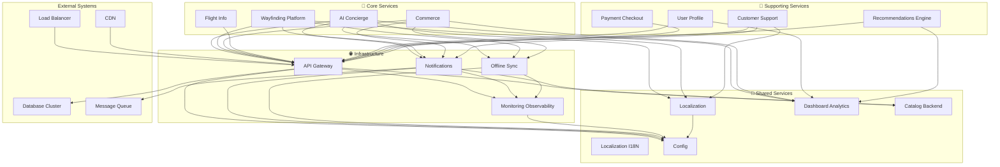

# 🌐 Platform Services - Infrastructure Foundation

## 🌐 Overview
Platform services form the **infrastructure foundation** of AeroFusionXR. These services provide essential infrastructure capabilities, shared utilities, and cross-cutting concerns that enable all other services to function effectively. They operate transparently behind the scenes to ensure reliability, security, and scalability.

## 🏛️ Architecture Principles

### **Infrastructure Standards**
- **Always-On Availability** - 99.9%+ uptime for infrastructure
- **Elastic Scalability** - Auto-scaling infrastructure services
- **Security First** - Zero-trust architecture principles
- **Cost Optimization** - Efficient resource utilization
- **Observability** - Complete system transparency

### **Platform Impact**
- **System Reliability** - Foundation for all services
- **Developer Productivity** - Shared infrastructure services
- **Operational Efficiency** - Automated infrastructure management
- **Compliance & Security** - Centralized governance
- **Cost Control** - Shared resource optimization

## 🏗️ Service Domains

```
platform/
├── 🌐 infrastructure/    # Core infrastructure services (4 services)
└── 🔧 shared/           # Shared utility services (5 services)
```

## 🌐 **Infrastructure Domain**
*Core infrastructure services that provide essential system capabilities*

### **Quick Navigation**
- **[Infrastructure →](./infrastructure/README.md)** - Core infrastructure services
- **[Shared Services →](./shared/README.md)** - Common utility services

### **Service Portfolio**
| Service | Purpose | Availability | Infrastructure Priority |
|---------|---------|--------------|------------------------|
| **API Gateway** | Traffic routing & security | 99.9% | Critical |
| **Notifications** | Message delivery | 99.5% | High |
| **Offline Sync** | Data synchronization | 99.0% | Medium |
| **Monitoring Observability** | System monitoring | 99.9% | Critical |

## 🔧 **Shared Services Domain**
*Shared utility services that provide common functionality across the platform*

### **Service Portfolio**
| Service | Purpose | Availability | Infrastructure Priority |
|---------|---------|--------------|------------------------|
| **Localization** | Multi-language support | 99.5% | High |
| **Localization I18N** | Internationalization | 99.5% | High |
| **Dashboard Analytics** | Business intelligence | 99.0% | Medium |
| **Catalog Backend** | Service catalog | 99.0% | Medium |
| **Config** | Configuration management | 99.9% | Critical |

## 📊 Service Dependencies



## 🚀 Performance Standards

### **Response Time Requirements**
- **API Gateway**: ≤50ms routing latency
- **Notifications**: ≤100ms message processing
- **Offline Sync**: ≤500ms sync operations
- **Monitoring**: ≤10ms metric collection
- **Localization**: ≤20ms translation lookup
- **Dashboard Analytics**: ≤2s query processing
- **Catalog Backend**: ≤100ms catalog lookup
- **Config**: ≤10ms configuration retrieval

### **Throughput Requirements**
- **API Gateway**: 50,000+ requests/second
- **Notifications**: 10,000+ messages/minute
- **Monitoring**: 1M+ metrics/minute
- **Localization**: 5,000+ translations/second
- **Config**: 100,000+ config reads/second

## 🔧 Operational Standards

### **Monitoring & Alerting**
- **Infrastructure Health**: Every 5 seconds
- **Performance Metrics**: Real-time collection
- **Error Tracking**: Immediate alerting
- **Capacity Planning**: Predictive scaling
- **Cost Monitoring**: Resource utilization tracking

### **Deployment Strategy**
- **Infrastructure as Code** - Terraform, CloudFormation
- **GitOps Deployment** - Automated infrastructure updates
- **Canary Deployments** - Safe infrastructure changes
- **Rollback Automation** - Quick recovery mechanisms

### **Disaster Recovery**
- **Multi-Region Architecture** - Geographic redundancy
- **Automated Backup** - Continuous data protection
- **Failover Automation** - Instant service recovery
- **Recovery Time Objective (RTO)**: <2 minutes

## 🛡️ Security Requirements

### **Infrastructure Security**
- **Zero Trust Architecture** - Never trust, always verify
- **Network Segmentation** - Micro-segmented networks
- **Encryption Everywhere** - Data at rest and in transit
- **Identity & Access Management** - Centralized IAM
- **Security Monitoring** - 24/7 threat detection

### **Compliance & Governance**
- **SOC 2 Type II** - Security controls compliance
- **ISO 27001** - Information security management
- **PCI DSS** - Payment card industry compliance
- **GDPR/PDPL** - Data protection regulations
- **Audit Logging** - Complete activity tracking

## 📈 Infrastructure Metrics

### **Key Performance Indicators (KPIs)**
- **System Availability**: 99.9%+ uptime
- **Response Time**: <100ms p99 latency
- **Error Rate**: <0.01% error rate
- **Resource Utilization**: 70-80% optimal range
- **Cost Efficiency**: 20%+ year-over-year optimization

### **Domain-Specific Metrics**

#### **Infrastructure Services**
- **API Gateway Latency**: <50ms p95
- **Notification Delivery Rate**: 99.9%+
- **Sync Success Rate**: 99.5%+
- **Monitoring Coverage**: 100% service coverage

#### **Shared Services**
- **Translation Cache Hit Rate**: 95%+
- **Analytics Query Performance**: <2s average
- **Config Update Propagation**: <30s
- **Catalog Search Performance**: <100ms

## 🛠️ Development Guidelines

### **Infrastructure as Code**
- **Version Control**: All infrastructure versioned
- **Code Review**: Required for infrastructure changes
- **Automated Testing**: Infrastructure validation
- **Documentation**: Comprehensive runbooks

### **Technology Standards**
- **Container Orchestration**: Kubernetes
- **Service Mesh**: Istio for microservices communication
- **Monitoring Stack**: Prometheus, Grafana, ELK
- **CI/CD Pipeline**: GitHub Actions, ArgoCD
- **Cloud Provider**: Multi-cloud strategy (AWS, Azure)

### **Operational Excellence**
- **Automation First**: Minimize manual operations
- **Self-Healing**: Automated recovery mechanisms
- **Capacity Planning**: Proactive scaling decisions
- **Cost Optimization**: Regular resource optimization

## 🚦 Service Status

### **Current Status**
| Service | Status | Version | Last Deploy | Uptime | Resource Usage |
|---------|--------|---------|-------------|--------|----------------|
| API Gateway | 🟢 Healthy | v3.0.2 | 2 hours ago | 99.95% | 65% CPU |
| Notifications | 🟢 Healthy | v2.1.1 | 4 hours ago | 99.92% | 45% CPU |
| Offline Sync | 🟢 Healthy | v1.8.0 | 6 hours ago | 99.88% | 55% CPU |
| Monitoring Observability | 🟢 Healthy | v4.2.0 | 1 hour ago | 99.98% | 70% CPU |
| Localization | 🟢 Healthy | v2.0.3 | 8 hours ago | 99.90% | 40% CPU |
| Localization I18N | 🟢 Healthy | v2.0.3 | 8 hours ago | 99.90% | 35% CPU |
| Dashboard Analytics | 🟡 Warning | v3.1.2 | 12 hours ago | 99.85% | 80% CPU |
| Catalog Backend | 🟢 Healthy | v1.5.1 | 10 hours ago | 99.87% | 50% CPU |
| Config | 🟢 Healthy | v1.9.0 | 3 hours ago | 99.96% | 25% CPU |

## 🔄 Infrastructure Operations

### **24/7 Operations**
- **Always-on monitoring** for critical infrastructure
- **Automated scaling** based on demand patterns
- **Proactive maintenance** during low-traffic windows
- **Incident response** with 5-minute escalation

### **Cost Optimization**
- **Resource rightsizing** based on usage patterns
- **Spot instance utilization** for non-critical workloads
- **Reserved capacity** for predictable workloads
- **Auto-shutdown** for development environments

## 🔄 Change Management

### **Infrastructure Changes**
- **Change Advisory Board** approval for major changes
- **Maintenance Windows** for planned updates
- **Emergency Procedures** for critical fixes
- **Rollback Plans** for all changes

### **Capacity Management**
- **Predictive Scaling** based on historical patterns
- **Resource Monitoring** for optimization opportunities
- **Performance Baseline** tracking over time
- **Growth Planning** for future capacity needs

## 🔗 Quick Links

- **[Infrastructure Dashboard](http://monitoring.aerofusionxr.com/platform)**
- **[Cost Management](http://finops.aerofusionxr.com/)**
- **[Security Console](http://security.aerofusionxr.com/platform)**
- **[Infrastructure Docs](../docs/infrastructure/)**
- **[Runbook Repository](../docs/runbooks/)**

---

*Platform services provide the reliable foundation that enables innovation and growth. Maintain the highest standards of reliability, security, and efficiency.* 