# 🌐 Infrastructure - Platform Domain

## 🌐 Overview
The **Infrastructure** domain provides the foundational infrastructure services that enable the entire AeroFusionXR ecosystem. These services handle traffic routing, system monitoring, data synchronization, and communication, ensuring reliable, secure, and scalable operations across all other services.

## 🎯 Domain Mission
**"Providing robust, scalable, and secure infrastructure foundation that enables seamless operation of all AeroFusionXR services."**

## 🏗️ Service Portfolio

```
infrastructure/
├── 🚪 api-gateway/               # API routing and security
├── 📢 notifications/             # Message delivery system
├── 🔄 offline-sync/              # Data synchronization
└── 📊 monitoring-observability/  # System monitoring
```

## 🚪 **API Gateway Service**
*Central traffic routing and security gateway*

### **Core Capabilities**
- **Traffic Routing** - Intelligent request distribution
- **Authentication & Authorization** - Centralized security
- **Rate Limiting** - API protection and throttling
- **Load Balancing** - Traffic distribution optimization

### **Key Features**
- Dynamic service discovery
- SSL termination and encryption
- Request/response transformation
- Circuit breaker implementation
- API versioning and documentation

### **Performance Standards**
- **Response Time**: ≤50ms routing latency
- **Availability**: 99.9% uptime
- **Throughput**: 50,000+ requests/second
- **Security**: Zero-trust architecture

## 📢 **Notifications Service**
*Comprehensive message delivery platform*

### **Core Capabilities**
- **Multi-Channel Delivery** - Email, SMS, push, in-app
- **Message Templating** - Dynamic content generation
- **Delivery Tracking** - Comprehensive delivery analytics
- **Priority Queuing** - Message priority management

### **Key Features**
- Real-time notification delivery
- Template management and localization
- Delivery status tracking
- Message scheduling and batching
- Notification preferences management

### **Performance Standards**
- **Response Time**: ≤100ms message processing
- **Availability**: 99.5% uptime
- **Delivery Rate**: 99.9%+ successful delivery
- **Throughput**: 10,000+ messages/minute

## 🔄 **Offline Sync Service**
*Data synchronization and offline support*

### **Core Capabilities**
- **Data Synchronization** - Real-time data sync
- **Conflict Resolution** - Intelligent merge strategies
- **Offline Support** - Local data caching
- **Delta Sync** - Efficient incremental updates

### **Key Features**
- Real-time data synchronization
- Offline-first architecture support
- Conflict detection and resolution
- Bandwidth optimization
- Cross-device data consistency

### **Performance Standards**
- **Response Time**: ≤500ms sync operations
- **Availability**: 99.0% uptime
- **Sync Success**: 99.5%+ successful syncs
- **Conflict Resolution**: 99%+ automatic resolution

## 📊 **Monitoring Observability Service**
*Comprehensive system monitoring and observability*

### **Core Capabilities**
- **Metrics Collection** - Real-time performance monitoring
- **Log Aggregation** - Centralized log management
- **Distributed Tracing** - Cross-service request tracking
- **Alerting** - Proactive issue detection

### **Key Features**
- Real-time dashboards
- Automated alerting and escalation
- Performance trend analysis
- Service dependency mapping
- Custom metric collection

### **Performance Standards**
- **Response Time**: ≤10ms metric collection
- **Availability**: 99.9% uptime
- **Data Retention**: 90 days standard
- **Alert Latency**: <30s detection to alert

## 📊 Infrastructure Integration Matrix

```mermaid
graph TB
    subgraph "🌐 Infrastructure Services"
        A[API Gateway]
        B[Notifications]
        C[Offline Sync]
        D[Monitoring Observability]
    end
    
    subgraph "🎯 Core Services"
        E[AI Concierge]
        F[Wayfinding Platform]
        G[Commerce]
        H[Flight Info]
    end
    
    subgraph "🔧 Supporting Services"
        I[User Profile]
        J[Payment Checkout]
        K[Customer Support]
        L[Recommendations Engine]
    end
    
    subgraph "🔧 Shared Services"
        M[Localization]
        N[Analytics]
        O[Catalog Backend]
        P[Config]
    end
    
    subgraph "External Systems"
        Q[Load Balancer]
        R[CDN]
        S[Database Cluster]
        T[Message Queue]
    end
    
    E --> A
    F --> A
    G --> A
    H --> A
    I --> A
    J --> A
    K --> A
    L --> A
    M --> A
    N --> A
    O --> A
    P --> A
    
    E --> B
    G --> B
    H --> B
    K --> B
    
    E --> C
    F --> C
    G --> C
    I --> C
    
    A --> D
    B --> D
    C --> D
    E --> D
    F --> D
    G --> D
    H --> D
    I --> D
    J --> D
    K --> D
    L --> D
    M --> D
    N --> D
    O --> D
    P --> D
    
    Q --> A
    R --> A
    A --> S
    B --> T
```



## 🚀 Infrastructure Performance Standards

### **System-Wide KPIs**
- **Infrastructure Availability**: 99.9%+ uptime
- **Cross-Service Latency**: <100ms p99
- **System Reliability**: 99.99% data consistency
- **Security Posture**: Zero critical vulnerabilities

### **Service-Specific Metrics**

#### **API Gateway**
- **Request Latency**: <50ms p95 routing time
- **Throughput**: 50,000+ requests/second
- **Error Rate**: <0.01% gateway errors
- **Security Events**: Zero successful attacks

#### **Notifications**
- **Delivery Speed**: <5 minutes for standard messages
- **Delivery Success**: 99.9%+ message delivery
- **Template Rendering**: <50ms generation time
- **Channel Performance**: 99%+ per channel success

#### **Offline Sync**
- **Sync Latency**: <30s for real-time updates
- **Conflict Rate**: <1% of sync operations
- **Data Consistency**: 99.99% across devices
- **Bandwidth Efficiency**: 80%+ reduction vs full sync

#### **Monitoring Observability**
- **Metric Collection**: 1M+ metrics/minute
- **Log Processing**: 100GB+ daily volume
- **Alert Response**: <30s detection time
- **Dashboard Performance**: <2s query response

## 🛡️ Infrastructure Security

### **Security Architecture**
- **Zero Trust Model** - Never trust, always verify
- **Defense in Depth** - Multi-layer security approach
- **Encryption Everywhere** - Data protection at all layers
- **Identity Management** - Centralized authentication

### **Security Controls**
- **Network Segmentation** - Micro-segmented networks
- **Access Control** - Role-based permissions
- **Vulnerability Management** - Continuous security scanning
- **Incident Response** - Automated threat response

### **Compliance Standards**
- **SOC 2 Type II** - Security controls audit
- **ISO 27001** - Information security management
- **PCI DSS** - Payment security compliance
- **GDPR/PDPL** - Data protection regulations

## 🔧 Infrastructure Operations

### **24/7 Operations**
- **Always-On Monitoring** - Continuous system oversight
- **Automated Scaling** - Dynamic resource allocation
- **Proactive Maintenance** - Preventive system care
- **Incident Management** - Rapid issue resolution

### **Capacity Management**
- **Predictive Scaling** - AI-driven capacity planning
- **Resource Optimization** - Efficient resource utilization
- **Performance Tuning** - Continuous optimization
- **Cost Management** - Resource cost optimization

## 🚦 Infrastructure Health Dashboard

### **Real-Time Status**
| Service | Status | Uptime | Requests/Min | Error Rate | Resource Usage |
|---------|--------|--------|--------------|------------|----------------|
| API Gateway | 🟢 Healthy | 99.95% | 45,680 | 0.005% | 65% CPU |
| Notifications | 🟢 Healthy | 99.92% | 8,920 | 0.01% | 45% CPU |
| Offline Sync | 🟢 Healthy | 99.88% | 2,340 | 0.02% | 55% CPU |
| Monitoring Observability | 🟢 Healthy | 99.98% | 125,000 | 0.001% | 70% CPU |

### **System-Wide Metrics**
- **Total Requests**: 182,000+ per minute
- **Data Processed**: 2.5TB daily volume
- **Alerts Generated**: 45 per day average
- **Incident Response**: 3.2 minutes MTTR

## 🔄 Disaster Recovery

### **Backup & Recovery**
- **Real-Time Replication** - Continuous data backup
- **Multi-Region Deployment** - Geographic redundancy
- **Automated Failover** - Instant service recovery
- **Data Recovery** - Point-in-time restoration

### **Business Continuity**
- **RTO Target**: <2 minutes infrastructure recovery
- **RPO Target**: <5 minutes data loss maximum
- **Failover Testing** - Monthly disaster drills
- **Recovery Automation** - Scripted recovery procedures

## 🛠️ Development Standards

### **Infrastructure as Code**
- **Version Control** - All infrastructure versioned
- **Automated Deployment** - CI/CD infrastructure updates
- **Testing** - Infrastructure validation testing
- **Documentation** - Comprehensive runbooks

### **Technology Stack**
- **Container Orchestration** - Kubernetes
- **Service Mesh** - Istio
- **Monitoring** - Prometheus, Grafana
- **CI/CD** - GitHub Actions, ArgoCD
- **Cloud** - Multi-cloud strategy

## 📈 Performance Optimization

### **Continuous Optimization**
- **Performance Monitoring** - Real-time performance tracking
- **Bottleneck Identification** - Automated issue detection
- **Resource Tuning** - Dynamic resource optimization
- **Capacity Planning** - Predictive scaling decisions

### **Efficiency Metrics**
- **Resource Utilization** - 70-80% optimal range
- **Cost Efficiency** - 20%+ year-over-year improvement
- **Performance Improvement** - 15%+ annual optimization
- **Energy Efficiency** - Green infrastructure practices

## 🔗 Quick Links

- **[API Gateway Service →](./api-gateway/README.md)**
- **[Notifications Service →](./notifications/README.md)**
- **[Offline Sync Service →](./offline-sync/README.md)**
- **[Monitoring Observability →](./monitoring-observability/README.md)**
- **[Infrastructure Dashboard](http://monitoring.aerofusionxr.com/infrastructure)**
- **[Capacity Planning](http://capacity.aerofusionxr.com/)**

---

*The Infrastructure domain provides the rock-solid foundation that enables AeroFusionXR to deliver reliable, scalable, and secure services to millions of passengers worldwide.* 