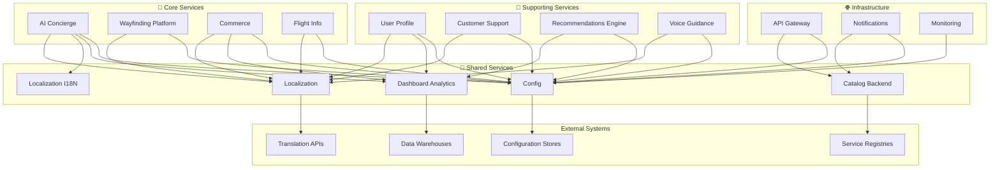

# 🔧 Shared Services - Platform Domain

## 🔧 Overview
The **Shared Services** domain provides common utility services that support the entire AeroFusionXR ecosystem. These services offer reusable functionality such as localization, analytics, configuration management, and catalog services, promoting consistency and reducing duplication across the platform.

## 🎯 Domain Mission
**"Providing high-quality, reusable shared services that enable consistency, efficiency, and rapid development across the entire AeroFusionXR platform."**

## 🏗️ Service Portfolio

```
shared/
├── 🌍 localization/         # Multi-language support
├── 🌐 localization-i18n/    # Internationalization
├── 📊 dashboard-analytics/  # Business intelligence
├── 📚 catalog-backend/      # Service catalog
└── ⚙️ config/              # Configuration management
```

## 🌍 **Localization Service**
*Multi-language support and content management*

### **Core Capabilities**
- **Translation Management** - Multi-language content support
- **Content Localization** - Region-specific content adaptation
- **Real-Time Translation** - Dynamic language switching
- **Cache Management** - Optimized translation delivery

### **Key Features**
- 15+ language support
- Real-time translation caching
- Cultural content adaptation
- RTL language support
- Translation quality management

### **Performance Standards**
- **Response Time**: ≤20ms translation lookup
- **Availability**: 99.5% uptime
- **Cache Hit Rate**: 95%+ for translations
- **Translation Accuracy**: 98%+ quality score

## 🌐 **Localization I18N Service**
*Internationalization framework and tools*

### **Core Capabilities**
- **Format Localization** - Currency, date, number formatting
- **Locale Management** - Regional preference handling
- **Content Management** - Localized content delivery
- **Cultural Adaptation** - Region-specific customization

### **Key Features**
- Multi-currency support
- Date/time localization
- Regional content variations
- Cultural preference adaptation
- Locale-aware sorting

### **Performance Standards**
- **Response Time**: ≤20ms format conversion
- **Availability**: 99.5% uptime
- **Locale Coverage**: 50+ regions supported
- **Format Accuracy**: 99.9%+ precision

## 📊 **Dashboard Analytics Service**
*Business intelligence and analytics platform*

### **Core Capabilities**
- **Data Aggregation** - Multi-source data collection
- **Report Generation** - Automated reporting
- **Real-Time Dashboards** - Live data visualization
- **Data Warehousing** - Centralized data storage

### **Key Features**
- Real-time business dashboards
- Custom report generation
- Data export capabilities
- Trend analysis and forecasting
- Cross-service analytics

### **Performance Standards**
- **Response Time**: ≤2s query processing
- **Availability**: 99.0% uptime
- **Data Freshness**: <5 minutes lag
- **Report Generation**: <30s for standard reports

## 📚 **Catalog Backend Service**
*Centralized service and resource catalog*

### **Core Capabilities**
- **Service Discovery** - Dynamic service registration
- **Resource Management** - Centralized resource catalog
- **Metadata Management** - Service documentation
- **Version Control** - Service versioning support

### **Key Features**
- Dynamic service registration
- API documentation hosting
- Service health monitoring
- Resource discovery
- Version management

### **Performance Standards**
- **Response Time**: ≤100ms catalog lookup
- **Availability**: 99.0% uptime
- **Service Registration**: Real-time updates
- **Search Performance**: <50ms query response

## ⚙️ **Config Service**
*Centralized configuration management*

### **Core Capabilities**
- **Configuration Storage** - Centralized config management
- **Dynamic Updates** - Runtime configuration changes
- **Environment Management** - Multi-environment support
- **Security Management** - Encrypted configuration storage

### **Key Features**
- Environment-specific configurations
- Real-time configuration updates
- Configuration versioning
- Encrypted secret management
- Audit logging

### **Performance Standards**
- **Response Time**: ≤10ms configuration retrieval
- **Availability**: 99.9% uptime
- **Update Propagation**: <30s across services
- **Cache Efficiency**: 99%+ hit rate

## 📊 Shared Services Integration Matrix



## 🚀 Shared Services Performance Standards

### **Domain-Wide KPIs**
- **Service Availability**: 99.0%+ average uptime
- **Response Performance**: <100ms average response
- **Resource Efficiency**: 70%+ optimal utilization
- **Developer Productivity**: 30%+ faster development

### **Service-Specific Metrics**

#### **Localization Services**
- **Translation Coverage**: 95%+ content translated
- **Cache Performance**: 95%+ hit rate
- **Language Support**: 15+ active languages
- **Cultural Accuracy**: 98%+ localization quality

#### **Analytics Service**
- **Data Processing**: 10GB+ daily volume
- **Report Generation**: 1,000+ reports/day
- **Dashboard Users**: 500+ active users
- **Query Performance**: <2s average response

#### **Catalog Service**
- **Service Registration**: 100+ active services
- **Discovery Success**: 99%+ lookup success
- **Documentation Coverage**: 95%+ API docs
- **Search Efficiency**: <50ms search queries

#### **Config Service**
- **Configuration Items**: 10,000+ managed configs
- **Update Speed**: <30s propagation time
- **Security**: 100% encrypted secrets
- **Audit Coverage**: 100% change tracking

## 🛡️ Shared Services Security

### **Data Protection**
- **Encryption**: AES-256-GCM for sensitive data
- **Access Control**: Role-based permissions
- **Audit Logging**: Complete activity tracking
- **Data Classification** - Sensitivity-based handling

### **Service Security**
- **Authentication**: Service-to-service auth
- **Authorization**: Resource-based access
- **Rate Limiting**: Abuse prevention
- **Input Validation**: Comprehensive sanitization

## 🔄 Service Lifecycle Management

### **Development Phase**
1. **Service Design** - Standard service patterns
2. **API Definition** - OpenAPI specification
3. **Testing** - Comprehensive test coverage
4. **Documentation** - Complete service docs

### **Deployment Phase**
1. **Service Registration** - Automatic catalog entry
2. **Configuration Setup** - Environment-specific configs
3. **Monitoring Setup** - Health checks and metrics
4. **Localization** - Multi-language support

### **Operation Phase**
1. **Performance Monitoring** - Real-time metrics
2. **Configuration Management** - Dynamic updates
3. **Analytics Collection** - Usage tracking
4. **Maintenance** - Regular updates and optimization

## 🛠️ Development Standards

### **Shared Service Guidelines**
- **API Consistency** - Standardized interfaces
- **Backward Compatibility** - Version management
- **Documentation** - Comprehensive service docs
- **Testing** - 80%+ test coverage

### **Integration Patterns**
- **Service Mesh** - Istio for communication
- **Circuit Breaker** - Fault tolerance
- **Bulkhead Pattern** - Resource isolation
- **Retry Logic** - Resilient service calls

## 🚦 Service Health Dashboard

### **Real-Time Status**
| Service | Status | Requests/Day | Response Time | Success Rate | Cache Hit Rate |
|---------|--------|--------------|---------------|--------------|----------------|
| Localization | 🟢 Healthy | 125,000 | 18ms | 99.2% | 96% |
| Localization I18N | 🟢 Healthy | 89,500 | 16ms | 99.5% | 97% |
| Dashboard Analytics | 🟡 Warning | 45,200 | 1.8s | 98.5% | N/A |
| Catalog Backend | 🟢 Healthy | 28,900 | 85ms | 99.8% | 94% |
| Config | 🟢 Healthy | 156,000 | 8ms | 99.9% | 99% |

### **Business Impact Metrics**
- **Developer Productivity**: 30% faster feature development
- **Consistency Score**: 95% cross-service consistency
- **Reusability Index**: 80% shared component usage
- **Maintenance Efficiency**: 25% reduced maintenance overhead

## 📈 Optimization & Efficiency

### **Resource Optimization**
- **Caching Strategy** - Multi-level caching
- **Data Compression** - Efficient data transfer
- **Resource Pooling** - Shared resource usage
- **Load Balancing** - Optimal resource distribution

### **Performance Tuning**
- **Query Optimization** - Database performance tuning
- **Memory Management** - Efficient memory usage
- **Network Optimization** - Reduced latency
- **Batch Processing** - Efficient bulk operations

## 🔄 Service Evolution

### **Continuous Improvement**
- **Usage Analytics** - Service utilization tracking
- **Performance Monitoring** - Response time optimization
- **Feedback Collection** - Developer satisfaction surveys
- **Feature Roadmap** - Planned enhancements

### **Innovation**
- **Emerging Technologies** - AI/ML integration
- **Automation** - Self-healing capabilities
- **Scalability** - Elastic resource management
- **Integration** - New service connectivity

## 🔗 Quick Links

- **[Localization Service →](./localization/README.md)**
- **[Localization I18N Service →](./localization-i18n/README.md)**
- **[Dashboard Analytics Service →](./dashboard-analytics/README.md)**
- **[Catalog Backend Service →](./catalog-backend/README.md)**
- **[Config Service →](./config/README.md)**
- **[Shared Services Dashboard](http://monitoring.aerofusionxr.com/shared)**
- **[Developer Portal](http://developers.aerofusionxr.com/shared)**

---

*Shared Services enable rapid development and consistent experiences across AeroFusionXR by providing high-quality, reusable components that eliminate duplication and promote best practices.* 