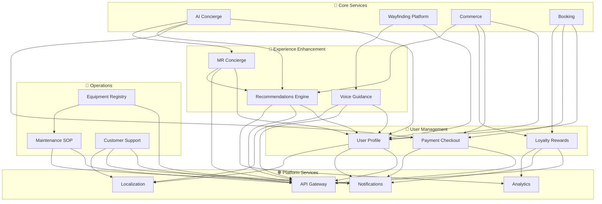

# 🔧 Supporting Services - Business Critical

## 🔧 Overview
Supporting services are **business-critical enablers** that enhance and support core functionality. While not directly passenger-facing, these services are essential for delivering a complete, seamless experience and ensuring operational efficiency across the AeroFusionXR ecosystem.

## 🏛️ Architecture Principles

### **Business-Critical Standards**
- **99.5%+ Uptime** - High availability during business hours
- **Scalable Performance** - Efficient resource utilization
- **Modular Design** - Pluggable service architecture
- **Quality Enhancement** - Elevate core service capabilities
- **Operational Support** - Enable smooth airport operations

### **Business Impact**
- **User Experience Enhancement** - Personalization, recommendations
- **Operational Efficiency** - Equipment management, maintenance
- **Customer Satisfaction** - Support services, multilingual assistance
- **Business Intelligence** - Analytics, insights, optimization

## 🏗️ Service Domains

```
supporting/
├── 👤 user-management/           # User-centric services (3 services)
├── 🔧 operations/               # Operational support (3 services)
└── 🎯 experience-enhancement/   # Experience enhancers (3 services)
```

## 👤 **User Management Domain**
*Services that manage user data, preferences, and financial transactions*

### **Quick Navigation**
- **[User Management →](./user-management/README.md)** - User-focused services
- **[Operations →](./operations/README.md)** - Operational support services
- **[Experience Enhancement →](./experience-enhancement/README.md)** - UX enhancement services

### **Service Portfolio**
| Service | Purpose | Availability | Business Priority |
|---------|---------|--------------|------------------|
| **User Profile** | User data & preferences | 99.5% | High |
| **Payment Checkout** | Payment processing | 99.8% | Critical |
| **Loyalty Rewards** | Loyalty program | 99.0% | Medium |

## 🔧 **Operations Domain**
*Services that support airport operations and maintenance*

### **Service Portfolio**
| Service | Purpose | Availability | Business Priority |
|---------|---------|--------------|------------------|
| **Equipment Registry** | Equipment tracking | 99.0% | Medium |
| **Maintenance SOP** | Maintenance procedures | 98.5% | Medium |
| **Customer Support** | Help desk support | 99.5% | High |

## 🎯 **Experience Enhancement Domain**
*Services that provide advanced features and personalization*

### **Service Portfolio**
| Service | Purpose | Availability | Business Priority |
|---------|---------|--------------|------------------|
| **Voice Guidance** | Voice assistance | 99.0% | Medium |
| **Recommendations Engine** | Personalization | 99.5% | High |
| **MR Concierge** | Mixed reality assistance | 98.0% | Low |

## 📊 Service Dependencies



## 🚀 Performance Standards

### **Response Time Requirements**
- **User Profile**: ≤200ms for profile data
- **Payment Checkout**: ≤2s for transaction processing
- **Loyalty Rewards**: ≤500ms for point calculations
- **Equipment Registry**: ≤1s for equipment lookup
- **Maintenance SOP**: ≤300ms for procedure retrieval
- **Customer Support**: ≤1s for ticket creation
- **Voice Guidance**: ≤500ms for voice processing
- **Recommendations**: ≤300ms for personalized results
- **MR Concierge**: ≤200ms for interaction response

### **Throughput Requirements**
- **Concurrent Users**: 5,000+
- **Requests per Second**: 500+
- **Data Processing**: 500K+ events/hour
- **Batch Processing**: 10K+ records/minute

## 🔧 Operational Standards

### **Monitoring & Alerting**
- **Health Checks**: Every 30 seconds
- **Performance Metrics**: Business hours monitoring
- **Error Tracking**: Alert on service degradation
- **Business Metrics**: User engagement, efficiency gains

### **Deployment Strategy**
- **Rolling Deployments** - Gradual service updates
- **Blue-Green for Critical** - Zero downtime for payments
- **Scheduled Maintenance** - Off-peak hour updates
- **Feature Toggles** - Runtime feature control

### **Disaster Recovery**
- **Regional Redundancy** - Multi-zone deployment
- **Data Backup** - Daily automated backups
- **Service Degradation** - Graceful failure modes
- **Recovery Time Objective (RTO)**: <15 minutes

## 🛡️ Security Requirements

### **Data Protection**
- **Encryption**: TLS 1.2+ for all communications
- **Authentication**: Service-to-service authentication
- **Authorization**: Resource-based access control
- **Audit Logging**: Business activity tracking

### **Privacy Compliance**
- **Data Classification** - Sensitive data identification
- **Access Controls** - Least privilege principle
- **Data Retention** - Automated cleanup policies
- **Consent Management** - User preference tracking

## 📈 Business Metrics

### **Key Performance Indicators (KPIs)**
- **Service Availability**: 99.0%+ uptime
- **User Satisfaction**: 90%+ positive feedback
- **Operational Efficiency**: 25%+ improvement
- **Cost Optimization**: 15%+ resource savings

### **Domain-Specific Metrics**

#### **User Management**
- **Profile Accuracy**: 95%+ data quality
- **Payment Success Rate**: 99.5%+
- **Loyalty Engagement**: 60%+ active users

#### **Operations**
- **Equipment Uptime**: 98%+ availability
- **Maintenance Efficiency**: 30%+ faster resolution
- **Support Resolution**: 85%+ first-call resolution

#### **Experience Enhancement**
- **Voice Recognition Accuracy**: 95%+
- **Recommendation CTR**: 15%+ click-through rate
- **MR Session Length**: 5+ minutes average

## 🛠️ Development Guidelines

### **Code Quality Standards**
- **Test Coverage**: 80%+ for all supporting services
- **Code Review**: Required for critical changes
- **Security Scanning**: Regular vulnerability assessment
- **Performance Testing**: Load testing for key services

### **Technology Standards**
- **Languages**: TypeScript, Python, Node.js
- **Frameworks**: Express, FastAPI, React
- **Databases**: MongoDB, PostgreSQL, Redis
- **Message Queues**: Redis Pub/Sub, RabbitMQ

### **Integration Patterns**
- **Event-Driven**: Asynchronous communication
- **Circuit Breaker**: Fault tolerance
- **Retry Logic**: Resilient service calls
- **Caching**: Performance optimization

## 🚦 Service Status

### **Current Status**
| Service | Status | Version | Last Deploy | Health Score |
|---------|--------|---------|-------------|--------------|
| User Profile | 🟢 Healthy | v1.5.2 | 8 hours ago | 98% |
| Payment Checkout | 🟢 Healthy | v2.0.1 | 4 hours ago | 99% |
| Loyalty Rewards | 🟡 Warning | v1.3.0 | 2 days ago | 85% |
| Equipment Registry | 🟢 Healthy | v1.2.1 | 1 day ago | 92% |
| Maintenance SOP | 🟢 Healthy | v1.4.0 | 6 hours ago | 95% |
| Customer Support | 🟢 Healthy | v1.6.1 | 12 hours ago | 97% |
| Voice Guidance | 🟢 Healthy | v1.1.3 | 1 day ago | 93% |
| Recommendations Engine | 🟢 Healthy | v2.1.0 | 3 hours ago | 96% |
| MR Concierge | 🔵 Maintenance | v1.0.2 | 3 days ago | 88% |

## 🔄 Business Hours Optimization

### **Peak Hours (6 AM - 10 PM)**
- **Auto-scaling enabled** for high-traffic services
- **Real-time monitoring** for performance metrics
- **Priority support** for critical incidents

### **Off-Peak Hours (10 PM - 6 AM)**
- **Maintenance windows** for non-critical updates
- **Batch processing** for analytics and reports
- **Resource optimization** for cost efficiency

## 🔗 Quick Links

- **[Supporting Services Dashboard](http://monitoring.aerofusionxr.com/supporting)**
- **[Business Metrics](http://analytics.aerofusionxr.com/supporting)**
- **[Service Catalog](http://catalog.aerofusionxr.com/supporting)**
- **[Operational Runbooks](../docs/operations/)**

---

*Supporting services enhance core capabilities and ensure operational excellence. Focus on reliability, efficiency, and user satisfaction.* 