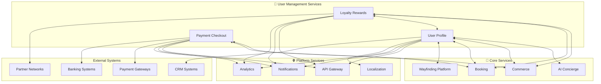

# 👤 User Management - Supporting Domain

## 👤 Overview
The **User Management** domain provides comprehensive user-centric services that manage passenger profiles, financial transactions, and loyalty programs. These services enable personalized experiences while ensuring secure data handling and seamless payment processing across the AeroFusionXR ecosystem.

## 🎯 Domain Mission
**"Delivering secure, personalized user experiences through comprehensive profile management, seamless payments, and rewarding loyalty programs."**

## 🏗️ Service Portfolio

```
user-management/
├── 👤 user-profile/      # User data and preferences
├── 💳 payment-checkout/  # Payment processing
└── 🎁 loyalty-rewards/   # Loyalty program management
```

## 👤 **User Profile Service**
*Comprehensive user data and preference management*

### **Core Capabilities**
- **Profile Management** - Comprehensive user data storage
- **Preference Engine** - Personalization and customization
- **Privacy Controls** - Granular data consent management
- **Multi-Device Sync** - Cross-platform profile synchronization

### **Key Features**
- Personal information management
- Travel preferences and history
- Accessibility settings
- Privacy and consent controls
- Cross-service data sharing

### **Performance Standards**
- **Response Time**: ≤200ms for profile data
- **Availability**: 99.5% uptime
- **Data Accuracy**: 99%+ profile information
- **Sync Latency**: <5s across devices

## 💳 **Payment Checkout Service**
*Secure and efficient payment processing*

### **Core Capabilities**
- **Multi-Payment Methods** - Cards, wallets, biometric payments
- **Transaction Security** - PCI DSS compliant processing
- **Currency Management** - Multi-currency support
- **Fraud Detection** - Real-time transaction monitoring

### **Key Features**
- Secure payment processing
- Multiple payment methods
- Currency conversion
- Fraud prevention
- Refund and dispute handling

### **Performance Standards**
- **Response Time**: ≤2s for transaction processing
- **Availability**: 99.8% uptime
- **Transaction Success**: 99.5%+ completion rate
- **Security Compliance**: PCI DSS Level 1

## 🎁 **Loyalty Rewards Service**
*Comprehensive loyalty program management*

### **Core Capabilities**
- **Points Management** - Earning and redemption tracking
- **Tier Management** - Status level progression
- **Rewards Catalog** - Available benefits and offers
- **Partnership Integration** - Multi-brand loyalty networks

### **Key Features**
- Points earning and tracking
- Tier-based benefits
- Personalized offers
- Partner program integration
- Gamification elements

### **Performance Standards**
- **Response Time**: ≤500ms for point calculations
- **Availability**: 99.0% uptime
- **Calculation Accuracy**: 99.9%+ point calculations
- **Engagement Rate**: 60%+ active participants

## 📊 User Journey Integration



## 🚀 Domain Performance Standards

### **User Management KPIs**
- **Profile Accuracy**: 95%+ data quality
- **Payment Success Rate**: 99.5%+ transactions
- **Loyalty Engagement**: 60%+ active users
- **Data Sync Speed**: <5s cross-platform

### **Service-Specific Metrics**

#### **User Profile Service**
- **Profile Completeness**: 85%+ complete profiles
- **Data Updates**: Real-time synchronization
- **Privacy Compliance**: 100% GDPR/PDPL adherence
- **Cross-Device Sync**: 99%+ successful syncs

#### **Payment Checkout Service**
- **Transaction Volume**: $2M+ daily processing
- **Payment Methods**: 15+ supported options
- **Fraud Prevention**: 99.9%+ accuracy
- **Settlement Time**: T+1 for most transactions

#### **Loyalty Rewards Service**
- **Active Members**: 75%+ of users enrolled
- **Point Redemption**: 45%+ redemption rate
- **Partner Engagement**: 30%+ partner offers used
- **Tier Progression**: 25%+ users advance annually

## 🛡️ Security & Privacy

### **Data Protection Standards**
- **Encryption**: AES-256-GCM for all user data
- **Access Control**: Role-based permissions
- **Audit Logging**: Complete activity tracking
- **Data Residency**: Region-specific storage

### **Privacy Compliance**
- **GDPR Compliance** - EU data protection rights
- **UAE PDPL** - Local privacy law adherence
- **Consent Management** - Granular consent tracking
- **Data Minimization** - Collect only necessary data
- **Right to be Forgotten** - Complete data deletion

### **Payment Security**
- **PCI DSS Level 1** - Highest security certification
- **Tokenization** - Secure payment data storage
- **3D Secure** - Enhanced authentication
- **Fraud Monitoring** - Real-time transaction analysis

## 🔄 User Lifecycle Management

### **User Onboarding**
1. **Profile Creation** - Basic information collection
2. **Preference Setup** - Customization options
3. **Payment Setup** - Secure payment method addition
4. **Loyalty Enrollment** - Program registration

### **Active Usage**
1. **Profile Updates** - Dynamic preference learning
2. **Transaction Processing** - Seamless payments
3. **Points Earning** - Automatic accrual
4. **Personalization** - Experience optimization

### **Retention & Engagement**
1. **Loyalty Benefits** - Tier-based rewards
2. **Personalized Offers** - Targeted promotions
3. **Profile Enhancement** - Additional services
4. **Cross-Platform Sync** - Unified experience

## 🛠️ Development Standards

### **Domain-Specific Guidelines**
- **Privacy by Design** - Built-in privacy protection
- **Security First** - Security in every component
- **User Experience** - Seamless interaction design
- **Data Quality** - High-quality data management

### **Integration Patterns**
- **Event-Driven Updates** - Real-time profile changes
- **Saga Pattern** - Complex transaction workflows
- **CQRS** - Optimized read/write operations
- **Data Federation** - Cross-service data access

## 💳 Financial Operations

### **Payment Processing**
- **Daily Volume**: $2M+ transactions
- **Payment Methods**: Cards, wallets, biometric
- **Currency Support**: 15+ currencies
- **Settlement**: Automated reconciliation

### **Revenue Tracking**
- **Transaction Fees**: Revenue from processing
- **Loyalty Program**: Engagement metrics
- **User Acquisition**: Cost and conversion
- **Lifetime Value**: User revenue tracking

## 🚦 Service Health Dashboard

### **Real-Time Status**
| Service | Status | Active Users | Daily Transactions | Success Rate | Revenue Impact |
|---------|--------|--------------|--------------------|--------------|----------------|
| User Profile | 🟢 Healthy | 25,840 | 18,920 updates | 99.2% | Data quality |
| Payment Checkout | 🟢 Healthy | 8,450 | 1,280 payments | 99.6% | $156,780 |
| Loyalty Rewards | 🟡 Warning | 19,200 | 3,840 redemptions | 98.8% | Engagement |

### **Business Impact Metrics**
- **User Engagement**: 85% daily active users
- **Payment Revenue**: $156,780 daily volume
- **Loyalty Participation**: 75% enrolled users
- **Data Quality Score**: 96% profile accuracy

## 🎯 Personalization Engine

### **User Segmentation**
- **Behavioral Segments** - Usage pattern-based grouping
- **Demographic Segments** - Traditional segmentation
- **Value Segments** - Revenue-based classification
- **Journey Segments** - Travel pattern analysis

### **Recommendation Systems**
- **Collaborative Filtering** - User similarity-based
- **Content-Based** - Preference matching
- **Hybrid Approach** - Combined recommendation
- **Real-Time Adaptation** - Dynamic adjustments

## 📈 User Analytics

### **Profile Analytics**
- **Completion Rates** - Profile information density
- **Update Frequency** - Data freshness tracking
- **Preference Accuracy** - Prediction validation
- **Cross-Service Usage** - Service adoption rates

### **Payment Analytics**
- **Transaction Patterns** - Spending behavior analysis
- **Payment Method Preference** - Method adoption
- **Fraud Patterns** - Security threat analysis
- **Revenue Attribution** - Service contribution

### **Loyalty Analytics**
- **Engagement Metrics** - Program participation
- **Redemption Patterns** - Reward usage analysis
- **Tier Progression** - Status advancement
- **Partner Performance** - Partner program effectiveness

## 🔗 Quick Links

- **[User Profile Service →](./user-profile/README.md)**
- **[Payment Checkout Service →](./payment-checkout/README.md)**
- **[Loyalty Rewards Service →](./loyalty-rewards/README.md)**
- **[User Analytics Dashboard](http://analytics.aerofusionxr.com/user-management)**
- **[Privacy Management Console](http://privacy.aerofusionxr.com/)**

---

*The User Management domain creates the foundation for personalized experiences while maintaining the highest standards of security, privacy, and data quality.* 